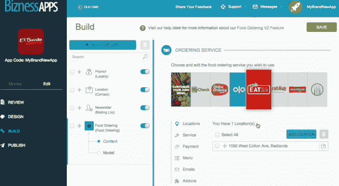

# 在构建了 500，000 个应用程序后，Bizness Apps 推出了 Apex，这是一个新的白色标签应用程序构建器 

> 原文：<https://web.archive.org/web/https://techcrunch.com/2015/12/23/after-500000-apps-built-bizness-apps-launches-apex-a-new-white-label-app-builder/>

# 在创建了 500，000 个应用程序后，Bizness Apps 发布了 Apex，这是一个新的白色标签应用程序生成器

[Bizness Apps](https://web.archive.org/web/20221006065530/https://www.biznessapps.com/) 成立于 2010 年，是一个 DIY 应用和网站开发平台，它已经悄悄地将注意力转向经销商和数字机构，成为市场上最大的白牌应用开发软件提供商之一。

事实上，现在已经有超过 500，000 个移动应用程序使用该公司的软件创建，它们占 iTunes 应用程序商店所有应用程序的 5%。

现在，该公司正在推出 Apex，这是他们的应用构建器平台的完整重建。新平台的目标是缩短总开发时间，并将设计、应用构建和营销整合到一个基于网络的平台中。本质上，Apex 包含了 web 专业人员为客户快速构建交互式应用程序所需的一切。

虽然这在理论上听起来很棒，但大多数现有的移动应用程序开发工具包只擅长制作没有太多交互的前端应用程序…本质上是一个网站克隆。

幸运的是，Apex 通过允许建筑商轻松添加互动模块(如忠诚度计划、订购系统和深度位置感知功能)而逆潮流而动。该平台还允许开发者定制他们的应用程序的外观和感觉，一直到特定的字体和颜色。

Apex 还处理应用程序向 iOS 和 Android 应用程序商店的提交，并为开发者提供推送通知和参与跟踪等批准后功能。

通过将注意力从网站转移到应用程序，该公司正在大举押注应用程序将等同或超过网站，成为接触客户的主要方式。然而，这似乎是一个安全的赌注，因为谷歌已经开始在其搜索结果中显示纯应用程序内容。

最终，像 Apex 这样的平台对消费者和开发者来说是一个净利好，因为它们缩短了开发时间，同时鼓励更多的小企业转向应用程序，同时确保应用程序实际上比企业的静态网站提供更多的功能。