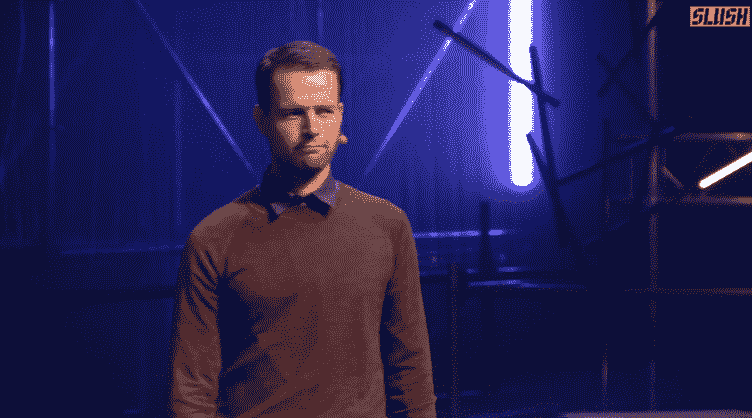

# 与微软离婚后，诺基亚展示了 N1，一款首次登陆中国的安卓平板电脑 

> 原文：<https://web.archive.org/web/https://techcrunch.com/2014/11/18/after-divorcing-microsoft-nokia-reveals-an-android-tablet-the-n1-hitting-china-first/>

今天在赫尔辛基的 [Slush 会议上，家乡英雄](https://web.archive.org/web/20221208180510/http://www.slush.org/)[诺基亚](https://web.archive.org/web/20221208180510/http://www.nokia.com/)——没有被[出售给微软](https://web.archive.org/web/20221208180510/https://beta.techcrunch.com/2014/04/25/microsofts-7-2bn-acquisition-of-nokias-devices-business-is-now-complete/)的业务部分——展示了其第一款设备:[N1](https://web.archive.org/web/20221208180510/http://n1.nokia.com/)，一款类似 iPad 的小型平板电脑，铝制外壳，7.9 英寸屏幕，搭载 Android Lollipop 操作系统。这款手机售价 249 美元，将首先通过与富士康的制造和分销合作在中国销售，最初至少只支持 WiFi。

“他们说诺基亚死了，”诺基亚的设备主管塞巴斯蒂安·尼斯特伦(Sebastian Nyströ)在开始今天的演示时说，如下图所示。“我说，他们大错特错。”继 N1 之后，将会有更多的产品问世。

然后他陷入了情绪化(对一个芬兰人来说！)关于诺基亚专注于伟大的设计、工程和以消费者为中心的演讲——他说公司不能因为出售给雷德蒙而放弃这些领域。

他开玩笑地说，N1 将瞄准那些还没有找到他们喜爱的安卓平板电脑的人。

你可以在这里看到我们的 N1 [视频演示。这是该公司以超过 70 亿美元的价格将其设备和服务业务出售给微软后发布的第一款设备。该协议](https://web.archive.org/web/20221208180510/https://beta.techcrunch.com/2014/11/18/video-nokias-new-small-tablet-the-n1-is-a-showcase-for-its-z-launcher/)[禁止诺基亚在 30 个月内](https://web.archive.org/web/20221208180510/https://beta.techcrunch.com/2013/09/03/nokias-licensing-its-name-to-microsoft-but-its-free-to-keep-building-hardware-and-could-even-dial-up-to-mobile-devices-again-by-january-2016/)制造智能手机或手机，直到 2016 年 1 月，但该协议不包括其他设备。

自那以后，诺基亚的另一个产品是安卓主屏幕，[Z 启动器](https://web.archive.org/web/20221208180510/https://beta.techcrunch.com/2014/06/19/z-launcher/)。现在很明显，Z launcher 为今天的集成硬件新闻奠定了基础——它使用 Launcher 运行，并完成了 Launcher 包括的简洁功能，例如在屏幕上随意写一个字母以调用特定应用程序的能力。

Z Launcher 在最初几天的下载量超过了 100，000 ny strm 今天表示，从今天开始，它将在 Google Play 商店免费下载。

正如 Nyströ所说，鉴于公司的文化，诺基亚再次进军硬件领域的想法可能是不可避免的——尽管诺基亚团队中多年来开发这些消费产品的许多人在过去几年里已经离开了公司。

然而，如果你从公司的大局考虑，这一点也不奇怪。

微软对诺基亚品牌本身并不特别感兴趣，尽管多年来它的影响力显著减弱，诺基亚仍然有着强大的吸引力，该公司的设备仍然是最受欢迎的手机之一，这包括功能手机和智能手机，并占据全球市场。

(在这方面，像中国这样的市场长期以来一直是手机行业的目标，其庞大的人口、对手机的完全接受以及不断增长的经济刺激了人们的胃口。毫不奇怪，这是诺基亚将首先推出的地方，特别是在中国制造业巨头富士康的帮助下，富士康已经将视野扩大到服务等领域。)

虽然诺基亚在出售微软之前的几年里一直未能将其在移动领域的现有地位转化为一个强大的智能手机业务，但或许一个重组后的较小企业将以旧诺基亚从未成功做到的方式战斗。

简而言之，如果诺基亚*而不是*试图利用这些不同的力量，那将是疯狂的。

N1——或者更确切地说是它的盒子——在昨天的一份[声明中被取笑了。从那时起，一些](https://web.archive.org/web/20221208180510/https://beta.techcrunch.com/2014/11/17/nokia-black-box-hardware/)[的规格](https://web.archive.org/web/20221208180510/http://www.nirmaltv.com/2014/11/18/nokia-n1-android-tablet-specifications-features/)已经[泄露](https://web.archive.org/web/20221208180510/https://www.dropbox.com/s/dhhslf9f9bgnavo/nokia_n1.JPG?dl=0)在今天的舞台上宣布之前。(以下是诺基亚的官方规格。)

N1 由喷砂铝外壳制成，看起来非常像 iPad mini。

这是一个连公司自己都在强调的相似之处。诺基亚科技公司总裁 Ramzi Haidamus 告诉《金融时报》, N1 平板电脑“将与苹果的 iPad mini 一样好，但价格更低。”

与此同时，诺基亚发布的这款设备的宣传视频更加突出了这一点。

(下面全视频。)

其他功能包括大猩猩玻璃 3，重量为 318 克，800 万像素的后置摄像头和 500 万像素的前置摄像头。它将只支持 WiFi，目前还不清楚何时以及是否有计划将其扩展到移动网络。鉴于诺基亚在网络方面的背景以及与运营商的现有关系，这一点的加入似乎只是时间问题。

诺基亚并不是本周唯一一家可能在 Slush 上发布硬件的芬兰公司。由诺基亚兽医创立的 Jolla 公司本周也发布了公告。

[YouTube https://www.youtube.com/watch?v=IwJmthxJV5Q]