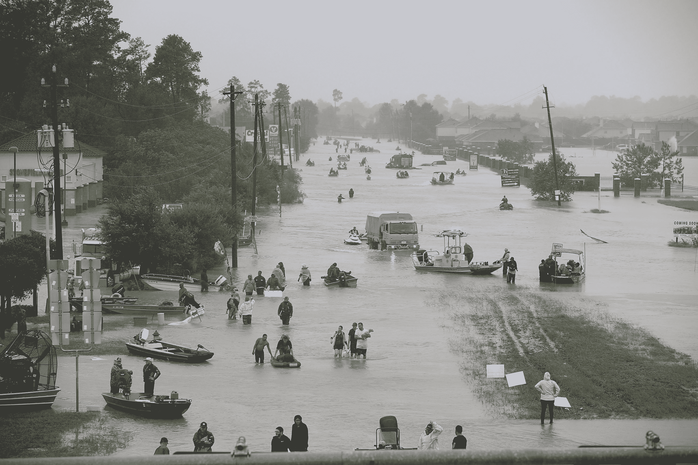

# 哈维之后，忽略气候辩论，专注于建设更好、更高效的城市 

> 原文：<https://web.archive.org/web/https://techcrunch.com/2017/09/02/after-harvey-ignore-the-climate-debate-and-focus-on-building-better-more-efficient-cities/>

随着热带风暴 哈维本周在路易斯安那州和得克萨斯州边境附近第二次登陆，[新奥尔良迎来了卡特里娜飓风 12 周年纪念日](https://web.archive.org/web/20221208164608/https://www.nytimes.com/2017/08/29/us/new-orleans-katrina-houston.html?_r=0)。

在这些风暴之后的几年里，这个国家不断遭受“历史性”气候事件的打击。

虽然这个国家一直受到大自然的打击，但州议会、市政厅和华盛顿的对话却陷入了关于气候变化的讨论。是什么造成的，该怎么办，我们在这里是谁的错。

左翼和右翼之间的争论最终是为了转移注意力，并为不愿告诉国家所面临的艰难而昂贵的选择的人提供政治掩护。

所以这里有一个适度的建议。忘掉气候变化吧。在不久的将来，让我们接受我们已经完蛋了，并讨论如何防止我们的城市成为美化的鱼缸，这样我们就可以拯救那些在这些天气事件中处于最危险的人口。使用技术可以帮助提供答案。

对于那些对仅在过去一年里发生的所有历史性灾难的程度感到好奇的人，请考虑以下几点。

2016 年 8 月，一场风暴淹没了东巴吞鲁日教区，摧毁了该市及其周围的城镇，摧毁了 3 万所房屋，[造成 13 人死亡](https://web.archive.org/web/20221208164608/http://abcnews.go.com/US/death-toll-rises-13-historic-louisiana-flooding/story?id=41470753)。

去年六月，26 人死于西弗吉尼亚州百年不遇的洪水(该州今年也被洪水淹没)。冬天，乔纳斯打破了有史以来最大的暴风雪袭击了几个城市，包括纽约、巴尔的摩和宾夕法尼亚州的哈里斯堡。暴风雪造成 50 人死亡，影响了 26 个州约 1.028 亿人。

再加上 2012-2016 年袭击加州的多年干旱(一些人认为这是 1200 年一遇的事件)，以及西南部的热浪，即使是不经意的观察者也能感觉到这里肯定发生了什么。

根据 NOAA 国家环境信息中心的数据，自 2001 年以来，自然灾害已经造成了大约 8140 亿美元的损失。在此前的 20 年里，总额为 4394 亿美元。(哈维的清理工作预计将在此基础上再增加 1900 亿美元。)

在所有这些过程中，本可以用来为城市应对下一场自然灾害做准备的联邦资金被占用了[，这要归功于一场关于](https://web.archive.org/web/20221208164608/http://www.latimes.com/opinion/editorials/la-ed-harvey-global-warming-trump-flood-20170830-story.html)[气候变化是否是之前发生的事情的罪魁祸首](https://web.archive.org/web/20221208164608/https://www.washingtonpost.com/opinions/harvey-should-be-the-turning-point-in-fighting-climate-change/2017/08/29/21c53244-8cd2-11e7-84c0-02cc069f2c37_story.html?utm_term=.08ee4304d241)的辩论。

政府官员、保守派议员和智囊团都刻意避免将哈维的病情归咎于气候变化，或者嘲笑那些认为是气候变化的报道。控制着众议院和参议院数十亿美元的立法者已经公开反对批准任何以气候变化概念为逻辑基础的政策。

总统收回了前任政府要求基础设施项目在开发过程中考虑气候变化和海平面上升的命令。

美国总统唐纳德·特朗普和第一夫人梅兰妮·特朗普于 2017 年 8 月 29 日离开 DC 华盛顿州的白宫，前往得克萨斯州查看飓风哈维造成的损失。尼古拉斯·卡姆/法新社/盖蒂图片社

准将将军 Gerald E. Galloway(退役)说:“在未来的二三十年里，我们都无法应对气候变化。”气候与安全中心顾问委员会成员、马里兰大学公共政策学院工程学教授告诉我。“过山车已经到了最高点，它将以相当快的速度下降。所以你最好开始准备处理这件事。”

对加洛韦来说，这意味着动员地方和州政府，教育民众采取措施减轻与气候相关的自然灾害的风险(FEMA 已经建议人们计划自给自足 72 小时)。

由于气候变化的争论，盖洛维将军对联邦政府的角色也不看好——至少在短期内。“我不会对华盛顿的这些家伙抱太大期望，”他说。“就处理气候问题而言，他们对这个词的使用如此偏执，以至于人们回避他们需要解决的问题。”

## 设计更安全的生活

幸运的是，州和城市——甚至公民个人——可以采取措施为未来做准备，包括更恶劣的天气和更频繁的自然灾害。技术在增强应对能力方面发挥着作用，让城市更具复原力，让市民更好地准备应对这些灾难。

“当其中一个事件发生时，每个人都开始转向基础设施，并问‘我们该怎么办？’布鲁金斯学会大都市政策项目的高级研究员约瑟夫·凯恩告诉我。

他的回答？凯恩说:“我们正面临一些极端气候事件，我们需要实际升级和现代化我们的基础设施系统，有些系统已经有 100 多年的历史了。”

Sidewalk Labs 的联合负责人 Rit Aggarwala 是纽约可持续性和弹性计划的作者，他将政府应对自然灾害及其影响的方式分为四类:预测、缓解、救援和重建。

在每一个不同的阶段，新技术公司和服务都可以发挥作用。事实上，在纽约，当 Aggarwala 实施新的可持续性和弹性计划时，技术在这一过程中发挥了关键作用。

## 大城市，遇见大数据

Aggarwala 说:“我们在 20 世纪 30 年代和 50 年代绘制的一套洪泛区地图是用当时精确和先进的测量技术绘制的，但现在已经不精确了。”。

该市购买了使用激光雷达技术制作的新地图，这些地图为该市预测纽约在遭遇大风暴时可能会发生洪水提供了基础。仅仅几年后，当飓风桑迪席卷纽约和新泽西时，这座城市的理论受到了考验。

“正是利用这些数据，对飓风桑迪将席卷纽约的位置做出了非常准确的预测，”Aggarwala 说。"它能让你更准确地制定疏散计划."

更好的制图技术可以让城市规划者知道哪里的自然灾害影响最大，但预测这些灾害需要更精确的事件信息。科技在这方面也能有所帮助。

兰德公司(Rand Corporation)基础设施、复原力和环境政策项目主任本杰明·普雷斯顿(Benjamin Preston)告诉我，“越来越多的预测正被私营部门掌握……尤其是在农业部门。“对于私营技术公司来说，这是他们真正投入巨资来利用和管理风险并最大限度地提高生产率的领域。”

这些数据收集技术的含义不仅仅是洪水。来自气候公司、T2 气象公司、T4、T5、T6、T7、T8、KatRisk、T9 和 T10 天气风险管理服务公司的数据可以帮助加州等州应对干旱。普雷斯顿说:“如果我们能够在干旱的严重程度、干旱的持续时间以及干旱可能结束的时间方面获得更长的前置时间，那将有助于规划。”。

## 面向所有人的分布式能源和水管理系统

如果分析和绘图可以帮助预测事件并部分缓解其严重性，那么微电网等分布式能源系统以及太阳能和风能等可再生能源可以减轻集中式电力系统崩溃时的潜在电力损失。

这与这些发电技术的排放情况无关。相反，它是关于使电网更加灵活，减少对大型集中式发电厂和传输网络的依赖，这些发电厂和传输网络可能会在强大的风暴、地震、火灾或洪水中发生故障。

根据 Aggarwala 的说法，在这方面，像特斯拉这样的公司，凭借其[太阳能电池阵列和](https://web.archive.org/web/20221208164608/https://www.tesla.com/powerwall)Powerwall，可以提供有所帮助的技术。

“预测你的降雨量，并在风暴到来前 12 小时将你的蓄水池和湿地抽干——今天在休斯顿没有任何方法可以帮助你——但在你得到 12 英寸而不是 50 英寸降雨量的情况下，”Aggarwala 说。

## 消费者技术拯救世界

Aggarawala 还认为，消费者技术在救援工作中发挥着作用，与联邦、州和地方机构协同行动。社交网络已经在为哈维的救援工作尽自己的一份力量。

“ [Cajun Navy，](https://web.archive.org/web/20221208164608/https://www.youtube.com/watch?v=fATmpZpY47k)”来自路易斯安那州的公民水手组成的大杂烩，他们首先在社交媒体上动员起来，以应对去年巴吞鲁日的洪水，他们使用 Twitter 和脸书来帮助他们救援受哈维影响的人。

下面是一群好心人的更多背景资料，他们来到德克萨斯帮助恢复和救援工作，[由 NOLA.com](https://web.archive.org/web/20221208164608/https://www.youtube.com/channel/UC5Y52fCWFDJh-4wkgSH4wDQ)提供。

脸书、推特、Instagram 和 Snap 都被用来讲述受害者的故事，并发布援助请求——通常是在执法人员和其他第一反应者的抗议下——普雷斯顿称之为社交媒体时代登陆的第一场大飓风。

“你现在在社交媒体上看到这么多故事，说‘是的，我很好。’或者‘不，我不好，我需要被拯救。普雷斯顿说:“这让你尝到了(社交媒体)在紧急情况应对方面的沟通中所能发挥的作用。”。

## 难题和硬件解决方案

Aggarwala 还建议，房主可以让第一反应者访问 Nest 或 Canary(有限制)等家庭安全和自动化系统，以提供关于家中谁可能需要救援的更好数据，或在危机情况下远程监控邻居。

普雷斯顿说，其他硬件技术也可以帮助急救人员和恢复工作。他指出，几家无人机公司，如:[预警实验室、](https://web.archive.org/web/20221208164608/https://www.earlywarninglabs.com/) [无人机冒险、](https://web.archive.org/web/20221208164608/http://droneadventures.org/) 精确鹰、 [德事隆系统](https://web.archive.org/web/20221208164608/http://civilcommercial.textronsystems.com/disaster)都在致力于救灾和恢复工作。

凯恩认为，至关重要的是，所有这些技术都应该有超越其在危机时刻提供帮助的潜力的应用。“我们需要在全国范围内对基础设施做些事情，”凯恩说。“不仅仅是极端天气事件，还有慢性应激源……这些系统都很陈旧，实际上已经被淹没了。”

德克萨斯州休斯顿-8 月 28 日:2017 年 8 月 28 日，在德克萨斯州休斯顿，该地区被飓风哈维淹没后，人们走在被洪水淹没的街道上，因为他们撤离了家园。哈维于周五晚些时候在科珀斯克里斯蒂北部登陆，预计未来几天德克萨斯州的降雨量将高达 40 英寸。(照片由乔·雷德尔/盖蒂图片社拍摄)

## 弹性是答案

这需要超越目前主导基础设施对话的“修理和更换”心态。

“我们已经建立了一个庞大的交通系统、能源系统和供水系统网络，而这些系统正接近其生命的尽头。”

为了看一看那些将这些经验铭记于心的项目，凯恩指出了纽约的“[大 U](https://web.archive.org/web/20221208164608/http://www.rebuildbydesign.org/our-work/all-proposals/winning-projects/big-u)；新奥尔良的[gentily Resilience 区](https://web.archive.org/web/20221208164608/https://nola.curbed.com/2016/1/27/10843012/gentilly-resiliency-district-informatio)；以及[弹性奥克兰](https://web.archive.org/web/20221208164608/https://beta.oaklandca.gov/issues/resilient-oakland)，这一切都源于洛克菲勒基金会的 [100 个弹性城市](https://web.archive.org/web/20221208164608/http://www.100resilientcities.org/)计划。

盖洛维将军说，更好发展的责任从拥有住房或租房的个人延伸到地区、州和联邦官员。

“你不能征税，但如果你要重建你的房子，你可以提高它的高度。你可以让它更防水。”

所有这一切都发生在凯恩承认整个美国基础设施目前正在失败，需要采取一些措施来解决这个问题的时候。这也发生在自动驾驶汽车、新型材料和改进的数据收集和分析系统等技术可能迎来基础设施建设和最有效利用方式的复兴的时候。

(从埃隆·马斯克在特斯拉的实验到埃隆·马斯克在 Hyperloop 的实验，一切都说明了这一点。)

Aggarwala 说:“当你可以进行投资，而不仅仅是防范不良资产时，这是一个巨大的机会。”“只有当它能带来持续的好处时，你才会花这笔钱。”