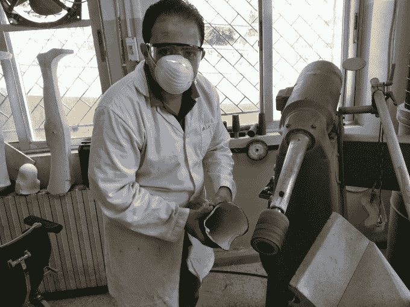
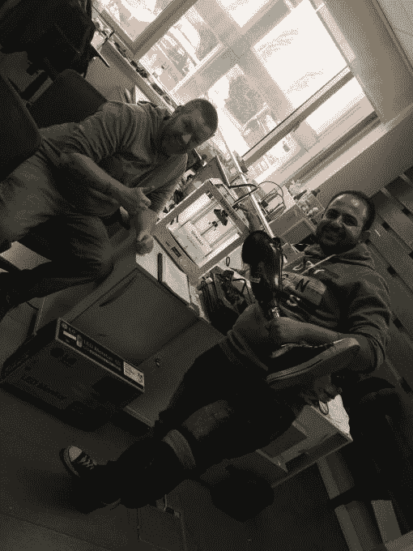

# 失去一条腿后，一名叙利亚战争幸存者求助于科技 3D 打印假肢 

> 原文：<https://web.archive.org/web/https://techcrunch.com/2016/05/15/after-losing-his-leg-a-syrian-war-survivor-turns-to-tech-to-3d-print-prosthetic-limbs/>

法里德 y .法里德撰稿人

More posts by this contributor

【2013 年 4 月，在大马士革西南的一个小镇上，一颗炮弹炸掉了他的左腿，22 岁的阿塞姆·哈斯纳听到了五分钟的死寂。

当巴沙尔·阿萨德的叙利亚军队炮击该地区时，一名数学专业的学生变成了志愿护理人员 Hasna，他在 Khan El Shih 前线装载受伤的叛军后打开了救护车门。

“爆炸太大了，我甚至没有意识到我的腿已经不在了。这一切发生得太快了，”哈斯纳在柏林举行的科技大会间隙告诉 TechCrunch。

哈斯纳被 2011 年阿拉伯各国首都掀起的民主浪潮迷住了。他一整年都在面对催泪瓦斯和子弹参加反对阿萨德政权的示威游行。

然而，随着局势恶化为全面内战，目前已夺去 25 万人的生命，400 多万人流离失所，他决定在 2013 年 2 月离开他在大马士革农村的家乡 Qatana。

警方搜查了他的家，并拘留了他的父亲，讽刺的是，他的父亲是国防部的翻译。在臭名昭著的阿德拉监狱呆了一段时间后，他在几周后被释放。

在与以色列接壤的 T2 城镇汗埃尔希，哈斯纳在一个临时医院工作，这个医院位于一个蔬菜仓库的地下冷藏库里。

“我在那里看到了噩梦的东西。很多尸体和重伤，我们治疗了所有人，甚至是政府军的士兵。我们没有歧视，我们必须尽可能挽救更多的生命。

由于他的断腿大量出血，他时而昏迷，医院的同事立即将他和其他 13 名战士一起送往约旦治疗。在夜深人静的时候，用卡车走私，躲避子弹和检查站，哈斯纳勉强活了下来。

“没有水和食物。我们只想去安曼。我们小组中有两人不幸在途中死亡，因为他们伤势严重”。

在背信弃义地穿越边境后，他从一家医院辗转到另一家医院，接受了五次截肢手术。

在康复期间，他是美国国务院和红十字会联合项目的一部分，该项目旨在培训叙利亚人成为假肢技术人员，为其他战争幸存者开发新的肢体。他第一次看到 3D 打印机，就迷上了。

[https://web.archive.org/web/20221006172733if_/https://www.youtube.com/embed/qhsnGAKI80s?feature=oembed](https://web.archive.org/web/20221006172733if_/https://www.youtube.com/embed/qhsnGAKI80s?feature=oembed)

视频

“真是奇怪。我知道 2D 打印机是如何工作的，但我想了解更多关于 3D 打印机的信息，并使用开源软件在网上如饥似渴地学习，”Hasna 指出。“你只需要练习，用你自己的双手”。

他开始与安曼一家名为 3D MENA 的 3D 打印初创公司合作，并学会了如何在三天内编写微芯片，掌握了使用 Arduino 的仿生假肢技术。

哈斯纳的注意力转向为假肢寻找低成本的解决方案，这些假肢在适应截肢者方面远非完美。

他为他的朋友艾哈迈德·奥拉比(Ahmed Orabi)开发了一种回声定位触觉设备(T1)，奥拉比在叙利亚的狙击火力中失明，他可以通过感觉振动来感知物体行走时的深度。

哈斯纳还在脚踝和脚跟之间印上了一个耐用的橡胶部件，这有助于稳定他的假腿，价格约为 2 美元。

“使用 3D 打印机作为低成本解决方案是有实际应用的，”他补充道。

[Muhammad Radwan](https://web.archive.org/web/20221006172733/https://re-publica.de/member/1137) ，一位埃及裔美国技术创新者，邀请 Hasna 参加今年在 re:publica 举行的[全球创新大会](https://web.archive.org/web/20221006172733/https://re-publica.de/global-innovation-gathering)，他同意告诉 TechCrunch，“现在这个地区正在发生一场运动，人们意识到制造过程正在变得分散，如果你想制造什么东西，你现在可以自己动手了”

随着在约旦支持性创业社区的成功，哈斯纳在安曼生活了两年后也面临困难，因为当局开始打击在这个已经收容了 100 多万寻求庇护者的高度紧张的国家工作的叙利亚人。

2015 年 9 月，他大胆地和受伤的室友决定踏上前往德国寻求庇护的艰难旅程。

他们飞往伊斯坦布尔，然后乘车前往伊兹密尔，找到一名走私者，每人支付了 1000 多美元，并在黄昏时分登上一艘挤满人的 6 米充气船，前往希腊的莱斯博斯岛。

“在你和死亡之间是一个波浪”哈斯纳悲伤地回忆道。“这是一次充满痛苦的旅行”。

在一周内，他和他的残疾朋友一起从希腊到马其顿，然后是克罗地亚、匈牙利、奥地利，最后是德国，都是用义肢。

在等待他的德国居留文件被接受的同时，Hasna 在他现在居住的柏林营地为孩子们举办编程课程，使用 Arduino 并传授一些他新获得的假肢数字制造知识。

他也在为[难民开放软件](https://web.archive.org/web/20221006172733/http://www.row3d.org/)磨练自己的技能，这是一个他在约旦合作过的组织，他使用激光切割机和铣床。

“开源技术打开了我的世界。它让我的生活变得更好，我想把它传给下一代，”他说。