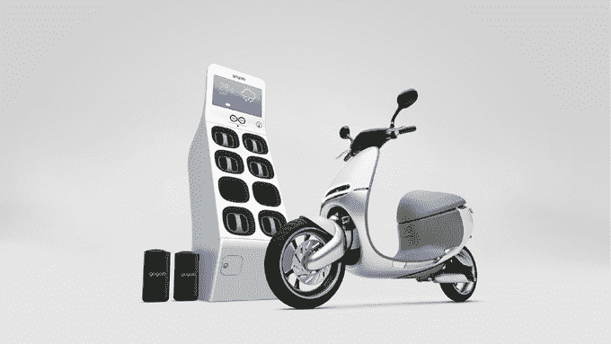
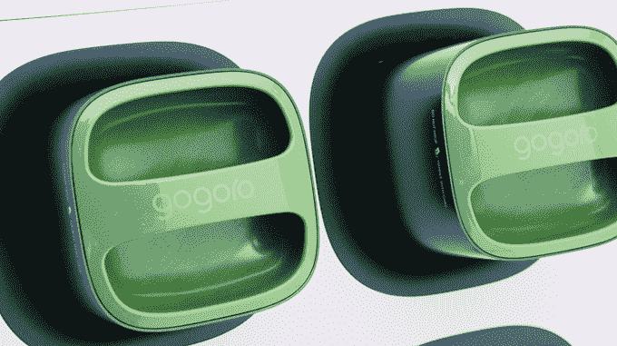
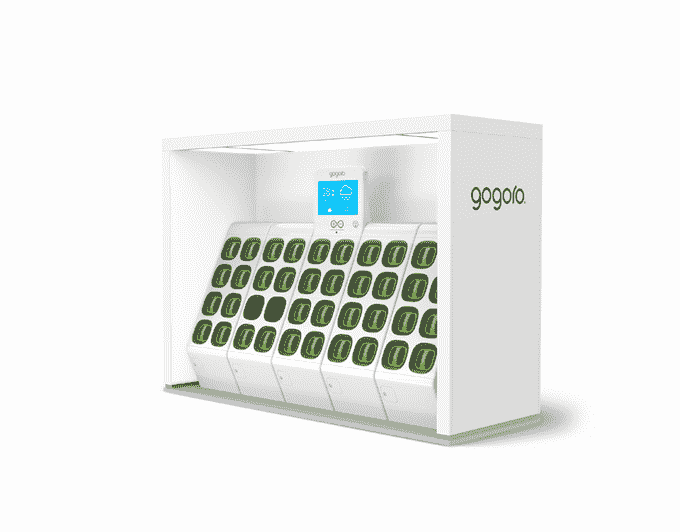
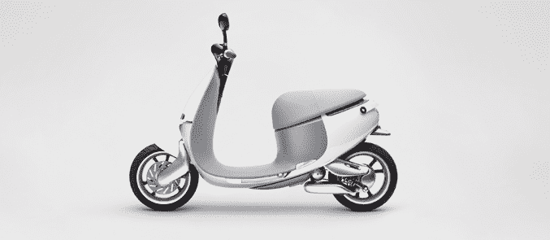
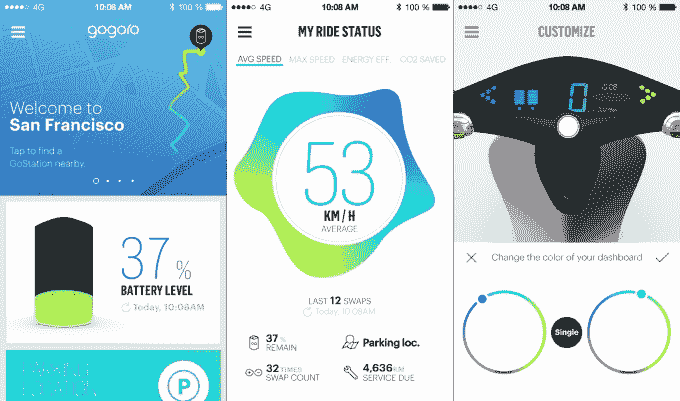

# 在隐形模式下融资 1.5 亿美元后，Gogoro 到底是个什么鬼？

> 原文：<https://web.archive.org/web/https://techcrunch.com/2015/01/05/after-raising-150-million-in-stealth-mode-what-the-heck-is-gogoro/>

2011 年，Gogoro 融资 5000 万美元。三年后，又是一亿美元。然而，似乎没有人知道 Gogoro 到底在做什么。

直到现在。

在过去的三年里，该公司设法将他们的计划几乎完全保密，今天早上在 CES 上推出了他们的第一款产品。几周前我们和他们谈过。

**直到今天，这里是所有人真正了解该公司的:**

*   它在研究与能源有关的东西
*   它的血管里有很多 HTC。它的一些工程师来自 HTC 其联合创始人之一霍勒斯·卢克(Horace Luke)在 2007 年至 2011 年期间担任 HTC 的首席创新官；他们筹集的 1.5 亿美元中，很大一部分是由 HTC 董事长王雪红捐赠的。

为了简化该公司所宣传的复杂的多年计划，Gogoro 目前正在做两件事:一件是他们称为 Smartscooter 的电动滑板车，另一件是为其供电的电池交换基础设施。

踏板车和电池网络是一枚硬币的两面，但踏板车似乎是一块垫脚石——开始为其电池交换网络奠定基础的第一步，该公司显然希望它能为许多小工具提供动力——无论是车辆还是其他东西——向前发展。

## 电池和 GoStation 集线器

电池特写

我们将从这里开始，虽然看起来很简单，但电池是总体概念的核心。

Gogoro 已经制造了一种新的电池来为其滑板车提供动力——并且有可能为其他发展中的事物提供动力。该公司的创始人大谈他们的电池能够串联起来为任何东西供电，从吹叶机到全尺寸汽车。

Gogoro 的每个电池都由松下的 18650 锂离子电池(与特斯拉 Model S 使用的电池相同)和几十个传感器组成，大小约为一个大鞋盒，重量约为 20 磅。

当需要更多果汁时，智能手机上的一个应用程序会指引你去最近的“GoStation”中心。每个集线器大约 6 英尺高，完全不受天气影响，可以同时容纳和充电 8 块电池。集线器可以链接在一起，如下图所示。

走过去，把你的电池放进一个开口的槽里；6 秒钟后，充满电的电池从另一个插槽中弹出。

你可以在到达之前预订电池，确保在途中别人不会偷走你的手机。

值得注意的是，与特斯拉不同，Gogoro 的客户从未真正“拥有”他们的电池。你不能在家里给这个东西充电。

相反，客户通过订阅来租赁电池，这使你可以访问交换网络——但至少在几周前，当我与该公司的创始人交谈时，他们仍然不太确定这一切的成本。

这些 GoStation 枢纽的分布和集中将是 Gogoro 成功的关键——没有人想要一辆他们不会驾驶的电动汽车。他们希望这些东西能在大都市地区的城市范围内提供，它们的密度与城市人口成比例。起初，他们的重点是像加油站这样的地方——但是他们注意到集线器可以安装在任何有 220 伏电源插座的地方。

联合创始人霍勒斯·卢克告诉我:“我们可以用一辆卡车，装上足够多的集散中心，覆盖一个大学校园或一个小城市。”。

就像电池上的订阅模式一样，对于希望安装一个集线器的企业主来说，这似乎并不是一成不变的。

## 智能滑板车

Gogoro 从头开始建造这个东西，从马达到车架。

它在 4.2 秒内从 0 加速到 30 英里，最高时速约为 60 英里。在滑板车的两个电池槽都充满的情况下，它的最大行驶里程接近 100 英里。它是城市骑手，不是公路旅行马。

正如你可能期望的那样，一个有着如此多智能手机血统的团队是非常聪明的。

它通过蜂窝连接与云相连，30 个机载诊断传感器可以跟踪几乎任何可能出错的情况。如果有什么东西坏了或者需要维护，你会在下次打开应用程序时听到，或者，如果没有，在下次更换电池时从集线器的显示屏上听到。

与此同时，车载传感器也在测量你的骑行方式——这样滑板车就可以不断调整自己的电源管理，以优化你的骑行方式，并提供如何获得更好里程的提示。如果你上坡时倾向于把油门开得太大，只是在浪费汽油，踏板车会告诉你。

BluetoothLE 密钥卡可以锁定和解锁您的踏板车，打开您的座椅下的存储空间，并在 GoStation hub 识别您的身份。

想改变你仪表板的颜色吗？只要跳进应用程序，滑动拨号器。想改变用遥控器锁定/解锁滑板车时闪烁的灯的模式吗？再说一遍，就在 app 里。

但是踏板车要花多少钱呢？像许多其他涉及金钱的细节一样，该公司仍在解决这个问题。

写这样一家公司是一种挑战，因为有太多的东西取决于上市时看不到的东西。市场要不要一个他们在家充不了电的电动滑板车？Gogoro 的电池最终会像该公司明确希望的那样，在踏板车之外找到许多用途吗？他们能够将他们的充电网络扩展到一个让整个事情物有所值的密度吗？

今天，我将把我的评论限制在我*能*看到的范围内——那是一辆非常漂亮的滑板车，有一个有趣的电池系统和一个漂亮的智能手机应用程序。踏板车是一个很值得一看的景观——尽管踏板车可能很“漂亮”,但它确实非常漂亮。

[gallery ids="1100462，1100463，1100464，1100465"]