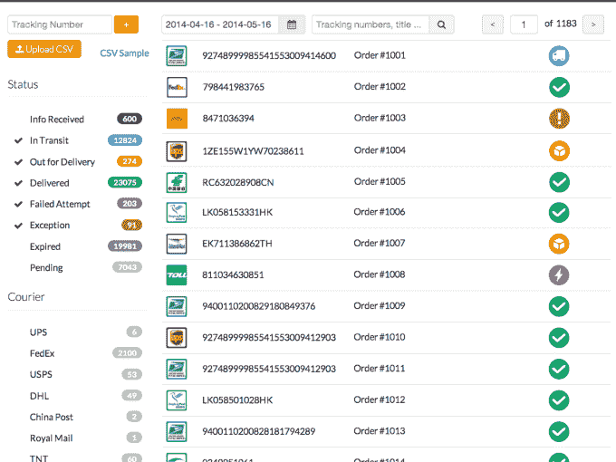

# AfterShip 从 IDG 加速公司获得 100 万美元，使包裹追踪不再像噩梦一样 

> 原文：<https://web.archive.org/web/https://techcrunch.com/2014/05/20/aftership-lands-1m-from-idg-accel-to-make-tracking-packages-less-nightmarish/>

追踪包裹对于在线供应商来说是一件非常麻烦的事情，尤其是对于通过当地邮政服务进行的国际运输。一旦一件物品出国，跟踪往往会停止，卖家和客户都处于悬念中，直到该物品(有希望)再次出现并安全送达。

[after ship](https://web.archive.org/web/20230119143017/https://www.aftership.com/),[TechCrunch 去年首次对其进行了描述](https://web.archive.org/web/20230119143017/https://techcrunch.com/2013/01/15/aftership-launches-package-tracking-api-gives-amazon-style-post-sale-powers-to-any-online-merchant/)，它解决了这一问题，让供应商能够在同一平台上跟踪不同承运商的多批货物。AfterShip 最初的目标是中小型企业，现在的客户包括主要的电子商务网站，如 [Groupon Goods](https://web.archive.org/web/20230119143017/http://www.groupon.com/deals/g1gd-riptunes-mp3-nyc) 、 [Etsy](https://web.archive.org/web/20230119143017/http://www.etsy.com/) 、 [Wish](https://web.archive.org/web/20230119143017/https://www.wish.com/) 和 Rocket Internet properties[Zalora](https://web.archive.org/web/20230119143017/http://www.zalora.com/)和 [Lamido](https://web.archive.org/web/20230119143017/http://www.lamido.com/) 。

这家总部位于香港的初创公司今天宣布，它已经完成了来自 [IDG 资本合伙公司(IDG-加速)](https://web.archive.org/web/20230119143017/http://www.idgvc.com/en/about/)的 100 万美元 A 轮投资，该公司的其他投资包括中国顶级互联网公司[百度](https://web.archive.org/web/20230119143017/http://www.baidu.com/)和[腾讯](https://web.archive.org/web/20230119143017/http://www.tencent.com/)。

AfterShip 将利用这笔资金为卖家开发交付分析工具，以便他们可以看到不同承运人的表现，跟踪延迟的货物，并为客户提供更准确的交付时间估计。

“每个承运人都说他们是最快的，但往往当他们承诺两天发货时，包裹实际上并没有在两天内到达。AfterShip 的联合创始人、CMO 的安德鲁·陈(Andrew Chan)表示:“不同国家的货运类型不同，或者他们不诚实，或者做得不如他们说的那么好。”。“我们可以让公众和商家对运营商的表现有一个客观的看法。”

AfterShip 让在线卖家可以访问其货物跟踪 API，他们可以通过跟踪按钮小工具或作为电子商务平台上的应用程序将这些 API 集成到他们的网站上 [Shopify](https://web.archive.org/web/20230119143017/http://www.shopify.com/) 、 [Bigcommerce](https://web.archive.org/web/20230119143017/http://www.bigcommerce.com/) 、[易贝](https://web.archive.org/web/20230119143017/http://www.ebay.com/)和 [Magento](https://web.archive.org/web/20230119143017/http://www.magento.com/) 。

该公司成立于 2011 年 12 月，于 2013 年 7 月向公众推出。从那时起，它已经与全球 183 家运营商整合，拥有超过 15，000 名用户。AfterShip 表示，它目前每月跟踪 300 万次活跃发货，每月增长 25%。

该平台与 58 个国家的政府运营的邮政服务相集成，这使他们能够跟踪跨国运输。例如，如果由美国邮政署​发送的包裹被递送到香港，那么一旦该包裹落入香港邮政手中，AfterShip 将自动继续跟踪该包裹。一旦包裹被投递到最终地址，供应商和客户就会收到短信通知。

对于大型电子商务公司来说，AfterShip 省去了他们必须访问每个运营商网站的工作。

“以 Groupon 为例，他们使用了 100 多家运营商。这就是为什么他们需要一个单一的解决方案，因为运营商的网站在技术上不是很友好，他们需要一个单一的层，如 AfterShip，来与他们集成，”Chan 说。