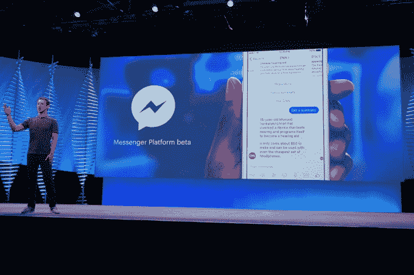
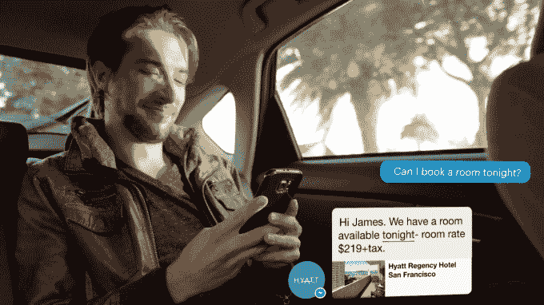
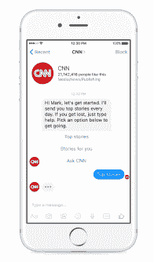

# 脸书推出聊天机器人信使平台

> 原文：<https://web.archive.org/web/https://techcrunch.com/2016/04/12/agents-on-messenger/>

脸书现在将允许企业通过聊天机器人提供自动化的客户支持、电子商务指导、内容和互动体验[。通过其庞大的开发者和商业生态系统提供实用程序，脸书可以通过 Messenger、one-up SMS 提高忠诚度，并跟上聊天竞争对手，如拥有自己的机器人平台的](https://web.archive.org/web/20230326052839/https://www.messenger.com/platform) [Kik](https://web.archive.org/web/20230326052839/https://techcrunch.com/2016/04/05/chat-app-kik-launches-a-bot-store-and-anyone-can-make-bots-for-it/) 、 [Line](https://web.archive.org/web/20230326052839/https://techcrunch.com/2016/04/07/line-is-the-latest-mobile-messaging-app-to-introduce-bots/) 和 [Telegram](https://web.archive.org/web/20230326052839/https://techcrunch.com/2016/04/12/telegram-beefs-up-its-bot-platform/) 。

这证实了 TechCrunch 一月份的独家报道，即[脸书正在与聊天机器人开发者](https://web.archive.org/web/20230326052839/https://techcrunch.com/2016/01/05/facebook-messenger-bots/)合作，上周，一个自动化代理程序[将在 F8 推出。](https://web.archive.org/web/20230326052839/https://techcrunch.com/2016/04/07/facebook-chatbots/)【更新:该平台的官方名称是“信使上的机器人”，而不是“信使上的代理”，这是以前的代号。]

脸书宣布了一系列与早期开发者合作的聊天机器人，比如 1-800-Flowers，所以你可以通过向它的信使机器人发送朋友的名字来订购鲜花。或者 CNN 可以给你发一份符合你兴趣的故事的“每日文摘”，跳过你不关心的话题。

扎克伯格解释说，通过人工智能和自然语言处理结合人类的帮助，人们将能够像与朋友交谈一样与信使机器人交谈。

*要了解更多关于 F8 的真实含义，请阅读我的随想:[活着的脸书](https://web.archive.org/web/20230326052839/https://techcrunch.com/2016/04/12/facebook-alive/)*

## 信使机器人如何工作

通过[信使平台的新发送/接收 API](https://web.archive.org/web/20230326052839/http://newsroom.fb.com/news/2016/04/messenger-platform-at-f8/) ，机器人可以发送的不仅仅是文本。他们将能够用包含图像、链接和行动号召按钮的[结构化消息](https://web.archive.org/web/20230326052839/https://developers.facebook.com/blog/post/2016/04/12/Bots-for-Messenger/?revisionid=269931516688945)做出回应。这些服务可以让用户预订餐厅、查看电子商务订单等等。你可以在产品传送带上刷一下，然后跳到网上付款。

重要的是，脸书的 Messenger 平台目前不允许通过添加到 Messenger 的信用卡直接支付。

 

Messenger 顶部的一个新的持久搜索栏将帮助人们发现机器人。对于已经通过短信与客户联系的公司，由于与 Twilio 的合作，一个电话号码匹配工具将让他们轻松地将这些对话转移到人们的 Messenger 帐户。为了让人们保持控制，每个机器人对话的顶部都会出现一个阻止按钮，这样你就可以很容易地让他们安静下来。

开发者将能够建造自己的机器人，或者与脸书的机器人建造伙伴合作。但脸书也有自己的机器人引擎，它建立在收购自然语言界面初创公司 Wit.ai 的基础上。基于脸书用来教授自己的人工智能 M 的相同系统，开发人员可以向机器人引擎输入样本对话，它将学习如何自行处理类似的对话。

## 让人类变得过时

聊天机器人突然成了科技领域最大的东西。它们释放了提供个性化、交互式沟通的能力，类似于与人类客户服务或销售代表交谈，但在规模上比呼叫中心便宜得多。

保守估计，聊天机器人可以取代 1-800 号码，提供更舒适的客户支持体验，而没有同步电话对话、等待时间和烦人的电话树的麻烦。

但如果 Messenger 和其他聊天机器人平台上的机器人蓬勃发展，它们可能会重新定义企业销售产品和服务的方式。聊天机器人可以询问你的标准，并显示需要购买的相关商品，而不是在应用程序中徘徊。聊天机器人可以了解你喜欢什么，并提供个人摘要和建议，而不是在新闻网站上筛选大量内容。

目前，脸书一直保留其收购的 WhatsApp 作为更清洁的通讯体验，同时在自己的聊天应用上尝试内容和商业。但如果 Messenger 上的聊天机器人成功了，脸书可能会允许 WhatsApp 上的聊天机器人，目前 WhatsApp 已经关闭了聊天机器人。

聊天机器人平台不是慈善机构。脸书还计划通过允许企业向已经自愿开始与企业对话的人发送“赞助信息”广告来赚钱。广告商也可以购买“点击发送消息”的新闻提要广告，与他们的机器人进行对话。两者都可以让机器人推动人们购买产品，以收回广告成本。

脸书肯定不是镇上唯一的聊天机器人游戏，但由于 Messenger 的 9 亿用户，它与广告商的巨大联系以及多年来建立的健康的开发者生态系统，它可能会提供最有吸引力的平台来运行它们。企业关注顾客数量最多的地方，没有比脸书更大的了。