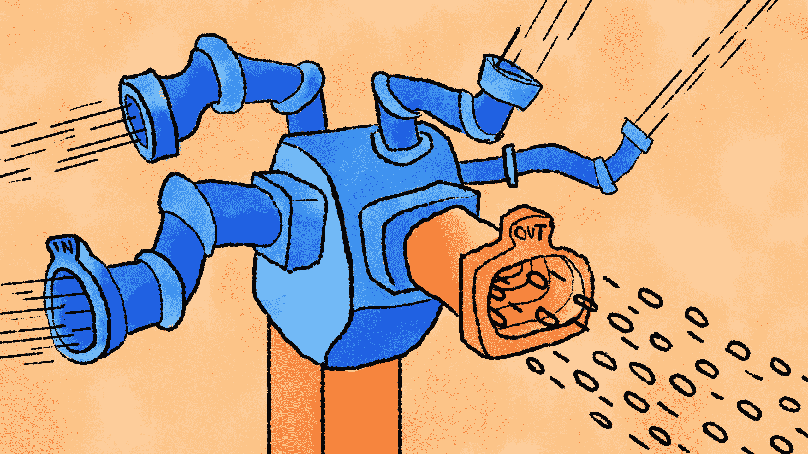

# “人工智能驱动”是科技对“所有自然的”|“科技危机”的无意义的等同

> 原文：<https://web.archive.org/web/https://techcrunch.com/2017/01/10/ai-powered-is-techs-meaningless-equivalent-of-all-natural/>

人工智能和鸡蛋价格有什么共同点？

假设您正在尝试决定商店里 9 种或 10 种不同的鸡蛋。有一句话吸引了你的眼球:“很自然。”嗯，这很好，自然也很好，而且只要多 30 美分——你可以买那些。现在，这些鸡和它们生产的鸡蛋可能比其他的更自然，也可能不更自然——因为没有官方甚至普遍认可的*自然的定义*。这是一个常见的策略，让您免费支付 30 美分。同样的事情正在成为科技领域的一个问题——但是对于人工智能来说。

人工智能没有官方或普遍认可的定义——如果你想知道为什么，我写了一篇非常模糊的帖子，名为 [WTF is AI](https://web.archive.org/web/20230407180527/https://techcrunch.com/2016/12/04/wtf-is-ai/) ，你可能会喜欢。但这种缺乏共识的情况并没有阻止大大小小的公司将人工智能作为一项革命性的新功能纳入他们的智能电视、智能插头、智能耳机和其他智能苹果手机中。(当然，只有在最松散的意义上才是智能的:像大多数计算机一样，它们从根本上来说笨得像石头。)

现在，这里有两个问题。

## 可能不是人工智能

第一个问题是:因为人工智能的定义太模糊了，所以很容易说你的设备或服务有人工智能，并以一些听起来似乎合理的胡言乱语来支持这一点，比如在电视节目或用水模式中向神经网络输入大量数据。

“这个术语完全是胡说八道，”一家大型机器人公司的首席执行官说，该公司将保持匿名，但肯定在其机器人中使用大多数人都会同意的所谓人工智能。这是一个用来创造能力感知的营销术语，因为大多数人无法想象一个无能的人工智能。邪恶，也许(“对不起，戴夫，我做不到”)，但不是无能。

人工智能最近蓬勃发展，成为一个适合塞进每个特征项目列表的流行词，这至少部分与神经网络和人工智能的融合有关。在不深入研究杂草的情况下，这两者是不可互换的，但营销人员对待它们就像对待它们一样。

如今，我们经常听到的神经网络是一种处理大量数据的新方法，它通过重复的、结构化的数学分析来梳理数据中的模式。这种方法受到大脑处理数据的方式的启发，所以在某种程度上人工智能这个术语是恰当的——但在另一个更重要的方面，它非常误导人。

AI 是一个有自己含义和内涵的短语，它们与神经网络实际做的事情并不完全匹配。我们可能还没有很好地定义 AI*，但是我们确实有*几个*想法。可以肯定地说，虽然这些软件很有趣，用途广泛，并在创作中使用人类的思维过程作为灵感，但它们并不智能。*

 *然而，任何软件，在其开发的任何阶段，采用卷积神经网络、深度学习系统或诸如此类的东西，都被称为“由人工智能驱动”或其某种变体。

现在如果连专家都说不出 AI 是什么，那消费者还有什么希望？它只是功能列表中的另一项，对于阅读它的人来说，很可能和其他部分一样晦涩难懂。但他们知道人工智能是高科技，所有的大公司都在研究，所以有人工智能的产品*肯定*更好。就像一个人选择“天然”鸡蛋而不是另一个品牌——这个品牌可以很容易地在自己的盒子上贴上标签，没有什么正当理由。

## 即使它是…

第二个问题是，即使有一些标准来说明人工智能是什么和不是什么，并且我们承认这些系统符合它，这些也不是人工智能擅长解决的问题。

例如，一家公司吹捧一种人工智能引擎，用于推荐电视节目。想想吧。围绕这样一个主观话题，在如此有限的一组数据上释放一个深度学习系统，会产生什么样的洞察力？对于一个喜欢 CSI: Miami 的人来说，确定一个推荐并不是一个很难的问题。他们会喜欢感兴趣的人什么的。这些不是微妙的、隐藏的模式，只有在仔细审查后才会出现，或者需要几个小时的超级计算机时间才能弄清楚。

事实上，正如杰伦·拉尼尔在[人工智能的神话](https://web.archive.org/web/20230407180527/https://www.edge.org/conversation/jaron_lanier-the-myth-of-ai)中解释得很好，因为数据来源于人——例如，看这个的人也看那个——人工智能完全依赖于人类的智能来做出所有决定。人们已经做了*难*的部分——品味的发展，选择他们喜欢和不喜欢的节目，判断剧集的质量，表演和导演——而计算机所做的只是通过人类的智能进行搜索并返回相关的结果。

类似的说法也代表了物联网设备，如恒温器和现在的淋浴喷头，它们可以监控你的使用，并在知道你不在时推荐东西或节能。你家的 AI！它会告诉你什么时候牛奶不够了！它能识别谁在门口！这些同样是虚假的:数据集是稀疏和简单的，输出是二进制的或非常有限的。仅仅因为一台设备没有你用了 30 年的那台那么笨，并不意味着它就是智能的。相反，这些声称的智能是… [人工的](https://web.archive.org/web/20230407180527/https://www.youtube.com/watch?v=6YMPAH67f4o)。

这是科技公司创造的一种虚构，即人工智能有意义地改善了许多这些东西——除了首先是人工智能的虚构之外。依赖机器学习甚至可能对他们的目的有害，因为这些模型得出结论的方法通常是模糊的。

这有点像鸡蛋盒上常见的另一种营销伎俩。有没有见过一个承诺鸡是全素食饲养的？好贴心！问题:鸡不是素食者，它们吃虫子和臭虫——已经吃了几百万年了。事实上，很有可能让它们脱离原生饮食会对它们的生活和鸡蛋的质量产生负面影响。(顺带一提，你要的是“牧场养的”。)

也许你在想，好吧，人工智能专家先生，如果这些都不算人工智能，那什么算呢？为什么在写 [clickbait headlines](https://web.archive.org/web/20230407180527/https://techcrunch.com/2016/11/22/googles-ai-translation-tool-seems-to-have-invented-its-own-secret-internal-language/) 的时候，你对人工智能这个术语不那么挑剔？

嗯，这只是我的观点，但当我们谈论人工智能作为大公司和大学正在研究或开发的概念时，稍微扩展一下定义是没问题的。因为我们所谈论的实际上是一个新生的软件类别，当这些想法被大多数人理解为人工智能时，没有必要迂腐。但当公司利用这种基本的模糊性作为欺骗性的推销时，我觉得我必须反对。所以我做到了。

误导、夸大或完全捏造的功能列表是科技领域的神圣传统，因此这种做法并不新鲜。但是，当一个新的含糊不清的词进入趋势追踪营销人员的词典时，指出这一点是有好处的。也许有一天，人工智能真的会成为你在冰箱里寻找的东西，但那一天不是今天。*