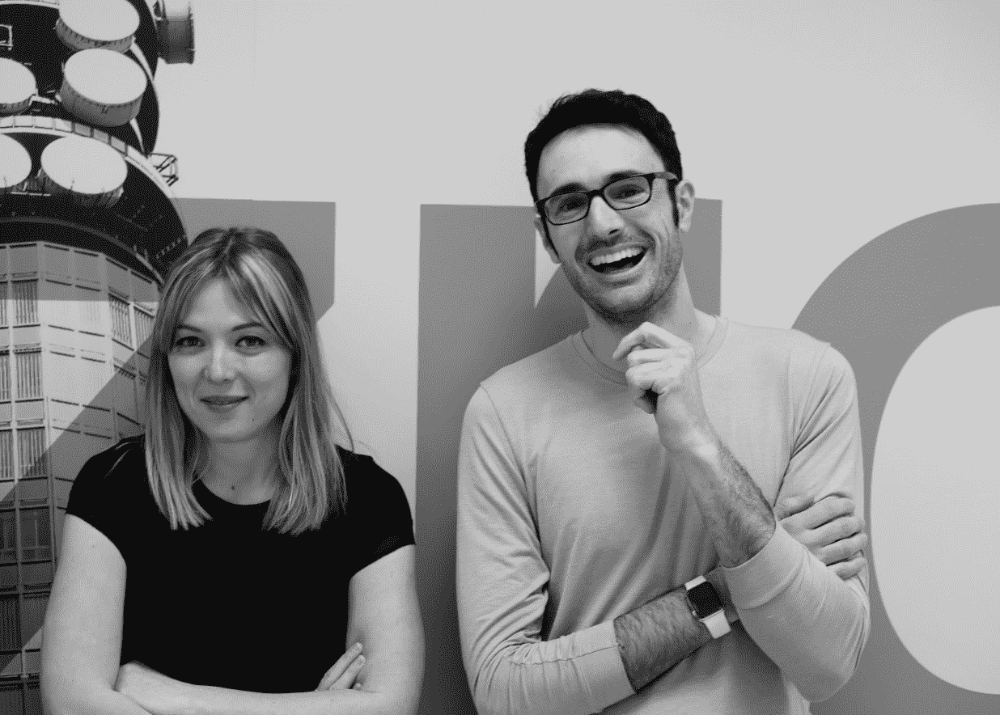

# 艾登完成了 750，000 美元的种子融资，以扩大营销人员 

> 原文：<https://web.archive.org/web/https://techcrunch.com/2017/03/29/aiden-closes-750000-seed-round-in-its-quest-to-amplify-marketers/>

# 艾登关闭了 75 万美元的种子轮，以寻求扩大营销人员

总部位于伦敦的初创公司 Aiden 正在开发一款基于机器学习的个人助理，以节省移动营销人员的时间和金钱，该公司今天完成了来自[基马风险投资](https://web.archive.org/web/20221209001049/http://www.kimaventures.com/)和一些天使投资人的 75 万美元种子轮投资，其中包括[尼古拉斯·平托](https://web.archive.org/web/20221209001049/https://www.crunchbase.com/person/nicolas-pinto)、[皮埃尔·瓦拉德](https://web.archive.org/web/20221209001049/https://www.crunchbase.com/person/pierre-valade#/entity)和[乔纳森·沃尔夫](https://web.archive.org/web/20221209001049/https://www.crunchbase.com/person/jonathan-wolf-2#/entity)。该团队首先在 TechCrunch Disrupt 的舞台上作为战场决赛选手展示了其服务[的功能。](https://web.archive.org/web/20221209001049/https://beta.techcrunch.com/2016/12/05/meet-aiden-your-new-ai-coworker/)

近年来，市场上新的监控平台泛滥，营销人员开始遭受信息瘫痪。Aiden 只是想帮助营销人员更快地获得他们需要的数据，而不是创建一个全新的端到端解决方案。

Aiden conversational assistant 旨在让关键绩效指标的查询像在亚马逊 Alexa 上查看天气一样简单。从技术角度来看，该团队正在将他们的努力集中在两个地方——自然语言处理和专家系统。

自然语言处理工作是直观的；在构建像 Aiden 这样的系统时，90%的挑战是获取任何给定用户查询的意图。花在 NLP 上的时间有助于艾登做出恰当的回应，不管问题是如何措辞的。

另一方面，对专家系统的强调就不那么教科书式了。自 20 世纪 70 年代以来，专家系统已经以某种形式出现。这个想法是，人类可以将他们的知识编码到计算机中，以后可以回忆起来——创造智能的幻觉。虽然大多数人认为它们已经过时，但专家系统体现了当前人机合作的精神。

艾登联合创始人玛丽·奥特蒂尔和皮埃尔-让·卡米莱里

Aiden 的联合创始人 Marie Outtier 是一名营销人员。她的联合创始人 Pierre-Jean Camillieri 围绕 Outtier 对行业的了解建立了 Aiden。因为艾登拥有关键绩效指标的基线预期，所以当某些东西似乎失去平衡时，它可以主动提醒营销人员。

当该公司结束测试后，它计划瞄准移动营销广告支出相对较高的企业——这往往包括许多初创公司。如果它能够跨越足够多的营销异常长尾，这应该允许公司更快地识别广告支出的不匹配，以更有效地分配有限的资源。