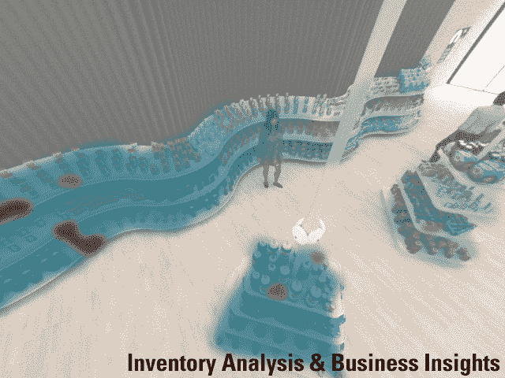
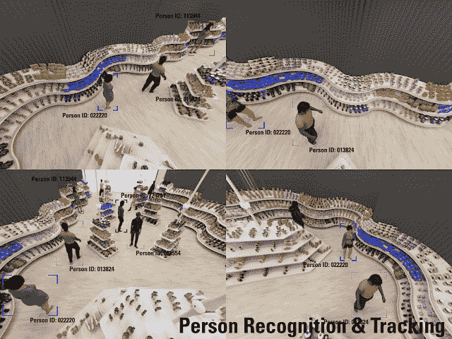
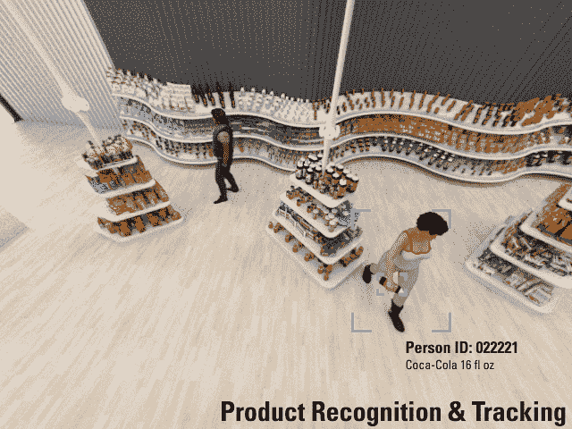

# AiFi 在无收银员零售领域脱颖而出，类似于 Amazon Go 

> 原文：<https://web.archive.org/web/https://techcrunch.com/2018/02/27/aifi-emerges-from-stealth-with-its-own-take-on-cashier-free-retail-similar-to-amazon-go/>

法威尔，出纳工作。继亚马逊在西雅图[推出无现金、无收银员的 Amazon Go 便利店](https://web.archive.org/web/20230201084552/https://techcrunch.com/2018/01/21/inside-amazons-surveillance-powered-no-checkout-convenience-store/)之后，一家名为 AiFi 的初创公司今天悄然出现，宣布向零售商提供自己的免结账解决方案。但与 Amazon Go 不同的是，AiFi 声称其基于人工智能、传感器和摄像头网络的系统可以从小型夫妻店一直扩展到拥有数万平方英尺和 10 万种产品的大型零售商。

AiFi 总部位于圣克拉拉，于 2016 年 1 月由 [Steve Gu](https://web.archive.org/web/20230201084552/https://www.linkedin.com/in/steve-gu-ab143318/) 和 [Ying Zheng](https://web.archive.org/web/20230201084552/https://www.linkedin.com/in/ying-zheng-1b9070a/) 这对已婚夫妇创立，他们之前曾在谷歌和苹果工作过。

Gu 是杜克大学的计算机科学博士，在苹果公司工作时曾研究过 3D Touch 和 Force Touch 技术。他后来去了 Google X，在那里为谷歌眼镜开发技术。

郑也是杜克大学的计算机科学博士，她最初在谷歌研究院工作，后来去了苹果公司，在那里担任高级研究科学家。

AiFi 的 25 人团队由具有计算机科学、计算机视觉和深度学习背景的其他工程师组成。

顾说:“顾名思义，我们认为人工智能应该像 Wi-Fi 一样普及。”虽然人工智能技术有很多应用，但 AiFi 专注于大规模零售，因此未来的商店——除了亚马逊的商店——可以实现免结账。“这基本上证明了人工智能已经变得有多好，”他谈到这项技术时说。

与亚马逊类似，AiFi 的系统包括摄像头、传感器和人工智能技术，以识别购物者从商店货架上拿走的东西。也像亚马逊的 Go 商店一样，购物者将不得不使用一个配套的智能手机应用程序，其中存储了他们的支付信息。不过，顾表示，AiFi 是按规模设计的——它可以支持跟踪多达 500 人，以及数万个 SKU 商品编号。

今年晚些时候，该公司将在旧金山湾区推出一家示范店，并在纽约与一家大型杂货店合作推出一家试点店，以证明这些说法。

除了监控产品，AiFi 还监控人。

也就是说，它可以跟踪购物者在商店的行为，包括他们是否成群结队地购物，他们拿起和放回什么物品，他们的步态，他们的身体姿势，他们在商店里去了哪里，甚至可以识别他们是否在做一些不正常的事情，如入店行窃。

今天的系统旨在使用包括面部识别在内的多种技术来识别购物者，但在未来，这可以与他们过去的销售历史联系起来，以提供个性化的建议。( [*少数派报告，*](https://web.archive.org/web/20230201084552/https://www.youtube.com/watch?v=7bXJ_obaiYQ) 有人吗？)

对于注重隐私的人来说，这有点令人担忧——线下购物是你可以走进商店、支付现金、几乎不留任何数字痕迹的最后领域之一。当然，如果你*偷了*什么东西，有人可能会查看摄像机镜头——但除此之外，你是匿名的。未来的商店——如果 Amazon Go 和 AiFi 这样的初创公司取得成功——将不再允许这种程度的隐私。

目前唯一阻止 AiFi 更广泛推广其技术的是成本。

顾承认，启动并运行系统的成本可能很高，但他相信摩尔定律将在未来几个月降低与处理能力相关的成本。“到明年初，整个相机模块的价格可能会低于 100 美元，”他估计。“一般来说，人工智能的好处是它不需要复杂的镜头或复杂的硬件组件，”顾补充道。

此外，AiFi 的商业模式不会基于硬件，而是与系统的持续使用相关的订阅费。该公司未来也可能进军支付领域，而不是将其收银台与第三方处理器集成在一起。

显然，至少有一些消费者对这种技术感兴趣。Amazon Go 的无收银商店开业时，门外就有人排队测试，尽管其目标是从总体上消除排队等待。

“去年超过 90%的零售额来自实体店，但美国人至少花了 370 亿小时排队，这被认为是购物者最大的挫折，”顾说。

问题是，我们真的如此沮丧，以至于愿意放弃我们的隐私，以换取不间断的监控，从而稍微加快退出速度吗？

我们是否对排队的一两分钟感到如此恼火，以至于我们愿意让技术取代人类的另一个工作角色？

这些日常交易形式的人际交往的价值——无论是收银员、[咖啡师、](https://web.archive.org/web/20230201084552/https://techcrunch.com/2017/01/30/cafe-x-opens-in-san-francisco-bringing-robots-to-the-coffee-shop/)[服装店店员、](https://web.archive.org/web/20230201084552/https://fashionista.com/2017/02/reformation-san-francisco-store)、[午餐、](https://web.archive.org/web/20230201084552/https://techcrunch.com/2015/08/31/eatsa/)、[厨师、](https://web.archive.org/web/20230201084552/https://techcrunch.com/2017/03/07/meet-flippy-a-burger-grilling-robot-from-miso-robotics-and-caliburger/)还是[送货员、](https://web.archive.org/web/20230201084552/https://techcrunch.com/2017/04/12/marble-and-yelp-eat24-start-robot-food-delivery-in-san-francisco/)——有没有被纳入这些等式？

[gallery ids="1602274，1602277，1602276，1602275，1602273"]

顾认为，就像科技领域的许多人一样，人工智能可以将人类劳动力从重复的任务中解放出来，专注于需要更多“人类创造力”的事情——这是人工智能尚未完全掌握的领域。

“我认为这项工作的乏味部分应该被人工智能和机器取代，因为它让一切变得更有效率。这对商店和顾客都有好处，”他解释道。“我们还解放了人类的劳动力，让他们去做一些在情感上更有吸引力或更有创造力的事情——一些人类真正擅长、而机器还不擅长的事情。”

“每当出现行业革命时，你都会看到人们抱怨失业。但我们总是为公众创造更多的工作和机会，”顾补充道。

但对于那些未来工作可能性从未被质疑的人来说，这或许是一种更容易的情绪。对于那些资格和教育水平限制他们只能从事初级工作的人来说，比如烙牛肉饼、煮咖啡或装食品袋，意识到科技行业发展替代者的速度有多快可能会有点令人不安——替代者永远不会请病假或休假，不会有孩子或需要照顾他们；而且不需要昂贵的健康保险或任何其他公司福利。

毕竟，零售商不太可能指望人工智能“解放”收银员，让他们从事更具创造性的工作；从长远来看，他们希望用人才换技术来提高他们的底线。

AiFi 已经从包括斯坦福 StartX 基金、Plug & Play、Greylock、Amino Ventures、Oriza Ventures、CSC Ventures、AngelPlus Ventures 以及私人投资者在内的投资者那里筹集了 400 万美元的种子资金。