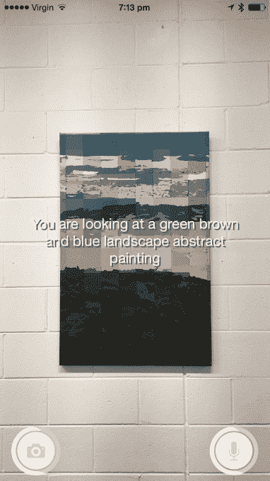
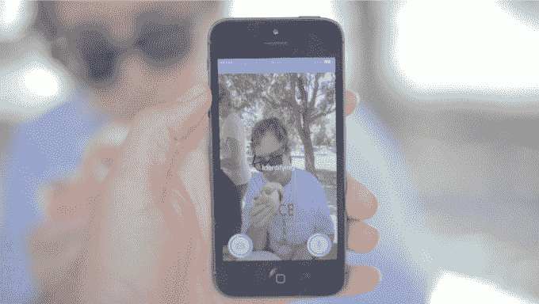

# Aipoly 将机器视觉交到视障人士手中

> 原文：<https://web.archive.org/web/https://techcrunch.com/2015/08/17/aipoly-puts-machine-vision-in-the-hands-of-the-visually-impaired/>

现在是凌晨 3:30，在毫无特色的[奇点大学](https://web.archive.org/web/20230316235925/https://techcrunch.com/tag/singularity-university/)会议室里，我正通过 Skype 窥视，我刚刚请 Marita Cheng 给她的联合创始人 Alberto Rizzoli 的衬衫上的纽扣拍了张照片。这绝对是我在一天中任何时候向科技创始人提出的奇怪要求之一，但这两个人连眼皮都不眨一下——半分钟后，程的 iPhone 里传来一个机器人的声音，告诉我们里佐利穿的衬衫叫[亨利衬衫](https://web.archive.org/web/20230316235925/https://en.wikipedia.org/wiki/Henley_shirt)。

这还不是全部。该语音指定一名黑发男性穿着白色 Henley 衬衫。技术演示进行得相当顺利。我还学到了一些额外的服装术语。对于周一早上(英国时间)来说还不错。这可能是硅谷的午夜，但你几乎不知道；程和里佐利对他们正在建造的东西的热情显然盖过了他们对睡眠的需求。还有迫在眉睫的演示日，他们正忙着准备幻灯片。

奇点大学的使命就是应用“指数技术”，如人工智能和机器学习，来推动边界，解决人类的关键挑战——尽管睡眠的边际显然是第一个因该计划的关注强度而后退的。因此，一些当代学生戏称它为“不眠大学”。

“我们宿舍离教室 10 米远。这就像是一个奇异的大学泡沫，”程说，他来自澳大利亚，拥有机器人和科技教育创业公司的背景。

“没有隐私，”里佐利笑着补充道。他从伦敦过来参加这个项目。在苏之前，他创办了一家科技教育 3D 打印创业公司，从事其他创业活动。“一切都是免费的。一切都是谷歌赞助的。所以我们在每天早上 4:30 的工作时间里拥有最放松的生活方式，”他面无表情。

这两人是苏大学为期 10 周的研究生课程[的 27 个团队之一，将在本周二的示范日投球。然后将选出五支队伍出席周四的闭幕式。该项目的所有直接申请者都将在今明两年得到谷歌的资助。](https://web.archive.org/web/20230316235925/http://singularityu.org/graduate-studies-program/)

那么，这两个挑灯夜战的企业家在建设什么呢？他们向我演示的 iOS 应用程序名为 ai poly——它将在大约一周后登陆 App Store(当我用 Skype 登录时，他们正在向商店提交它)。这是一款智能助理应用程序，使用计算机视觉和机器学习技术来识别照片中的情况。

最初，他们的目标是盲人和视力受损者，通过在 iPhone 上拍照来帮助他们导航或识别物体，并获得音频描述作为回报——所有这些都不需要依赖任何人来帮助他们。该团队首先专注于在 iOS 上开发，因为该平台现有的辅助功能使该设备受到目标用户的欢迎。

> 很谨慎。在它说某人生气之前，它有一个很低的门槛来说一个人确实生气了。

“我们想，如果我们创造一种算法，在(用户)面前描绘一个场景，会怎么样。里佐利说:“我通常会引导(一位失明的家庭朋友)进入一个新的领域。“向他们描述右边有一座雕像，左边有一个树篱和栅栏，前面有两棵树。我想如果机器视觉可以做到这一点呢？如果计算机视觉可以自动做到这一点，而这些人不必依赖其他人来获得独立感、好奇心和探索感，那会怎么样？”

用户在应用程序中拍照，然后上传到云端进行处理。一旦机器视觉系统识别出它在照片中看到的是什么，它就会以文本和语音的形式返回答案。Cheng 说，对于最初的 MVP，该团队没有使用他们自己的算法，而是计划开发自己的算法，并用针对目标用户的特定数据集来训练它们。

“这是一个非常简单的应用程序。它拍摄一张照片，然后上传到服务器，在那里它使用一个叫做卷积神经网络的系统来浏览照片。本质上，它…将它细分为不同的兴趣点…并将每个兴趣点与特定的对象相匹配，”Rizzoli 在讨论核心技术时解释道。

该系统可以发现场景中的多个对象，例如桌子上的不同物品，还可以理解图像中对象之间的关系，例如能够指定一个人正在骑自行车。

“如果我们给一个骑自行车的人拍照，2010 年的算法，最先进的，可能会喷出关键词‘人’和‘自行车’，但今天他们实际上可以找到物体之间的关系。所以'人'，'骑'，'自行车'。对于计算机来说，这是非常高级的概念，”他补充道。“这就是为什么这项技术对于无障碍市场来说变得非常令人兴奋。”

在高速 Wi-Fi 网络上，整个过程可能只需要 5 秒钟，而在网速较慢或分析场景需要更多“算法思维”的情况下，整个过程可能需要 20 秒左右。程说，在这个阶段，这项技术已经用大约 30 万张图像进行了训练。我们的计划是继续完善这一点，特别关注可能对盲人和视障用户有用的图像，如街道标志或他们可能需要使用或定位的特定物品，如白手杖、盲文阅读器甚至是他们的导盲犬(假设狗睡得太沉，听不到他们的呼唤)。

“我们周六和硅谷盲人委员会一起去野餐，我们拍下了每个人在许多不同位置的白手杖的照片，我们将把所有这些图像上传到我们的算法，这样如果一个盲人把他们的白手杖掉在了某个地方，他们不太确定他们可以从哪里拿出手机，就在他们认为他们的白手杖所在的附近拍一张照片，让应用程序识别出他们正在看的白手杖，这就是他们应该四处搜索的地方，”她补充道。

今年年初，一款名为 [Be My Eyes](https://web.archive.org/web/20230316235925/https://techcrunch.com/2015/01/16/be-my-eyes/) 的丹麦应用以类似的概念吸引了人们的注意——尽管它完全由人眼驱动。因此，该应用程序将需要识别特定事物(如食品罐头上的标签)的盲人和视障用户与愿意将眼睛借给手头任务的视力正常的用户联系起来，以便他们可以实时告诉他们正在看什么。

Aipoly 正在寻求解决类似的问题——从帮助导航，到识别相册中的照片或食物、衣服或颜色的盘子——但将技术应用于这项任务。这两种方法都是有效和有用的。程认为，虽然看起来向人类求助(而不是向机器求助)会让感觉更好，但对于需要帮助的人来说，向机器求助可能会更容易、更好，因为这可以让他们减少对他人的依赖。

根据里佐利的说法，使用算法来自动化动态音频描述已经成为可能，这要归功于该领域相对较新的突破，来自斯坦福大学和谷歌在 2012 年的联合研究。“通过改进卷积的方式，算法的精度提高了两倍以上——本质上是对图片的细分。”

“这些突破在过去 10 年里一直很稳定，所以我们可以预计这种技术在未来几年里会更快、更精确，”他补充道。

就局限性而言，机器视觉技术显然有一些限制——例如，它可能不总是能正确区分性别。虽然它可以识别某些非常强烈和独特的面部表情——比如一个人笑得很开心或者一个人看起来很生气——但它还不是非常敏感(尽管提高情绪识别是该团队希望努力的一个领域)。

“这很谨慎，”算法的里佐利说。“在说某人生气之前，说一个人确实生气的门槛很低。对性别的识别也是如此。

“当不太确定的时候，在称呼一个人为男性之前，它会非常努力地思考，因为如果那个人实际上是女性，这可能有点不礼貌。但有时对男人来说会适得其反，认为他们是女人。这种情况发生过几次。”

如果照片质量不是很好，这项技术显然也不太好，所以如果拍摄的照片有点模糊。例如，Rizzoli 在我们的 Skype 通话中拍摄的一个空塑料瓶橙汁标签的特写镜头被算法命名为“裸玻璃罐”，它的机器视觉眼睛抬起品牌名称“裸”并看到玻璃，而不是更平淡无奇的塑料。所以很明显有混淆的余地。(但我敢说，这也是一首偶然发现的诗歌。)

延迟是另一个明显的限制。云处理时间不可避免地限制了效用——在可预见的未来，这仍将是一个障碍。“当你问什么是弱点时，我会说是获取信息所需的时间，”程承认道。

Rizzoli 补充说，在这个阶段，实时处理是不可能的，尽管他们正在努力改进每次处理的时间(他希望这通常可以减少到每次拍摄 5 到 6 秒)。

也不可能在移动设备上本地进行图像处理。那样做太费时间了。这是一个更加遥远的未来。

“这不是实时的。它不是你可以用相机绑在耳朵上的东西，它会告诉你你面前到底有什么——目前还没有。但我们没有理由认为在未来几年内不会发生这种情况，”里佐利说。“在本地设备上做当然很好，但耗时太长。在 iPhone 上，这需要 25 分钟到半个小时的处理时间。”

程补充说，依靠云处理还有一个好处，就是将更多数据反馈给算法——让每个人的经验和应用程序输入都能从集体处理中受益。

虽然 Aipoly 的最初目标是视力障碍用户，但该团队看到了该技术更广泛的应用——讨论可以识别现实世界物体的机器视觉应用程序的更一般的使用案例，无论是满足孩子对他们在周围世界遇到的陌生物体的好奇心，还是为专业兴趣社区提供更新的实地指南体验，如鸟类观察者。

除此之外，他们对这项技术能做什么的观点进一步放大。Rizzoli 谈到了如何利用它来为可搜索层提供动力，以找到现实世界中的物体——以及作为机器人和人类的导航助手。

“我们正在实验在物理世界之上建立一个可搜索的环境层，基于这种特定算法找到的对象，”他说。“这仍是我们试图从概念上构建的东西。但是这个想法是，如果不仅仅是人，机器人，机器人和机器都可以在现实世界中导航，识别物体，识别物体与距离的关系，识别颜色，识别建筑物的内部，甚至识别街景的外部。用关键词记录它们，把它们放在坐标上，这样你就可以搜索你家里的物品或者机场等地的地标和商店，而不必手动在 GPS 地图上绘制它们。”

程说，与此同时，最初的业务——这是他们正在建立的业务——将专注于盲人和视障用户的核心市场，可能会提供应用程序的订阅服务。

“盲人告诉我们他们很难找到的东西包括洗手间，他们还说在机场、火车站和体育场很难导航，”她补充道。“目前所有的机场都不一样，布局也不一样，很难熟悉周围的路。但是，如果建筑物的内部被绘制并存储在某个地方，那么盲人可以随身携带他们的手机，当他们在机场走动时，拿着它，它可以在他们行走时拍摄他们周围的照片，这可以与已经创建的内部图像数据库相匹配，应用程序可以告诉盲人再向前走 20 英尺，然后右转。这是盲人说他们会非常感激的事情。”

Aipoly 的想法是在程去 Google.org 参加一个会议讨论她的其他一些项目后产生的，最终她与一位也拥有机器学习博士学位的员工讨论了即将到来的苏团队项目。“她说她有一个朋友是盲人，还有一个问题还没有解决，就是从 A 到 B，”程回忆说。

“我们还邀请了 IBM Watson 的首席技术官来给我们做了一次演示，我们记得一些演示是关于它如何进行语义描述，以及它如何还可以进行一些非常好的图像识别，所以我们研究了这一点，我们研究了如何将这两者结合起来，为视障人士创建更好的物理世界导航体验，”Rizzoli 补充道。

一年后，他们希望与 Aipoly 合作到什么程度？里佐利说，他们的目标是从一个 MVP 发展成为一个“世界各地”视力受损者手中的应用程序，该应用程序具有一种“识别他们生活导航所需的所有物体”的算法。

“我们希望这成为我们业务的主要资产，并使用这种算法，不仅识别可能是产品的对象，还识别与导航有关的对象，不仅帮助视力障碍者，还帮助每个人——从人类到机器——导航和识别世界。这是 Aipoly 的核心使命，”他补充道。