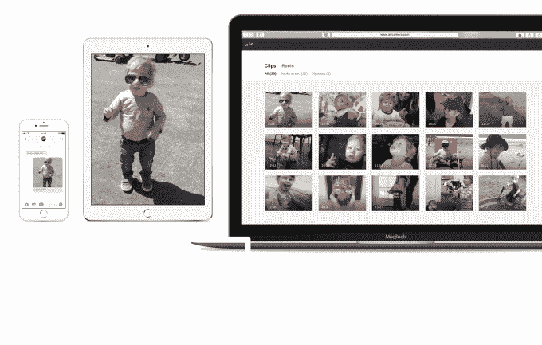
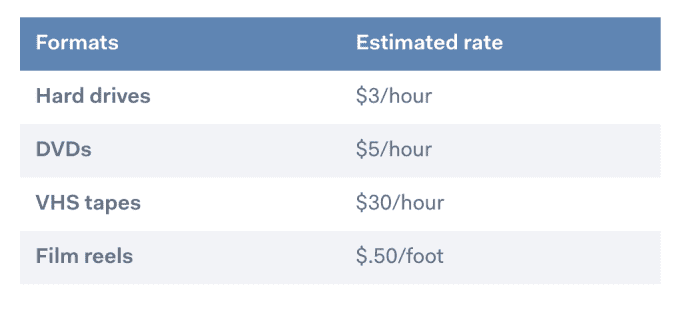

# Air 的应用程序让您可以录制高质量的家庭电影，而不会耗尽空间

> 原文：<https://web.archive.org/web/https://techcrunch.com/2018/03/02/air-lets-you-record-high-quality-home-movies-without-running-out-of-space/>

如今，家庭电影不是用手持摄像机录制的，而是用我们的智能手机。不幸的是，这也有不好的一面。我们的 iPhones 默认使用较低质量的视频，这样录像就不会耗尽存储空间；虽然你可以在新的设备上调整到 4K，但这将大大增加你的存储消耗。如果你总是以高质量录制，你很快就会收到“空间不足”的警告，然后不得不不断地将视频卸载到云上。一家名为 [Air](https://web.archive.org/web/20230406162206/https://www.aircamera.com/) wants 的新创公司提供了另一种解决方案。

Air 应用程序不是使用原生相机应用程序来录制，而是自动以 4K 超高清格式录制，并自动将您的视频存储在私人画廊的云中。这意味着您永远不会用完空间，即使您正在录制长篇家庭电影或任何其他高质量的视频。

当然，已经有在云端存储视频的解决方案，包括 iPhone 内置的 iCloud，以及 Google Photos，这是一款顶级的照片共享应用，带有方便的“释放空间”选项。亚马逊和 Dropbox 也有受消费者欢迎的云存储解决方案。

但据 Air 联合创始人兼首席执行官[谢恩·海格德](https://web.archive.org/web/20230406162206/https://www.linkedin.com/in/shanehegde/)称，没有竞争对手仅针对视频优化过他们的产品。

“视频因其大小和复杂性而独一无二，但大多数解决方案都将它们视为照片:降低质量，让回放成为噩梦，”他说。“我们的产品采用了与网飞和 Youtube 相同的先进视频技术，为用户带来无缝、用户友好的视频体验。”

Air 的服务会自动对所有视频进行转码，以便在播放过程中自适应地流式传输。这意味着您不必等待视频加载，即使您目前没有足够的带宽。当您想要共享视频时，Air 也不会压缩您的视频——您只需向朋友或家人发送视频链接，接收者就可以访问高质量的文件。

此外，Air 还包括一个名为“卷轴”的协作视频编辑功能。专为捕捉更大的事件而设计——例如，度假或婚礼——任何人都可以将他们的视频剪辑贡献给卷轴，然后通过社交媒体或他们喜欢的任何地方分享最终结果。

Air 每月 4.99 美元，比传统云存储的入门级价格略高。举例来说，如今 iCloud 上 50 GB 的每月费用仅为 0.99 美元，谷歌上 100 GB 的每月费用为 1.99 美元(包括照片、Gmail 和硬盘)，价格还会继续上涨。你必须定期录制大量家庭电影，才能从购买 Air 的无限存储空间中受益。

但这就是为什么该公司主要向年轻父母推销该产品的原因，他们正是这样做的。然而，半专业摄像师也可以受益，因为任何人都可以更容易地在 4K/高清录制，而不必担心存储空间。

使用 Air 的另一个好处是其可选的物理媒体数字化服务。这项服务需要 50 美元的押金，但接受任何存储设备或视频格式，包括 VHS 磁带、电影胶片、硬盘、DVD、USB 驱动器等。价格按数字化每小时计算，并因格式而异。

Hedge 与斯坦福大学毕业生 Tyler Strand(首席技术官)共同创建了 Air，他说，他在一个用索尼 Handycams 录制的家庭中长大，随着技术的变化，这最终导致了一系列不值得观看的视频，因此他受到启发，简化了高质量家庭电影的录制。

我没有摄像机；新的笔记本电脑没有 DVD 播放器；他说:“过时的设备无法访问这些‘数据’”。“2016 年末，我决定辞职，让家庭电影的内容格式起死回生。我想创建一家完全基于这种个人激情的公司:一款允许人们用手机拍摄无限量家庭电影的产品，以及一个保存他们已经拥有的珍贵物品的空间。”

在 Air 之前，Hedge 在斯坦福大学创办了一家名为 [Swap](https://web.archive.org/web/20230406162206/https://www.linkedin.com/company/swap-mobile/) 的初创公司，在 [HPS 合伙公司](https://web.archive.org/web/20230406162206/http://www.hpspartners.com/)从事投资工作，然后是洛杉矶[反抗电视](https://web.archive.org/web/20230406162206/https://revolt.tv/)的首席数字策略师。与此同时，泰勒还在斯坦福创办了一家初创公司 [hostess.fm](https://web.archive.org/web/20230406162206/https://www.linkedin.com/company/3238182/) ，并将其出售给了 [SFX Entertainment](https://web.archive.org/web/20230406162206/https://www.crunchbase.com/organization/sfx-entertainment) 。最近，他在 Postlight 担任创始合伙人和产品总监。

总部位于布鲁克林的 Air 在 2017 年 10 月从媒体和科技投资者以及早期基金那里筹集了一轮未披露的种子资金。

该应用目前仅在 iOS 上可用，在 App Store 这里[。](https://web.archive.org/web/20230406162206/https://itunes.apple.com/us/app/air-a-camera-for-home-movies/id1244558410?mt=8)