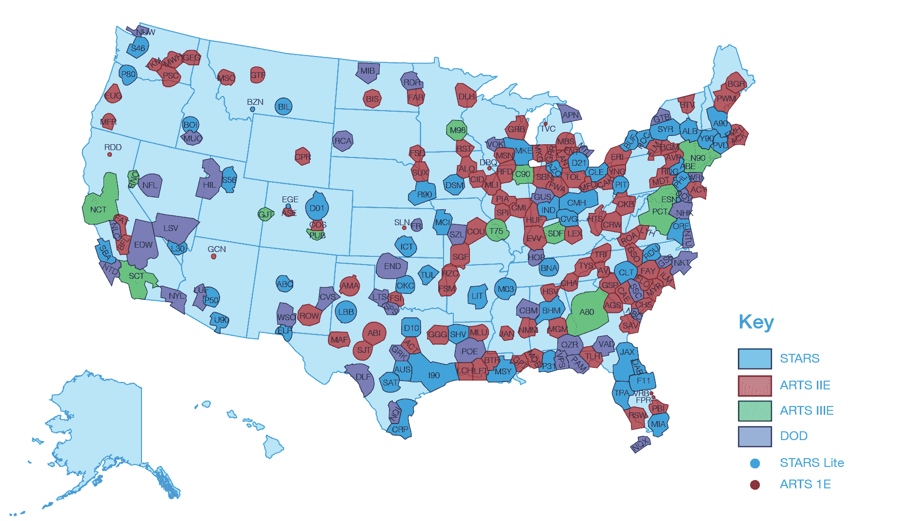
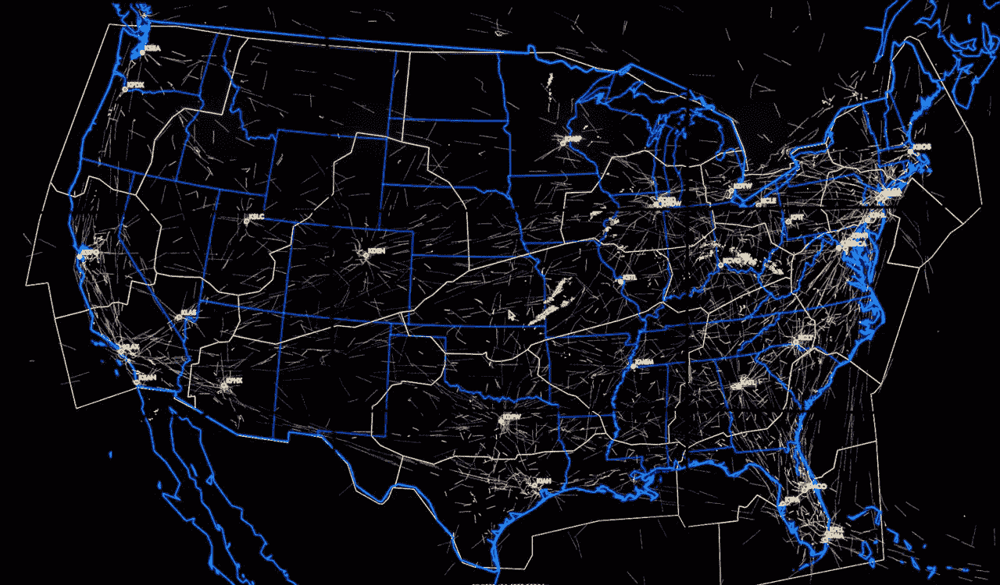
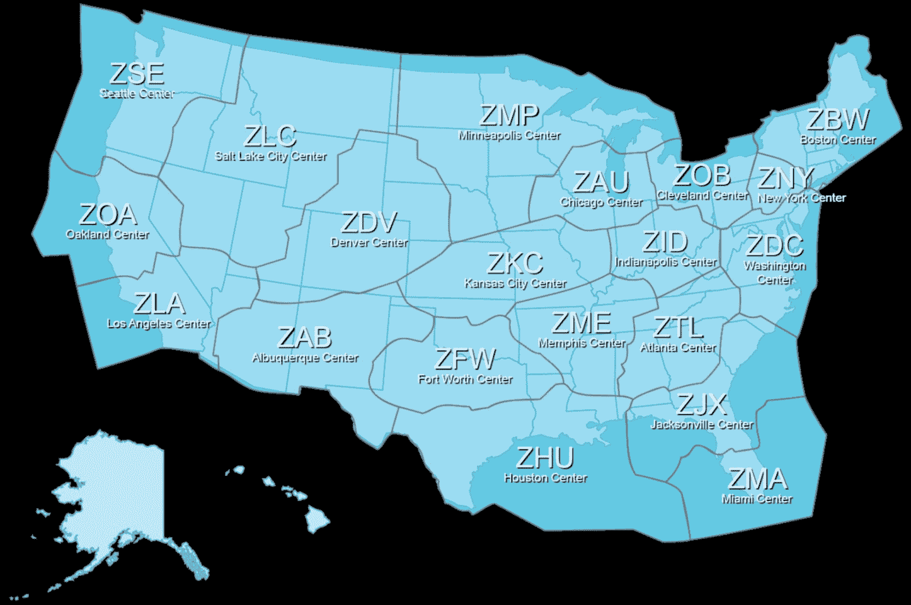
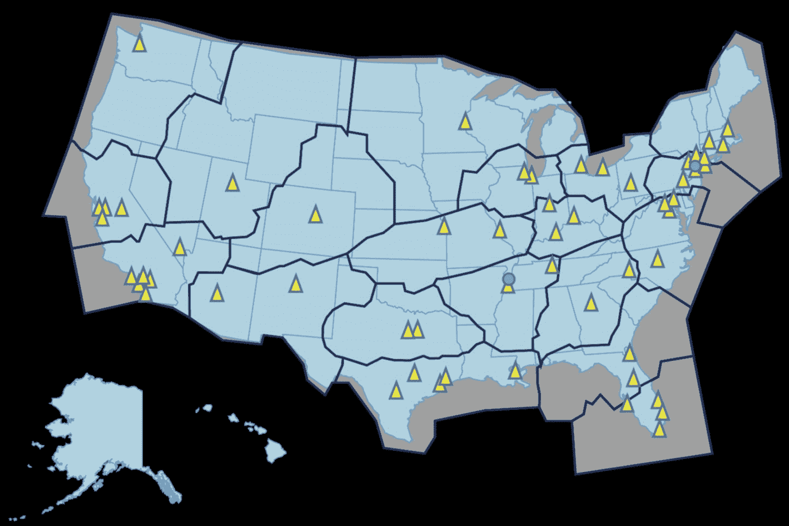
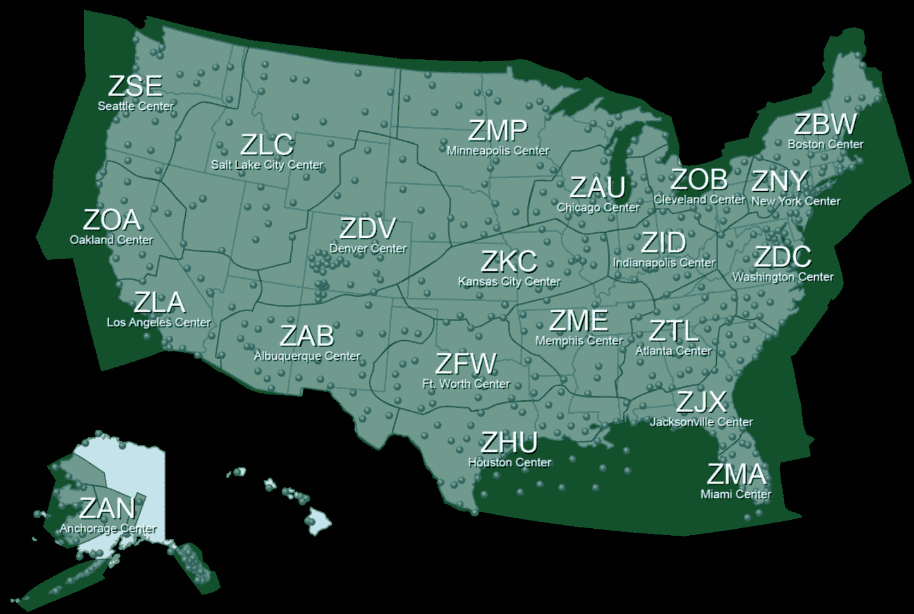

# 空中交通管制正在进行急需的升级

> 原文：<https://web.archive.org/web/https://techcrunch.com/2015/08/16/air-traffic-control-is-getting-a-much-needed-upgrade/>

旧金山上空晴空万里，万里无云，当你的机长宣布你的飞机因天气原因暂停进场时，你可以听到呻吟声。这不是飞行员、飞机或航空公司的问题——在你的越野旅行中，还有比你看到的更多的事情。你和支持你的 [117 英尺宽](https://web.archive.org/web/20221202105614/http://www.boeing.com/commercial/737ng/)的飞机在海湾地区上空的某个地方盘旋，等待来自你所居住空域的统治者——空中交通控制塔的许可。

空中交通管制塔是现代机场无处不在的特征，仅次于客机本身。然而，塔台只是将飞机从一个点传送到另一个点的庞大网络中的一小部分。像昔日的宠物一样，飞机在美国上空飞行时，由各种不同的力量引导和指引。

尽管价值数百万美元的飞机和大规模雷达装置如此复杂，但多层控制人员“记账”飞机的方式看起来相当过时。一个塑料条系统，按照处理顺序分类并插入一个架子，同名的“飞行条”，在许多方面是空中交通管制系统的支柱。这些卡片上贴有航班号、目的地和路线信息的标签，它们在插槽中发出的咔嗒声就像控制人员面前的绿色雷达显示屏一样无处不在。

很快，这种情况将会改变。[联邦航空管理局](https://web.archive.org/web/20221202105614/http://www.faa.gov/) (FAA)正在准备推出一套名为 [NextGen](https://web.archive.org/web/20221202105614/https://www.faa.gov/nextgen/) 的新系统，这代表着 21 世纪技术首次真正融入空中交通管制系统。

## 多层系统

国内的民用航空交通是在三个不同的层次上处理的。机场的控制塔处理地面操作、起飞调度和着陆，努力消除飞机进场冲突，并确保跑道操作之间的间隔。然而，这只是冰山一角——虽然当地的塔台处理着旅程的终点，但许多舞蹈编排甚至在飞机起飞前就已经发生了。

东部标准时间每天早上 6 点，作为与美国联邦航空局位于弗吉尼亚州沃伦顿的大卫·j·赫尔利指挥中心举行的全国电话会议的一部分，航空公司提交全国国内和国际出发的临时飞行计划。也在呼叫中的是区域空中交通管制中心、区域进场控制和机场控制塔。

作为联邦航空局所谓的“交通流量管理”的一部分，每架商用飞机、货运飞机和商务飞机都被小心翼翼地放置在整个大陆的空中交通网中。正是这些飞行计划决定了对航班时刻表和空中行动的遵守，也决定了起飞顺序、着陆时间和点到点的路线。

你会以为飞机从约翰·肯尼迪国际机场起飞后是直线飞往旧金山的，但事实并非如此。起飞后不久，飞机就被移交给所谓的终端雷达进场控制，该控制处理机场周围 30-50 海里区域内飞机的进出。缩写为 TRACON，其中 27 个控制中心管理区域进近，解除进出空中交通的冲突。

纽约市的空域包括 JFK、拉瓜迪亚、纽瓦克自由机场和费城国际机场，聚集在一起的多个机场由一个终端控制中心管理。据一位熟悉航空业的高级官员称，纽约市的终端控制中心处理全国三分之一的空中交通，以及全球六分之一的航班。

联邦航空局航迹图，截至 2015 年 2 月。

当一架飞机从一个 TRACON 或终端控制中心离开 5 到 40 英里(取决于机场)的距离后，它被移交给空中航线交通控制中心。他们控制着大片空域，一旦飞机飞越 18000 英尺的高度，或者当飞行员允许在机舱内活动和站立时，他们就会处理航线和高度。

在一次典型的跨国旅行中，一架飞机由 4-5 个中心处理，从一个中心跳到另一个中心，然后被移交给目的地机场指定的 TRACON。

美国大陆的航线中心。感谢米特公司。

虽然所有这些路由决策同时发生的前景令人望而生畏，但重要的是要记住，很少有路由选择是实时做出的。飞机的飞行计划通过系统传递到控制人员手中，控制人员处理路线和时间安排。正如熟悉这个问题的人解释的那样，飞行员只是在由于天气或其他条件而改变航线或计划的情况下才将数据输入系统。

## 新旧的融合

航空技术的引进和改造是一个充满严格的安全检查、评估和复杂的认证和整合过程的过程。这是有充分理由的，关键系统在被评定为在空中运载乘客之前需要多种级别的冗余和安全。

过时的信息管理系统使得与新技术的集成变得困难，并且由于管理高空飞行的系统需要大量的冗余和测试，升级实施起来很慢。

一个典型的例子是，用于高海拔交通管理的替代系统(ERAM:途中自动化现代化)及其 2000 万行计算机代码仅在今年 3 月完成，并且正在从盐湖城中心的部署转移到年底可用于 20 个途中交通控制中心。ERAM 是联邦航空局下一代系统的一部分，这是一项与航空业密切合作的努力。

美国联邦航空局 ERAM 中心位置

“它[下一代]需要航空公司和联邦航空局之间的合作努力来开发和提供新的能力，”联合航空公司的一位女发言人说。她进一步补充说:“我们支持任何旨在更快实现改善国家空域系统和全国空中交通流量的能力的努力。”

用于空中旅行的技术的系统集成的固有部分的单调乏味使人对最近将基于数据的通信引入空中交通管制系统有了深入的了解。该系统被称为“数据通信”，类似于飞机和控制人员之间的短信。目前，该系统正在地面塔台部署，直到 2019 年才会逐步进入航线中心。

当前和计划中的“数据通信”中心

尽管如此，ERAM 代表了飞行管理技术的一个量子飞跃，跟踪飞机身份，高度，飞行路径和速度，将控制器跟踪的飞行数量增加了一倍。它也是其他几种技术的平台。“ERAM 让我们在技术马力上有了很大的提升，”联邦航空局局长 Michael Huerta 在今年 4 月的 T2 新闻发布会上解释道。

今年 5 月，美国联邦航空局宣布在纽瓦克自由机场和孟菲斯机场实施一项试点计划，从语音通信转向控制器和飞机之间的数据通信。正如一位熟悉该技术的官员所说，与短信类似，该技术将增加信息流的数量和速度，允许更好的路由和减少延迟。

这位官员进一步解释说，所有这些都降低了成本，并将改善对恶劣天气和空域拥挤的规避和补偿。仍处于试点阶段，该计划将在今年年底前部署在 50 多个塔中，并从 2019 年开始分阶段进入区域“中心”。

当你在等待模式的飞机上阅读这篇文章时，可能更感兴趣的是一种称为自动相关监视广播(ADS-B)的技术，这是一种基于卫星的飞机跟踪和通信方法。

与使用地基雷达的传统系统相比，ADS-B 数据通过卫星传送到 ERAM 系统，从而可以更深入地了解缺乏雷达覆盖区域的飞机运行情况。ADS-B 使用卫星导航确定飞机位置，并通过卫星与控制中心通信。将 ADS-B 数据集成到 ERAM 系统中有助于 ADS-B 作为二次监视雷达的替代品(通俗地称为飞机的‘应答器返回脉冲’)。

不过，ADS-B 的整合不会一蹴而就。正如联合航空公司首席技术飞行员洛基·斯通解释的那样，联邦航空局的 ADS-B 装备规则到 2020 年才生效。

“当规则生效时，计划要求 ADS-B 成为主要的监视源，允许更精确的监视，”他解释说，并补充说，改进的监视能力将允许在各种天气条件下进行更可预测的操作。

尽管最初采用率很低，但航空公司有信心 ADS-B 的好处最终会传递到飞行员身上。“这些新技术将允许更多的飞机在更直接的航线上安全地飞得更近，减少延误，为环境和经济提供前所未有的好处，”联合航空的一位女发言人说，并补充说，这些变化将导致碳排放、燃料消耗和地面噪音的减少。

航空公司参与 ADS-B 的开发过程可以在缓解整合痛苦方面发挥作用。

“联合航空是通过航空规则制定委员会(ARC)制定最初 ADS-B 规则的积极参与者，”斯通说，并进一步补充说，该规则于 2009 年制定，并于 2010 年生效。

截至 2015 年 4 月的 ADS-B 覆盖率

另一位熟悉 FAA 和商业航空的官员解释说，这项技术最突出的应用可以在墨西哥湾看到，在那里，FAA 与石油钻机运营商的合作伙伴关系允许在石油平台上放置 ADS-B 系统。覆盖范围的增加降低了墨西哥湾上空飞机之间的间隔要求，并提高了在该地区运行的许多直升机的安全性。

熟悉航空业的消息人士解释说，这一布局的最大潜在收益之一是增加了航班密度，减少了海湾附近主要终点之一亚特兰大哈兹菲尔德-杰克逊国际机场的等待时间。

以客流量计算，哈兹菲尔德-杰克逊机场是世界上最繁忙的机场，即使是效率方面的微小提高也有可能提高全国范围内的航空公司业绩——例如，达美航空公司每天有 1000 个航班通过其枢纽。

## 为创新做好准备的空间

下次你发现自己在飞机上旅行时，值得考虑一下你成为其中一部分的难以置信的复杂系统——飞行员和飞机只是日日夜夜发生在脚下的大规模行动的冰山一角。

尽管这个系统看起来令人畏惧和复杂，但随着许多其他国家采用类似于联邦航空局部署的系统，空中交通管制的计算机化将是未来的发展方向。飞行管理是一个为下一波创新做好准备的空间，看看它如何影响人们的旅行方式将是令人着迷的。