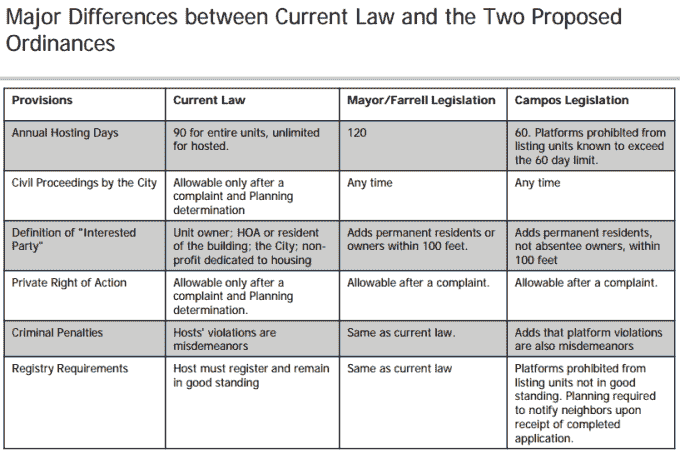
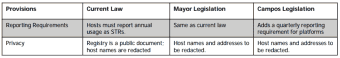
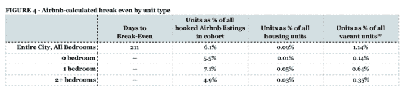
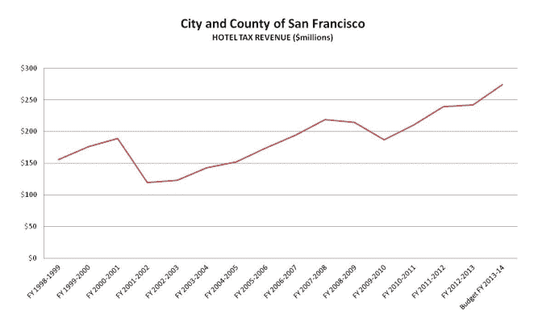
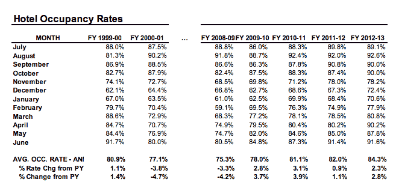
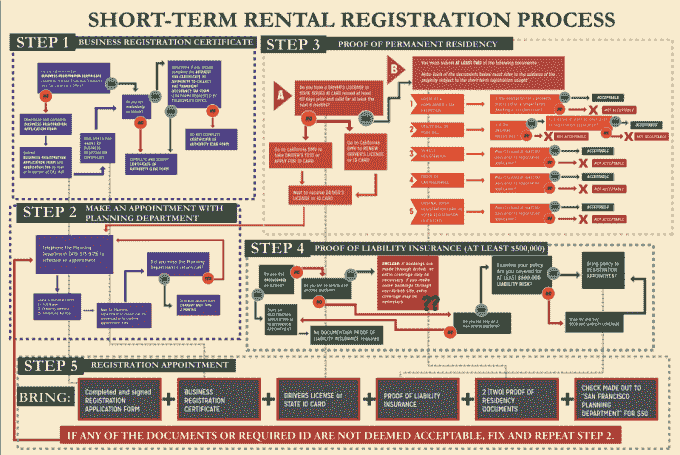

# Airbnb 和数据问题 

> 原文：<https://web.archive.org/web/https://techcrunch.com/2015/06/11/airbnb-and-the-problem-of-data/>

住房维权人士、旧金山政策制定者和 Airbnb 正在就短期租赁监管进行另一场摊牌，这场摊牌将持续到下个月，并可能延续到 11 月的选举。争论集中在执行、数据和主机在平台上发布一个单元的天数上限上。

如果一套新的规则不能很快形成，这场战斗将走向投票。这意味着选民将决定他们希望如何管理旧金山的短期租赁，旧金山正处于该市历史上最严重的住房短缺之一。如果法规是由公民提议进行投票表决的，这将意味着该市的法规将比通过正常立法程序通过的法案更不灵活，因为修正案必须得到投票公众的批准。

最终，旧金山、洛杉矶、纽约和其他经济繁荣、土地有限的城市如何决定监管 Airbnb，将影响该公司在其最有利可图的市场上增加库存的能力。虽然[洛杉矶市议会成员目前正在考虑新的规则](https://web.archive.org/web/20221129224406/http://www.latimes.com/local/lanow/la-me-ln-airbnb-regulation-20150602-story.html)，但纽约市长比尔·白思豪的政府还没有对短期租赁的立场。

无论如何，所有这些讨论都可能影响该公司最终 IPO 的价值。首席执行官 Brian Chesky 上个月说，该公司有望在[每晚接待 100 万名客人。Airbnb 的平台上有超过 120 万间客房，比洲际、万豪和希尔顿这样的品牌连锁酒店还要多。如果像我们和彭博报道的那样，它成功筹集了 200 亿美元的额外资金，这意味着它的最新投资者可能押注于 2 倍或 3 倍或更多的回报。](https://web.archive.org/web/20221129224406/http://recode.net/2015/05/27/airbnb-is-approaching-one-milllion-guests-per-night/)

这里的关键问题是:

*   由于担心短期租赁会侵蚀现有住房存量，是否应该对房主出租其住房的天数设置上限？如果有，应该是什么？
*   托管平台应该被强制与城市共享数据吗？它应该是以一种聚合的、匿名的方式还是在个人层面？
*   许可应该如何工作？如果托管平台列出了没有在城市注册的单位，应该受到处罚吗？
*   投诉和执法应该如何运作？邻居是否应该有投诉的权利？如果他们赢了，发现附近的主办方违反了城市法律，他们应该有权获得经济救济吗？

**最大天数上限:**

争论的一大焦点是是否应该对一个单元可以出租的天数设置上限。建议的天数从甘大为主管提议的 60 天到 11 月投票倡议的 75 天到市长李爱德支持的 120 天不等。

很难找到合适的帽子。所有这些研究——来自旧金山规划部门、[立法分析师办公室](https://web.archive.org/web/20221129224406/https://sfgov.legistar.com/View.ashx?M=F&ID=3746193&GUID=1AC2E540-A36F-4896-8DB4-0D99CF24FAA1)和[城市经济学家](https://web.archive.org/web/20221129224406/http://sfcontroller.org/Modules/ShowDocument.aspx?documentid=6457)——都是根据其他政府传唤的网站抓取和[数据进行的，因为 Airbnb 和其他托管平台不会与市政府共享汇总的匿名数据。Homeaway 等其他平台不收集这些数据，因为它们的收入模式不是基于预订。](https://web.archive.org/web/20221129224406/http://www.ag.ny.gov/pdfs/Airbnb%20report.pdf)

Airbnb 周一披露了一些数据，涉及从去年 5 月到今年 4 月在该平台上上市的 9692 套公寓。他们认为，一个人需要出租一个房间 211 天，才能比长期租户更有利可图，只有 6%的房源超过了这个门槛。

但是，将盈亏平衡租金定价在市场租金之外是有问题的，因为该市只有 10%的住房存量是市场租金。该市几乎一半的住房是租金控制的，另外三分之一是业主自住的。因此，不清楚人们支付了多少钱，也不清楚房东在 Airbnb 上的收入差距何时会大到足以放弃出租额外的卧室，甚至试图非法驱逐租户。这座城市已经有十多年没有研究租金控制的存量的人口构成了，因为租户团体担心这些数据会被政治化。(是的，对数据的需求有很多方面。)

受监管人甘大为委托，立法分析办公室的一项研究估计，全市有 925 至 1960 套[房屋通过 Airbnb 房源退出了](https://web.archive.org/web/20221129224406/http://www.sfbos.org/Modules/ShowDocument.aspx?documentid=52601)房地产市场。州检察长去年对纽约市发出的另一张传票发现，该市 6%的主机商创造了 37%的收入，2013 年总收入的 38%流向了出租其单元超过半年的主机商。

这里令人担忧的是，临时房东的长尾掩盖了 Airbnb 盈利能力的大头，因为更长期的运营商可能会取消住房供应。Airbnb 职业经理人组成了一个完整的家庭手工业，[包括枕头屋，它在 1 月份刚刚筹集了 270 万美元](https://web.archive.org/web/20221129224406/https://beta.techcrunch.com/2015/01/20/pillow-2-65m/)，并为其主人提供了有保证的月收入流。

旧金山的城市经济学家特德·伊根承认，如果没有准确的数据，就不可能知道有多少单位(如果有的话)被从该市的永久住宅中剔除。然而，在另一份报告中，他[认为所有提议的上限都过于保守，不足以保护住房。他的盈亏平衡计算从俄罗斯山的一年 123 天到内日落的一年 241 天不等。](https://web.archive.org/web/20221129224406/http://sfcontroller.org/Modules/ShowDocument.aspx?documentid=6457)

因为 Airbnb 在上周推出了[一种定价推荐算法，你可以在自己的空间上实际查看假设的盈亏平衡率。我在合租公寓里的个人卧室的建议价格从每晚 90 美元到 160 美元不等。因此，我房间的年化盈亏平衡率有时会低于主管马克·法雷尔建议的 120 天上限，有时会高出一个月或更长时间。(我是 Airbnb 的常客，但我不做房东，因为我是房客，而且当前纽约市关于短期租赁的法律不能取代现有的房客-房东协议。因为大多数租户协议没有明确提到短期租金，所以该市的立法在实践中可能对房东更有利。)](https://web.archive.org/web/20221129224406/https://beta.techcrunch.com/2015/06/04/airbnb-adds-a-pricing-recommendation-tool-for-renters/)

Airbnb 回应了我的观点，称驱逐租户将一个单元用于短期租赁是非法的。但在实践中，当这些情况发生时，很难识别并处罚它们。例如，市政府律师丹尼斯·埃雷拉(Dennis Herrera [上个月与两名房东(解决了一桩 27.6 万美元的案件，这两名房东在驱逐一名残疾租户后，将他们的单位放在 VRBO 和 Homeaway 上。但是，从 2009 年被告开始将该公司上市到结案花了六年时间。这是因为强制执行是由投诉驱动的，而不是由单位自动匹配埃利斯法案驱逐或财产记录。](https://web.archive.org/web/20221129224406/http://www.sfcityattorney.org/index.aspx?page=629)

**迭代调节和数据透明:**

随着科技公司促进越来越多的线上到线下行为，数据问题说明了一个更大的问题，这种行为开始大规模影响公共系统。在洛杉矶，驾驶应用 Waze 变得如此受欢迎，以至于它开始通过小巷和住宅区而不是主干道和高速公路[运送大量交通流量。](https://web.archive.org/web/20221129224406/http://www.citylab.com/commute/2015/04/las-lovehate-relationship-with-waze-continues/391832/)

Waze 的损失比 Airbnb 小得多，[选择与洛杉矶市长埃里克·加希提的政府共享匿名司机数据](https://web.archive.org/web/20221129224406/http://www.latimes.com/local/lanow/la-me-ln-garcetti-partnership-waze-20150421-story.html)，以设计更好的交通流量。当然，你可能会说，道路是公共基础设施，而大多数住房是私有的。然而，美国最高法院[支持住宅区划的做法已经有近一个世纪了。](https://web.archive.org/web/20221129224406/http://en.wikipedia.org/wiki/Village_of_Euclid_v._Ambler_Realty_Co.)

代表 Tenderloin 和 Central SOMA 的监督员 Jane Kim 暗示，城市决策者可能会在周二的监事会会议上推动更多数据。

她说:

> 我不认为我提到的分享人们的私人邮件和邮件内容的例子与分享主人出租给游客的住宿天数是同等类型的数据分享。也就是说，如果我们作为一个市政府要深入到数据共享的政策领域，我会更放心地知道，我们有一个更大的长期政策讨论，关于我们什么时候做什么时候不做，所以我们设置参数，以确保我们真正保护我们居民的有效隐私和安全权利。

这些想法不仅仅是监管者或政治家在谈论。技术专家也在讨论它们。

联合广场风险投资公司(Union Square Ventures)的尼克格罗斯曼(Nick Grossman)写了一系列关于他所谓的“监管 2.0”的文章。联合广场风险投资公司是一家高知名度的东海岸风险投资公司，曾投资 Twitter、Kickstarter 和 SoundCloud。

格罗斯曼[说那是:](https://web.archive.org/web/20221129224406/http://www.nickgrossman.is/2013/12/04/the-regulation-2-0-challenge/)

> 这种观点认为，鉴于现代网络服务产生的大量实时数据以及基于此的彻底透明的潜力，有机会探索全新的监管方法。这种方法不是像我们在“1.0”监管制度中所做的那样，对某项活动(比如拼车或点对点公寓租赁)提前做出决定，而是可以在前端更加宽容，同时通过透明度引入更多的问责制。

本质上，Airbnb 是一种介于酒店和永久住宅区之间的监管套利形式。它占用了一种物理空间，以前只能用于一种需求——永久住宅需求——并使其有效地用于另一种类型的短期或流动需求，这可能会将住房存量重置为更高的规模均衡价格。虽然旧金山的住房短缺有许多更大的潜在因素，但 T2 的 Airbnb 也可能增加了利润率的压力。

但是没有数据我们无法知道。

虽然我已经写了很多关于该地区相对于人口增长和城市化的住房建设不足的文章，但它也有不足的酒店空间。尽管 Airbnb 在增长，但 T4 的酒店入住率实际上还是上升了。[这就是为什么酒店没有成为公司明显的政治对手。](https://web.archive.org/web/20221129224406/http://www.nytimes.com/2015/05/12/business/airbnb-grows-to-a-million-rooms-and-hotel-rivals-are-quiet-for-now.html)

即使出现了 Airbnb 和其他托管平台，旧金山市酒店入住率和税收收入仍在继续上升。

但与酒店分区不同，在酒店分区中，城市分配固定的高度和密度，开发商在固定的土地上建造酒店，*短期租赁库存是波动的*。

城市需要了解短期租赁库存的扩张速度是否快于其产生的住房存量，以及这是否会影响长期居民的住房供应。换句话说:如果没有数据，你不会 A/B 测试软件平台或界面的变化，那么当涉及到他们有限的物理空间的“平台”时，你为什么会要求城市决策者在黑暗中 A/B 测试监管变化呢？

我知道反对意见是城市应该建造更多的住房。但是[正在以 20 年来最快的速度建造住房](https://web.archive.org/web/20221129224406/http://www.socketsite.com/archives/2015/04/housing-production-in-san-francisco-highest-in-over-20-years-but.html)，同时[正在推动 3 亿美元的经济适用房债券](https://web.archive.org/web/20221129224406/http://www.bizjournals.com/sanfrancisco/blog/real-estate/2015/06/mayor-san-francisco-housing-bond-mission-district.html)和[在历史上首次为中产阶级住房创造补贴](https://web.archive.org/web/20221129224406/http://www.bizjournals.com/sanfrancisco/morning_call/2015/05/san-francisco-housing-bond-middle-class-apartments.html)。

即使旧金山湾区有像休斯顿一样宽松的授权程序，去年某些季度批准的单元数量超过了整个加利福尼亚州，也比通过筹集资金、购买土地、雇佣建筑师、通过授权程序、解决环境影响、雇佣建筑工人以及营销和出售单元来建造全新单元更容易。在 15 街和 Mission 做 Vara 项目的开发商[本周早些时候告诉我](https://web.archive.org/web/20221129224406/http://www.bizjournals.com/sanfrancisco/blog/real-estate/2015/03/agi-eric-tao-mission-development-sf-housing.html)在经济周期的这个点上，每个新住房单元的原始成本大约是 65 万美元。

最重要的是，Airbnb 和市政府在许多方面并没有从根本上保持一致。虽然[托管平台的身份、声誉和审查系统可以取代一些旨在确保安全的政府许可](https://web.archive.org/web/20221129224406/http://www.wired.com/2012/10/from-airbnb-to-coursera-why-the-government-shouldnt-regulate-the-sharing-economy/)，但 Airbnb 是一家私人控股的营利性公司，其激励措施是最大化收入和预订量，而市政府则对其投票公众负责，他们是在城市生活和工作的长期居民，需要住房。

城市经济学家 Ted Egan 估计，每一个消失的住房单位，都会给城市经济带来每年 25 万到 30 万美元的损失。他认为，这些损失可能会很快超过 Airbnb 每月向该市缴纳的 100 多万美元的交通占用税，加上房东的收入和游客的支出。

需要明确的是，这些都不是禁止或消除短期租赁的理由。这只是为了随着市场规模的扩大获得准确及时的数据，以便对住房的负面影响进行管理。一家私人控股公司在世界上最具经济生产力、文化活力和土地有限的城市中占据越来越大的住宅存量份额，这是一个公众关注的问题。

**允许的话:**

Airbnb 的公共政策部门制作了这个图形来批评旧金山的注册流程。

尽管这篇帖子的大部分内容对 Airbnb 颇有微词，但市政府还是在一些领域把事情搞得太复杂了。

旧金山计划部门决定[要求*面对面会议*注册为主持人](https://web.archive.org/web/20221129224406/http://www.sf-planning.org/index.aspx?page=4004)。当然，截至昨日，这导致数千位主持人中只有约 625 位与伦敦金融城建立了预约。基本原理是，规划部门希望确保主人是拥有或租赁一个单元的人，并且这是他们的主要住所，并有适当的文件。

再说一次，我确实认为这要追溯到数据的缺乏。

如果你想一想这种情况，你有两三个专门的全职策划人员，他们拿着政府的工资，每年从数千个主持人那里收集一次自我报告表格。

不知何故，他们必须复制一个数据库，一个 200 亿美元的公司，可以用股票期权雇佣业内最好的工程师，可能会在内部仪表盘上即时调用。

与 Airbnb 不同，他们还负责确保所有这些房源都符合建筑安全、消防和健康法规，他们还需要确保这些房源都没有收入限制或负担得起。

**民事诉讼和禁令救济:**

如果 Airbnb 在政治上非常棘手的情况下不小心，这将在 11 月进行投票。

我可以告诉你，11 月的投票倡议(T7)得到了一些公民团体和住房活动家的支持，它允许“利益相关方”或邻居在规划部门调查后在民事法庭上赢得经济救济。这将引发邻居对邻居的诉讼，这可能会对上市总数产生寒蝉效应。那将会是*方式*更糟糕。

其他立法提案在这方面更为保守。例如，法雷尔的提议只允许城市获得民事处罚。

**技术变革与“后旅游”:**

最后，重要的是要记住，技术变革会带来我们旅行方式的改变。

19 世纪晚期的远洋客轮和铁路催生了大酒店，如美国镀金时代的华尔道夫酒店和欧洲的美女时代酒店。然后，私人汽车巩固了公路旅行，使之成为典型的美国旅行体验，许多汽车旅馆建在公路两旁。喷气式飞机和飞机旅行使拥有特许经营酒店的大型国际连锁企业能够提供标准化的体验，而 Airbnb [现在批评这种体验缺乏活力。](https://web.archive.org/web/20221129224406/http://valleywag.gawker.com/love-note-from-an-airbnb-billionaire-fuck-hotels-1558328928)

网络，以其身份和声誉系统，正在促成一些完全不同的东西。目前在旧金山，Airbnb 的许多反对意见批评该公司将住宅变成了旅游酒店。

但我认为把正在发生的事情称为“旅游”并不准确这是一个全新的市场，对传统酒店来说没有真正的竞争力。

在一篇关于外国人和 Airbnb 如何改变柏林的文章中，BTU Cottbus-Senftenberg 的城市学家 Johannes Novy 谈到了*后旅游*的想法:

> “后旅游”的概念与其说代表了我们旅行方式的改变，不如说代表了我们对旅行的思考方式的改变——它主要显示了技术和高度流动性在多大程度上帮助消除了“工作”、“度假”、“本地”和“游客”等类别。“这种新型旅游的想法对人们如今的生活方式提出了许多基本问题，”他说。“我们生活在一个流动性无限的世界里，所以我们一直都是游客。”

我个人知道有几个人其实不是住在哪里，从 Airbnb 到 Airbnb 全球上市的 perma-float。

因此，在某种程度上，关于 Airbnb 监管的辩论可能是一场更长期讨论的开始，这场讨论是关于我们如何看待长期居民和新兴的、更加全球化和流动的人口。

事实上，当今城市房地产最有趣的斗争与日益全球化的资本和劳动力流动有关。它们与来自[的](https://web.archive.org/web/20221129224406/http://qz.com/425821/the-worlds-most-expensive-housing-markets-have-one-thing-in-common-chinese-buyers/)[海外](https://web.archive.org/web/20221129224406/http://www.newyorker.com/magazine/2015/06/01/house-of-secrets) [资本](https://web.archive.org/web/20221129224406/http://www.nytimes.com/2015/02/08/nyregion/stream-of-foreign-wealth-flows-to-time-warner-condos.html)非居民购房者和不断增加的短期租赁游客流如何颠覆了美国半个世纪前最初围绕住宅物业建立的保护性脚手架，以刺激中产阶级拥有住房。

这是一次非常有趣的谈话。