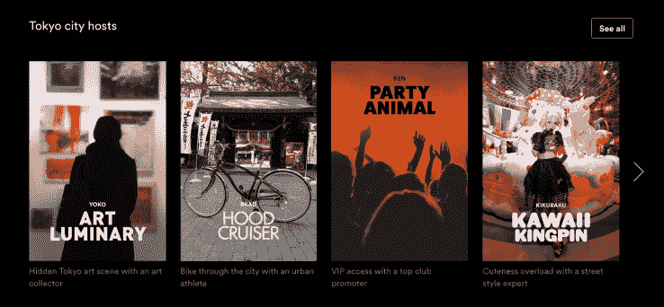

# Airbnb 开始测试城市主人计划，为客人提供有指导的独特体验 

> 原文：<https://web.archive.org/web/https://techcrunch.com/2016/06/03/airbnb-begins-testing-city-hosts-program-to-give-guests-guided-one-of-a-kind-experiences/>

# Airbnb 开始测试城市主人计划，为客人提供有指导的独一无二的体验

Airbnb 长期以来一直称赞他们能够给客人提供真正独特的度假体验，而不仅仅是呆在平淡无奇的酒店房间里。现在，该公司希望通过为客人提供选择，让他们通过专门的导游体验来体验城市生活，从而重振整个旅行体验。

这家房屋共享服务公司推出了一个名为 City Hosts 的新项目的私人测试版，该项目允许 Airbnb 的客人超越住宿和租赁私人导游，向他们展示他们所在地区隐藏的宝石。私人测试版目前允许访问旧金山、伦敦、洛杉矶、巴黎和东京的城市主机。

Airbnb 希望将自己更多地注入到人们度假的体验中。该界面与网飞极其相似，在很多方面，这就是 Airbnb 对待这个项目的方式:让用户能够简单地选择定制娱乐体验。

目前有 36 种体验可供选择，老实说，它们听起来都非常棒，从在旧金山与风筝冲浪者的冒险，到与巴黎厨师的越南烹饪课，再到与唱片球探的伦敦音乐之旅。体验是按每位客人收费的，你需要在体验的城市通过 Airbnb 预订住宿。根据你选择的城市主人，你可能会与其他 Airbnb 客人分享旅程，或者你可能会独自享受整个体验。

想要参加东京“艺术名人”城市主人体验的人将为每位客人支付 250 美元，然后由当地艺术策展人 Yoko 带领参观这座城市。客人可以在四天中每天花大约 3 个小时与 Yoko 一起检查我们当地的艺术画廊，与艺术家会面，并在鲜为人知的餐厅和酒吧建立联系。体验的大部分费用由初始付款支付。

尽管这个项目仍处于难以置信的早期阶段，但它表明 Airbnb 的思维方式明显拓宽了，Airbnb 正试图让用户获得更多的度假体验。它还为游客提供了一种更注重活动的方式来选择他们旅行的时间和地点。预订体验后，网站会给你一个靠近活动的景点列表，你可以在那里预订几晚住宿。

城市东道主的可扩展性是值得怀疑的。很明显，该公司在收集和审查这些城市的一些更酷的定制体验方面做了很多工作，但人们想知道该公司是否会向所有想要炫耀他们城市的用户开放这一点。许多体验要到今年夏天晚些时候才能获得。