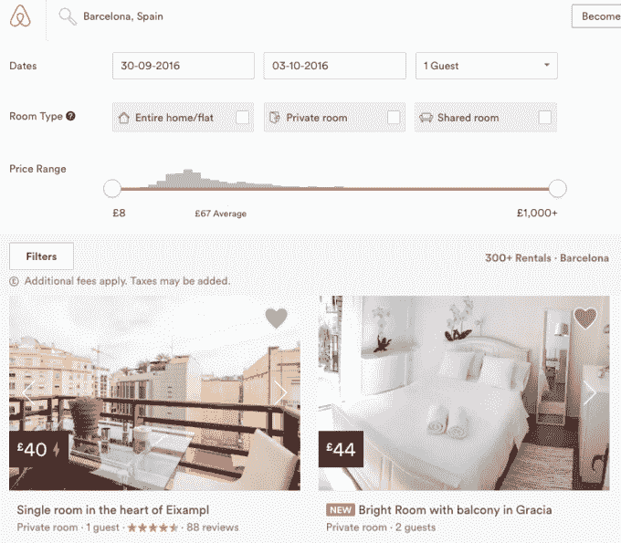

# Airbnb 在巴塞罗那面临新的打击，因为市议会要求居民举报非法租赁

> 原文：<https://web.archive.org/web/https://techcrunch.com/2016/09/19/airbnb-faces-fresh-crackdown-in-barcelona-as-city-council-asks-residents-to-report-illegal-rentals/>

Airbnb 在巴塞罗那的活动正面临进一步的挤压。巴塞罗那是加泰罗尼亚的首都，非常受游客欢迎。共享经济平台的迅速崛起加剧了与当地社区的紧张关系，以应对不断上涨的租金和游客的喧闹行为。

一段时间以来，该市一直试图打击非法旅游出租，新任市长阿达·科劳(Ada Colau)去年对出租汽车的新注册数量设置了临时上限——这一禁令今年夏天被延长。目前还不可能在巴塞罗那合法获得新的度假租赁许可证。

但是该委员会现在正在加强执法活动，给居民写信，要求他们如果怀疑某处房产被非法出租给游客，就要上报。

在市政委员会上个月宣布将加大对该市非法出租房屋的打击力度后，市政邮购已经从巴里奥斯、细川玉子和桑特-蒙朱奇的居民开始，但下个月将扩展到整个城市。

今年夏天早些时候，市政府还决定将出租给游客、不在加泰罗尼亚旅游登记处(RTC)的公寓的最高罚款从 6 万€提高到 60 万€。它正在利用一项地区旅游法来试图控制城市中的合租活动。

去年底,[委员会对 Airbnb 和另一个家庭共享平台,](https://web.archive.org/web/20221129015458/http://ajuntament.barcelona.cat/turisme/en/noticia/barcelona-fines-airbnb-and-homeaway-60000-euros-each) [Expedia 所有的 HomeAway,](https://web.archive.org/web/20221129015458/https://beta.techcrunch.com/2015/11/04/expedia-acquires-airbnb-rival-homeaway-for-3-9b/)罚款 6 万英镑，原因是它们为未在 RTC 注册的房屋做广告，以及未回应提供无 RTC 号码房屋详情的要求。

本月早些时候，一项由委员会委托进行的研究表明，巴塞罗那近 40%的旅游公寓供应是非法的。报告还指出，过去三年里，该市租金大幅上涨(33%)，这是西班牙最大的租金通胀，报告将其归咎于度假游客限制了住宿供应。

“巴塞罗那市议会致力于确保旅游活动符合可持续的城市模式，”市议会在给居民的信中写道，并补充说，它希望成为一个“对旅游业开放，但有明确行为规则的城市。”

它继续说它将加强打击非法旅游出租的活动，并要求居民通过举报任何可疑的财产来帮助它识别非法出租——要么拨打自由电话号码，要么使用[网络表格](https://web.archive.org/web/20221129015458/http://www.barcelona.cat/incidencies/habitatgesturistics)(有加泰罗尼亚语、西班牙语、英语、法语和德语版本)。

该网站还允许居民查询一个地址是否合法出租用于旅游目的。

柏林市议会采取了类似的举措，鼓励居民在怀疑邻居非法出租的情况下在网上提交(匿名)报告——尽管柏林对 Airbnb 等公司采取了更强硬的立场。该市 2014 年的住房法修改于今年 5 月[生效](https://web.archive.org/web/20221129015458/https://beta.techcrunch.com/2016/05/03/berlin-housing-law-change-squeezes-airbnb/)，禁止在没有许可的情况下经营整栋公寓的短期旅游租赁——允许柏林政府关闭家庭共享平台上的所有新活动。(虽然在公寓里出租私人房间仍然允许无照经营)。

在 Airbnb 上快速搜索本月的周末租房，会出现 300 多个巴塞罗那(和巴黎)的搜索结果，但柏林的搜索结果要少得多，Airbnb 指出，柏林“只有 11%的房源在这些日期剩余”。因此，尽管后者的打击似乎对 Airbnb 的库存产生了重大影响，但巴塞罗那减少 Airbnb 等平台上盛行的非法游客租赁的努力迄今似乎相当无效。

为了打击非法活动，巴黎市议会还发布了一张巴黎合法游客租赁的地图。

据路透社报道，上个月，巴塞罗那市政厅下令将 256 套公寓从 Airbnb 等房屋共享平台上移除，并表示正在调查 400 多名其他潜在违规者。

向所有居民发送邮件，要求他们举报非法使用该平台的邻居，这是否会让大量主机三思而行，还有待观察。(或者在如何使用该平台方面变得更有创意——比如[提供 30 天的合同](https://web.archive.org/web/20221129015458/http://www.spanishpropertyinsight.com/2016/07/07/barcelona-threatens-airbnb-others-fines-e600000/)并在游客离开几天后取消合同)。

在最近的研究中，市议会估计巴塞罗那有 15881 套旅游公寓，其中 9606 套是有执照的——这意味着 6275 套是非法的。

在今天[的一份新闻稿中，该委员会提供了其活动的最新情况，称其在 7 月和 8 月期间对 615 个非法公寓发出了拆除令——这意味着在宣布今年夏天将加强检查后，总共有 1290 个案例被立案。](https://web.archive.org/web/20221129015458/http://ajuntament.barcelona.cat/premsa/2016/09/19/el-pla-de-xoc-dhabitatges-dus-turistic-permet-ordenar-el-tancament-de-615-pisos-illegals-durant-lestiu/?hlst=huts)

它补充说，自从两个月前开通网络投诉表格以来，共收到 960 起关于非法出租的投诉，尽管它说投诉和建议的总数仍然更高，为 1，123 起。

根据[市政数据](https://web.archive.org/web/20221129015458/http://www.reuters.com/article/us-spain-airbnb-idUSKCN10M1YY)，在 2015 年之前的三年里，巴塞罗纳使用 Airbnb 的人数增加了两倍，达到 90 万。

Airbnb 在一份声明中回应了市议会的最新行动，指责市议会对旅游业的政策自相矛盾，并呼吁制定“明确的规则”来定义“坏人”。

上面写着:

> Airbnb 是巴塞罗那解决方案的一部分，令人失望的是，看到市政厅用威胁到数千人经济命脉的陈旧规则来恐吓当地人。巴塞罗那的旅游政策有一个矛盾的核心，它有利于旅游热点地区的商业经营者和完全用于旅游的公寓。家庭共享把钱放进了当地人的口袋，有效地利用了空间，并把客人和利益扩展到了中产阶级家庭和他们的社区。巴塞罗那需要明确的规则来区分房屋共享和不良行为者，就像世界上其他主要城市一样。

Airbnb 声称，它在巴塞罗那有大约 2.1 万个活跃的房源，这座城市的典型房东每年在€的收入为 5100 英镑，大多数人(73%的房东)只列出一处房产——尽管这使得该市近三分之一的 Airbnb 房东租用了多处房产，这表明许多居民正在利用该平台充当职业房东，而不是分享他们的实际房屋。

在今天的新闻发布会上，巴塞罗那市议会警告说，继续在没有 RTC 的情况下发布旅游租赁广告的平台将被要求与政府合作，并撤回广告。如果不这样做，他们将面临高达 60 万€的新罚款。

此外，在打击行动中，不及时回应居民有关其酒店活动投诉的旅游租赁公司也将面临纪律处分，包括最高 1000€元的罚款。该委员会已经设立了一个专门的呼叫中心来处理此类投诉。

市议会向 TechCrunch 证实，目前并没有对游客在他们居住的地址租房的情况进行监管。它的行动是针对整个公寓出租。然而，一位发言人指出，目前正在起草新的旅游法规，其中将包括房间租金，并允许每个城市在未来管理这种类型的租金。

*这篇文章更新了巴塞罗那公寓个人客房游客租赁管理制度的更多细节*