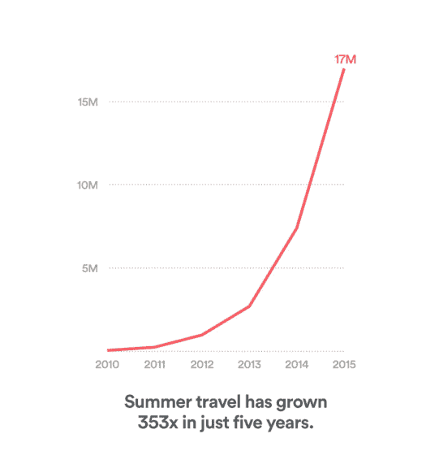
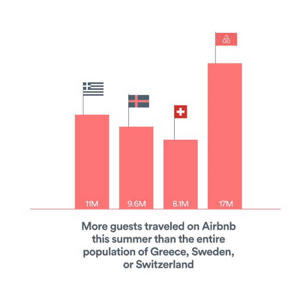

# Airbnb 今年夏天接待了近 1700 万名客人 

> 原文：<https://web.archive.org/web/https://techcrunch.com/2015/09/07/airbnb-hosted-nearly-17-million-guests-this-summer/>

Airbnb 的增长是向右上方的。根据一份新的[旅游报告](https://web.archive.org/web/20221207212120/http://blog.airbnb.com/wp-content/uploads/2015/09/Airbnb-Summer-Travel-Report-1.pdf)，今年夏天全球有近 1700 万人在 P2P 住宿平台上预订了客房。

这是过去五年里 353 倍的激增——与 Airbnb 在 2008 年夏天正式推出之前接待的三位客人相去甚远。Airbnb 创始人布莱恩·切斯基(Brian Chesky)和乔·格比亚(Joe Gebbia)当时正试图找到一种支付租金的方式，并制作了一个网站，广告称以 80 美元的价格在他们公寓的地板上租赁一个空气床垫，住一晚，外加早上的早餐。三个人，两个男孩和一个女孩，决定尝试一下，Airbnb 就诞生了。

快进到两年后，当时的预订量肯定看起来很大——2010 年夏天，只有 47000 多人使用该网站寻找住宿的地方。

Airbnb 现在表示，全球有超过 5000 万人追随了这三位客人最初的脚步——仅今年就有 3000 万人在 Airbnb 上预订了住宿，超过三分之一(1700 万人)是今年夏天通过该网站预订的。

客人来自 57，000 多个城市和 150 个不同的国家，在这个季节有趣的住宿条件下过夜，包括树屋、蒙古包、城堡和尼加拉瓜的一个私人岛屿。报告显示，去年超过一半的游客是女性(54%为女性，46%为男性)，游客的平均年龄为 35 岁。

然而，大多数夏季旅行者都呆在自己的大陆上。三条最受欢迎的预订路线是从巴黎到里斯本，从纽约到卡茨基尔和哈德逊谷，从首尔到大阪。

Airbnb 还声称正在通过该网站帮助中产阶级家庭补充收入。前白宫国家经济顾问吉恩·斯珀林(Gene Sperling)进行的一项早期研究发现，大多数寄宿者是工薪阶层家庭，他们一年大约有 66 天出租自己的主要住所。根据这项研究，平均每个主人还能从临时出租额外空间中获得大约 7350 美元，或者说年收入增加了 14%。

Airbnb 经历了一个有着巨大增长的巨大夏天，这是风投们乐于见到的健康的曲棍球棒。

切斯基想把图表推得更高。联合创始人[在今年春天早些时候透露了他的计划](https://web.archive.org/web/20221207212120/https://beta.techcrunch.com/2015/05/27/airbnb-hopes-to-have-almost-a-million-stays-a-night-by-summer/)，该平台将促进每晚超过一百万次住宿。该公司在 6 月份筹集了 15 亿美元来帮助实现这一目标。

一个夏天 1700 万的预订量并不是一个晚上 100 万的数字，但是一些风投的[认为这个平台不会太大](https://web.archive.org/web/20221207212120/https://medium.com/@bchesky/7-rejections-7d894cbaa084)可能正在路上。