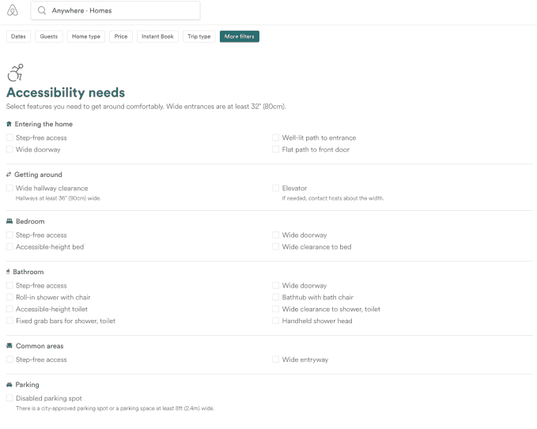

# Airbnb 让残疾人更容易获得服务 

> 原文：<https://web.archive.org/web/https://techcrunch.com/2018/03/15/airbnb-makes-service-more-accessible-to-people-with-disabilities/>

# Airbnb 让残疾人更容易获得服务

Airbnb 对其平台进行了一些更改，以使残疾人更容易找到符合他们需求的住宿。Airbnb 增加的 21 个新的无障碍过滤器使人们能够找到有无障碍进入房间、足够容纳轮椅的入口通道、电梯、带椅子的无障碍淋浴室等的住宅和公寓。

Airbnb 的客人以前可以搜索轮椅可进入的房源，但仅此而已。为了确定合适的过滤器，Airbnb 与加州盲人委员会、加州独立生活中心基金会和全国独立生活委员会合作。

Airbnb 愿意包容残疾人，这是鉴于 [Lyft](https://web.archive.org/web/20221208220923/https://techcrunch.com/2018/03/13/lyft-faces-discrimination-lawsuit/) 和[优步](https://web.archive.org/web/20221208220923/https://techcrunch.com/2017/07/18/uber-accessibility-lawsuit-new-york/)因缺乏可供使用轮椅的人选择的方案而面临诉讼。展望未来，Airbnb 表示，它将与主人和客人合作，确保过滤器有用且准确。

Airbnb 无障碍产品和项目经理 Srin Madipalli [在一篇博客文章](https://web.archive.org/web/20221208220923/https://press.atairbnb.com/airbnb-highlights-new-accessibility-filters-and-features-for-guests-with-disabilities-worldwide/)中说:“向所有主人和客人推出新的无障碍功能和过滤器只是我们改善 Airbnb 无障碍旅程的第一步。”“我们鼓励每个人使用它们，并通过它们发送反馈。”