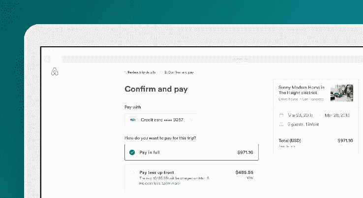

# Airbnb 现在允许用户提前支付更少的预订费用 

> 原文：<https://web.archive.org/web/https://techcrunch.com/2018/01/16/airbnb-now-lets-users-pay-less-up-front-for-bookings/>

# Airbnb 现在允许用户提前支付更少的预订费用

Airbnb 今天宣布了一项新功能，将帮助用户管理他们在该平台上的支付。这项功能的名字恰如其分，尽管缺乏想象力，但它让用户在预订时支付一部分旅行费用，其余部分在入住时支付。

在此之前，Airbnb 用户必须预先支付 100%的预订费用。对于周末旅行来说，这没什么大不了的。但是长期停留可能会相对昂贵，因此不方便预先支付。

紧随其后的是另一项支付功能，让团体游客[在预订时分期付款](https://web.archive.org/web/20221006181151/https://beta.techcrunch.com/2017/11/28/airbnb-launches-payment-splitting-for-group-trips/)。

Airbnb 表示，在测试免预付功能期间，40%的客人选择了该选项，并选择了更高价值的预订。该公司还表示，选择使用该功能的用户的预订时间是普通预订的两倍。

Airbnb 决定了可以预先支付的金额和入住前几天到期的金额，该公司表示，通常是 50%。该功能的一个规定是，预订必须在入住前 14 天进行，并且总价必须至少为 250 美元。

这项新功能现在可以在所有平台上使用。