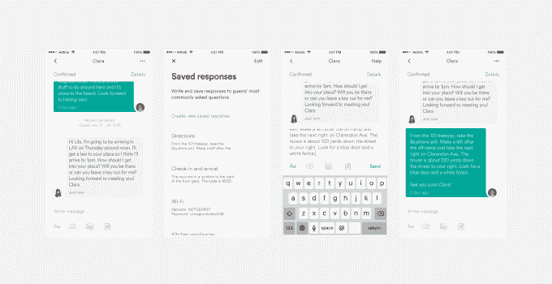

# Airbnb 用新的主机工具改进了应用程序，改进了消息传递技术

> 原文：<https://web.archive.org/web/https://techcrunch.com/2016/09/27/airbnb-revamps-its-app-with-new-tools-for-hosts-improved-messaging/>

Airbnb 可能还没有准备好推出其新的旅游服务应用程序，Airbnb Trips，但与此同时，该公司正在[对其旗舰应用程序](https://web.archive.org/web/20221205152203/http://airbnb.design/co-designing-with-hosts/)进行大改造。Airbnb 主要应用程序的即将到来的版本将为主机引入许多新功能，包括用于更快回复的消息模板和让他们轻松查看谁在何时入住、入住率等的日历。

该公司[称](https://web.archive.org/web/20221205152203/http://airbnb.design/co-designing-with-hosts/)这些变化不会立即生效，而是会在接下来的几个月内推出。

在去年的 Airbnb 公开会议上，主办方的反馈推动了这次改造。主持人表示，他们非常依赖这款应用，因为主持通常不是他们的全职工作。相反，该公司发现，他们管理自己的大部分活动，包括在旅途中回复收到的信息。

有了新的应用程序，信息将更加突出，并进行智能升级。

以前，收件箱被埋在应用程序的导航中，需要点击四次才能进入，现在它将作为第一个按钮直接位于主屏幕上。此外，主人将能够存储对常见问题的回答，以便更快地回答客人的信息，而不必在手机的小屏幕上键入回答，或从保存的文档中复制和粘贴。

相反，主持人可以使用这些“消息模板”来创建对问题的预写回复，如问路，或关于入住和退房时间的问题，请求 Wi-Fi 密码等。在消息传递界面中，一个新的选项将让主机通过点击从这些保存的响应中选择一个，然后他们可以选择编辑或发送。

该应用程序还允许主持人通过消息共享照片，这使其更接近真实的消息体验。

此外，更新后的 Airbnb 应用程序将包括一个新的日历功能，允许主人通过各种不同的视图查看他们的预订。例如，“概览”屏幕将显示所有列表的预订和免费日期，一目了然，而另一个屏幕让您深入每个预订以查看更多信息。

该屏幕顶部的选项卡让您可以在“月”视图和“详细信息”屏幕之间切换，前者显示客人的面孔，覆盖在他们预订的日期上，而后者则让主人看到每天的预订、可用性和价格。你甚至可以点击进入一天，切换可用性或关闭，并调整价格。

同样值得注意的是，该应用程序是使用 Airbnb 的[新设计语言系统](https://web.archive.org/web/20221205152203/http://airbnb.design/the-way-we-build/) (DLS)构建的，该系统允许快速迭代，并在团队间共享词汇。这也有助于该公司制作各种各样的产品，这些产品会让人感觉彼此之间的联系更加紧密——正如之前[报道](https://web.archive.org/web/20221205152203/https://beta.techcrunch.com/2016/08/17/airbnb-trips-a-test-version-of-companys-travel-services-app-pulled-from-google-play/)的那样，如果 Airbnb 选择在未来推出第二款旅游服务应用，这可能会有所帮助。

这并不是 Airbnb 第一次考虑到主人的需求而改进其移动应用程序——毕竟，客人只是偶尔使用该应用程序，而活跃的主人可能每天都会启动它。

[几年前](https://web.archive.org/web/20221205152203/https://beta.techcrunch.com/2013/11/12/airbnb-ios-android-apps/)，Airbnb 重新设计了这款应用，让主人可以直接通过手机界面回复信息、接受预订、更新日历、管理即将到来的客人等等。也是在这个时候，它引入了“主机主页”流程，无需电脑就可以向平台添加列表。

Airbnb 表示，新功能将在“未来几个月内”在 iOS 和 Android 上推出。