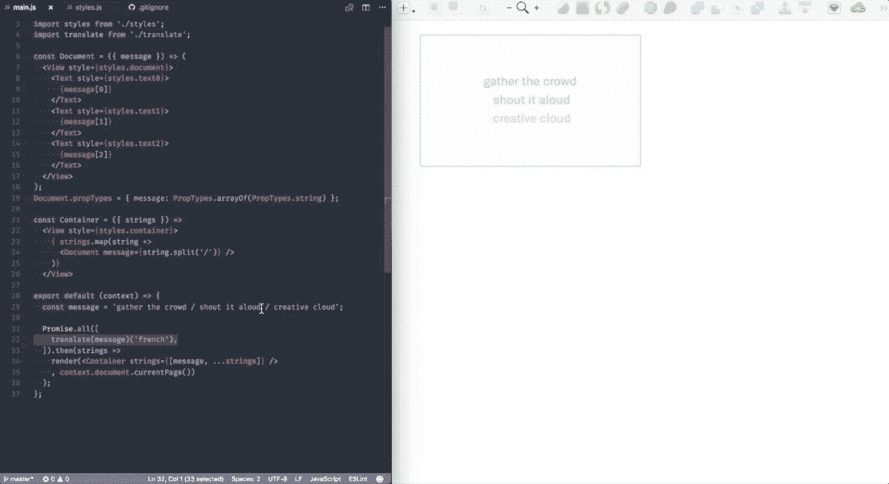

# Airbnb 的新开源库让您可以使用 React 和 render to Sketch 进行设计 

> 原文：<https://web.archive.org/web/https://techcrunch.com/2017/04/25/airbnbs-new-open-source-library-lets-you-design-with-react-and-render-to-sketch/>

# Airbnb 的新开源库让你可以使用 React 和 render to Sketch 进行设计

今天，Airbnb 的设计团队[开源了其内部库](https://web.archive.org/web/20221225120440/http://airbnb.design/painting-with-code/)，用于编写 React 组件，这些组件可以轻松地直接渲染到 Sketch。Airbnb 团队没有试图将 Sketch 导出为代码，而是将时间花在了相反的事情上——将画笔放在了工程师的手中。

日常的工程师和设计师可以在没有设计系统的情况下奢侈地工作，但是大公司忽视了他们，后果自负。例如，Airbnb 已经投入大量资源来开发可以在整个公司应用的设计组件。但尽管有必要的规划，Airbnb 仍在努力保持其迭代设计系统与草图模板同步，从而阻碍了开发。

如果你不熟悉设计系统，它们是任何有多个团队设计产品的公司的设计 DNA。想象一下，如果 Airbnb 负责房源页面的团队与负责点评功能的团队没有交流。结果将是业余设计时间，很明显，两个团队在构建应用程序体验时没有沟通。

[gallery ids="1481467，1481468"]

对于任何产品，无论是 Airbnb 还是脸书，很容易看到一个新的设计规则如何改变更多你无法合理跟踪的东西的外观。如果草图渲染只需要修改代码就可以立即更新，那么这个瓶颈就可以减少。这就是 React-Sketchapp 库的用武之地。

在上面的 GIF 中，Airbnb 正在实现其 React-Sketchapp 库，使用 Google Translate API 以相同的设计呈现不同语言的文本变体。将所有这些工作都放在 React 中的好处是，它是大多数工程师已经熟悉的范例。

该库在 GitHub 上[可用。虽然它的本意是作为减少 Airbnb 整体设计和开发时间的工具，但当工程师能够以他们通常与代码交互的方式与设计交互时，更多的事情是可能的。](https://web.archive.org/web/20221225120440/https://github.com/airbnb/react-sketchapp)