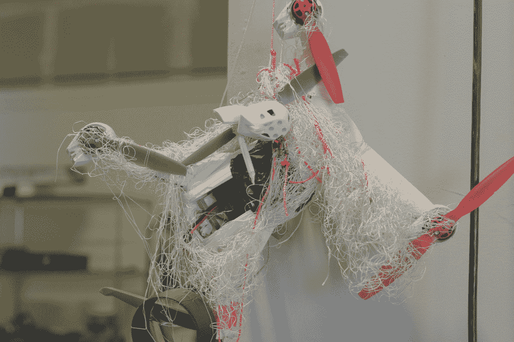
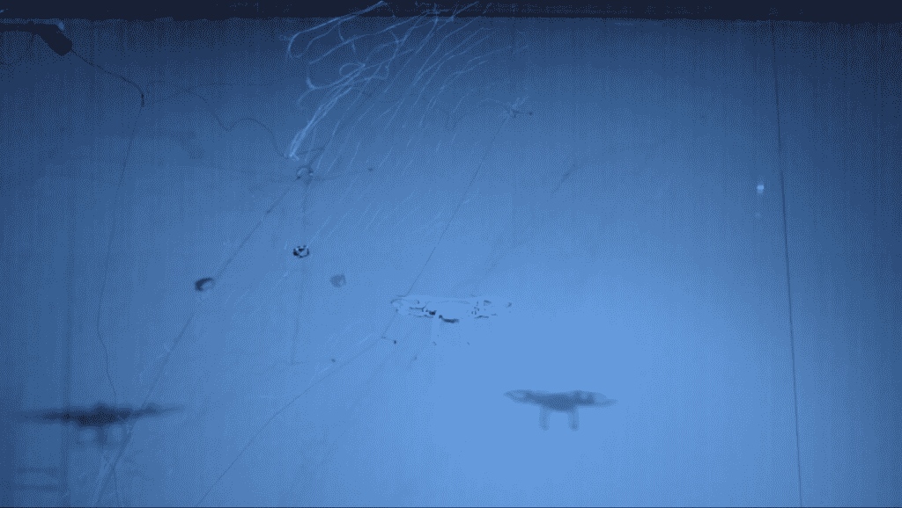

# 空域系统“拦截器”可以自己捕捉高速无人机 

> 原文：<https://web.archive.org/web/https://techcrunch.com/2016/11/18/airspace-systems-interceptor-can-catch-high-speed-drones-all-by-itself/>

总部位于圣莱安德罗的[空域系统](https://web.archive.org/web/20221208050321/http://airspace.co/)正在解决新兴无人机行业面临的最棘手的问题。

该公司设计了一架自己的无人机，挤满了传感器和机器智能，可以自主拦截高速飞行的威胁无人机，并将其带离大量人群。如果你认为这听起来很难，那你就对了。该公司为其无人驾驶飞行狗战斗机采用了无数技术，包括计算机视觉、物理学和一些非常严肃的工程技术。

为了不仅探测敌人的无人机，而且预测它们未来的位置，CTO Guy Bar-Nahum 和一个机器学习和计算机视觉专家团队设计了一种创造性的方法，使用模拟试飞来训练他们的机器学习框架。这个想法很棒，因为它很像人类飞行员在飞行模拟器上训练的方式。大多数培训可以在公司的办公室内全天候进行，耗时的户外测试飞行仅用于微调算法。

一旦飞行器擅长识别和预测其他高速无人机的方位，下一个挑战就是让优秀的无人机采取行动。这意味着创造一种凯夫拉尔纤维网，利用类似汽车安全气囊的技术从空域无人机的底部发射。该团队试验了各种方法来禁用对方无人机，而不会永久损坏它们。凯夫拉尔织网，结构上设计成展开时不会向后吹，证明是最好的选择。

一旦连接上，重型拦截无人机可以将现在已经失效的威胁转移到安全的地方。万一它不能抓住并开始表现不稳定，该飞行器有一个机载降落伞，以实现体面和软着陆。

空域第一次成功测试的结果

纽约大都会队已经开始与空域合作，实施防御措施，防止无人驾驶飞机袭击拥挤的体育场。除了给观众带来的风险之外，只是一次不必要的飞越的光学效果就可能会影响门票销售(没有双关语的意思)。

“消费无人机行业离不复存在还差一场灾难，”空域系统公司首席执行官 Jaz Banga 解释道。

如今几乎不存在任何障碍来阻止怀有恶意的人造成伤害，即使是用商店里买的无人机。一架现成的 DJI 无人驾驶飞机可以用生物战剂或炸药进行合理的武器化。

像 DroneShield 这样的公司在探测无人机方面开辟了一个市场利基，但他们将干预的责任留给了其他人。典型的方法，比如击落无人机，实际上并不能解决问题。一架带有炭疽热的坠落的无人机是可怕的，不管它接近地面的原因是什么。

如果这种情况在现实世界中发生，美国政府很可能会禁止所有无人机飞行，直到找到一种系统的方法来防止它们武器化。被任命为联邦航空管理局新成立的无人机咨询委员会(DAC)成员的 Banga 对这些风险了如指掌。

专门设计的凯夫拉尔纤维网向商店购买的无人机开火

空域的工作支持整个无人机生态系统。一个坏苹果制造混乱的可能性越小，消费无人机就越有可能存活足够长的时间来积极影响世界。现成的消费无人机已经能够为社会公益服务。在紧急情况下，无人机向护理人员运送专业医疗用品将变得司空见惯。

空域正在打造的无人机更像是一种服务，而不是一种产品。该公司咨询公共和私营部门实体，以提供定制的无人机安全。消费者不能购买空域无人机。迄今为止，该公司已经从 [Sterling VC](https://web.archive.org/web/20221208050321/http://www.sterling.vc/) 、 [Shasta Ventures](https://web.archive.org/web/20221208050321/http://www.shastaventures.com/) 、[Granite Hill Capital Partners](https://web.archive.org/web/20221208050321/http://www.granitehill.net/)和天使投资人那里筹集了 500 万美元的种子资金，用于开发初始产品和服务大量试点客户。

Banga 还指出，空域不仅仅是一家无人机公司。它的系统可以分解成单独的部分。将无人机上的相同传感器组装到固定在地面上的探测器上并不困难。最终无人机本身将完全模块化。这使得除了专业传感器和拦截技术之外，还可以增加多射凯夫拉尔织网等功能。