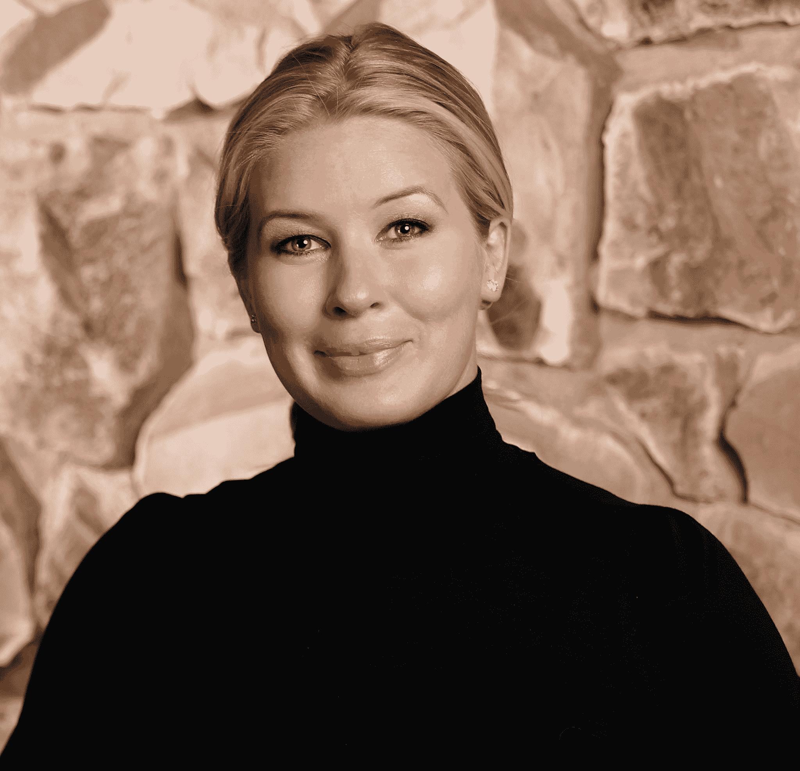

# 澳大利亚最大的风险投资公司 AirTree 从海外吸引了两名新的科技公司 

> 原文：<https://web.archive.org/web/https://techcrunch.com/2017/01/29/airtree-australias-largest-vc-lures-two-silicon-valley-players/>

# 澳大利亚最大的风险投资公司 AirTree 从海外吸引了两家新的科技公司

在经历了一段时间的科技“漫游”之后，澳大利亚正在经历一场小型科技繁荣。很长一段时间里，你能说出的这个国家最大的东西是亚特兰蒂斯。现在其他创业公司正在加入这个名单，风险投资也在增加。

这方面的最新迹象是，当地风投 AirTree Ventures 将英国风投、前 Accel Partners 的詹姆斯卡梅伦(James Cameron)加入了其团队。

“对我来说很明显，澳大利亚的生态系统已经到了一个转折点，”他在一份声明中说。“在 Accel，我们很幸运地支持了一些伟大的澳大利亚和新西兰创始人，他们是从该地区涌现出来的新一代世界级、关注全球的创业公司的一部分。”

和他一起在 AirTree 工作的还有 Julia French，她是 CoveredCo 的前创始人，covered co 是一家在硅谷久负盛名的营销公司。Julia 与澳大利亚生态系统有着长期的联系，帮助支持了包括 Atlasssian 在内的各种澳大利亚公司在美国的扩张和营销工作。

现在大约有 20 亿澳元的风险投资资金[可用于澳大利亚的初创公司](https://web.archive.org/web/20221225210837/http://www.startupdaily.net/2016/12/australian-startups-see-corporate-involvement-growing-international-investment-2017/)，而 AirTree Ventures 在过去几个月[关闭了该国有史以来最大的风险投资基金](https://web.archive.org/web/20221225210837/https://techcrunch.com/2016/09/12/tie-my-series-a-down-sport/)，达到 2.5 亿澳元。