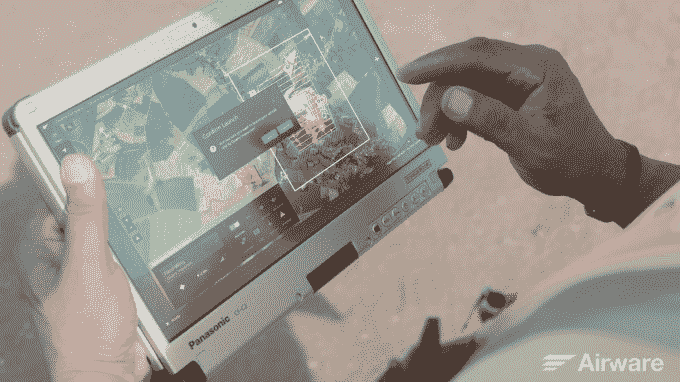

# Airware 收购 Redbird 打造全栈无人机服务帝国

> 原文：<https://web.archive.org/web/https://techcrunch.com/2016/09/22/airware-buys-redbird-to-build-a-full-stack-commercial-drone-services-empire/>

“我想成为全球领导者。我不想打造不相关的欧洲或法国球员。”这就是为什么 Emmanuel de Maistre 刚刚[向美国无人机服务巨头](https://web.archive.org/web/20230225043116/http://www.airware.com/news_items/airware-acquires-drone-data-analytics-pioneer-redbird) [Airware](https://web.archive.org/web/20230225043116/https://www.airware.com/) 出售了 [Redbird](https://web.archive.org/web/20230225043116/http://www.getredbird.com/en/) ，他为建筑和采矿公司提供无人机驱动的分析服务。

他们可以一起向不知道如何自己驾驶无人机的财富 500 强公司出售飞行器硬件、飞行软件、数据收集、云管理和可操作的见解。

Redbird 实际上是 Airware 自己的商业无人机基金在 2015 年的第一笔投资，这笔投资为其提供了 319 万美元的风险投资。Airware 首席执行官乔纳森·唐尼(Jonathan Downey)告诉我，他已经审查了 115 个无人机投资项目，红鸟仍然令人印象深刻，以至于当这家法国初创公司开始寻求筹集更多资金时，他决定购买它。

Airware 不愿透露它支付的价格，但首席执行官乔纳森·唐尼告诉我“这比收购要多得多。”Airware 正在收购 Redbird 的 38 名团队成员以及他们的技术和业务，后者将继续在欧洲以自己的品牌运营。Redbird 的巴黎办公室也将成为 Airware 的欧洲总部，为这家美国初创公司在那里的扩张提供动力。

[Airware 自 2011 年以来已经筹集了 7000 万美元](https://web.archive.org/web/20230225043116/https://techcrunch.com/2016/03/31/allware/)，最初是建立一个无人机操作系统，用于控制飞行器，进行数据收集飞行，并为工业客户提供云管理和数据分析。

今年早些时候，Airware 开始在必要时自行构建硬件，以提供完整的端到端无人机服务。然而现在，它发现装有其软件的高端消费无人机可以完成这项工作。这意味着它与中国制造商 DJI 合作多于竞争，后者是为数不多的其他无人机巨头之一。

唐尼告诉我“DJI 是从消费类汽车起家的。随着时间的推移，如果您将他们与合适的企业软件结合起来，他们就能够处理越来越多的商业应用。”

此次收购使 Airware 能够专注于保险垂直领域，帮助 State Farm 和其他客户检查屋顶、住宅索赔管理和商业承保。Redbird 将努力扩大其作为供应商的领先地位，为矿山、采石场和建筑工地提供无人机拍摄的航空数据，分析其生产数量和速度、效率以及安全合规性。

没有无人机，大企业被迫依赖昂贵的直升机，有限的卫星摄影，或者脆弱的人类爬梯子，吊在吊带上。科技很少能让某样东西瞬间变得更好、更便宜、更安全。Airware 打赌，随着市场的增长，在建筑和采矿无人机业务中购买一个立足点可能会变成大规模的足迹。