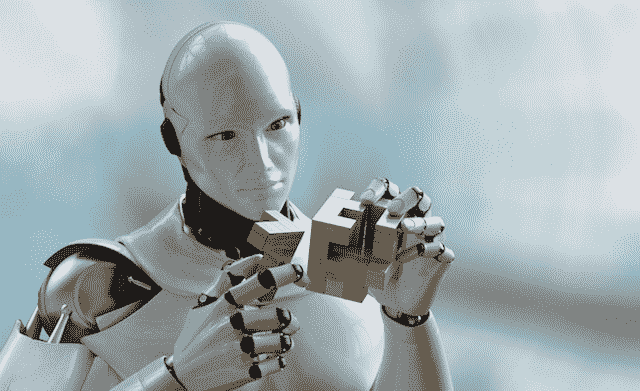

# 人工智能的开源模式是封闭的、不充分的、过时的 

> 原文：<https://web.archive.org/web/https://techcrunch.com/2017/01/28/ais-open-source-model-is-closed-inadequate-and-outdated/>

库马尔·斯里瓦斯塔瓦撰稿人

人工智能大。而且越来越大。拥有机器学习经验的企业正在寻求转向基于人工智能的技术。

尚未建立机器学习专业知识的企业正在争相了解和设计机器学习和人工智能战略。在炒作、混乱、偏执和落后的风险中，谷歌、脸书、百度、微软(通过 Tensorflow、BigSur、Torch、SciKit、Caffe、CNTK、DMTK、Deeplearning4j、H2O、Mahout、MLLib、NuPIC、OpenNN 等项目)等公司发布了一系列开源贡献公告。)提供了一个显而易见的方法来开始使用 AI & ML，尤其是为技术行业以外的企业。  

找到项目，下载，安装…应该很容易。但这并不像看起来那么容易。

当前的开源模式已经过时，不足以在一个由人工智能或人工智能影响的系统运行的世界中共享软件；用户可以在一天之内与数千个人工智能引擎进行互动。

AI 和 ML 的先驱们仅仅分享他们的代码是不够的。行业和世界需要一个新的开源模型，在这个模型中，人工智能和人工智能训练的引擎本身以及数据、功能和真实世界的性能细节都是开源的。

# 当前的开源模型是不充分的和过时的

AI 和 ML 支持和影响的系统不同于其他使用开源组件构建的软件。使用开源组件构建的软件本质上仍然是确定性的..该软件被设计和编写为每次执行时都以完全相同的方式执行。AI & ML 系统，尤其是人工智能系统，不能保证表现出确定性的行为。随着系统学习和适应新情况、新环境和新用户，这些系统将改变它们的行为。本质上，一旦人工智能被部署到现实世界中，系统的创造者就会失去对人工智能的控制。是的，当然，创作者可以在学习框架中建立制衡机制。然而，即使在人工智能的约束下，也有很大的解释空间。与此同时，一个被人工智能包围的世界所面临的更大挑战是被束缚的人类所产生的冲突。

AI & ML 系统，尤其是人工智能系统，不能保证表现出确定性的行为。随着系统学习和适应新情况、新环境和新用户，这些系统将改变它们的行为。本质上，一旦人工智能被部署到现实世界中，系统的创造者就会失去对人工智能的控制。是的，当然，创作者可以在学习框架中建立制衡机制。然而，即使在人工智能的约束下，也有很大的解释空间。与此同时，一个被人工智能包围的世界所面临的更大挑战是被束缚的人类所产生的冲突。

是的，当然，创作者可以在学习框架中建立制衡机制。然而，即使在人工智能的约束下，也有很大的解释空间。与此同时，一个被人工智能包围的世界所面临的更大挑战是被束缚的人类所产生的冲突。

想想最近梅赛德斯董事长冯·雨果(von Hugo)的报告，该报告被引述称，梅赛德斯自动驾驶汽车会选择保护乘客的生命，而不是行人的生命。尽管该公司后来澄清说冯·雨果的话被错误引用，但这暴露了一个基本问题，即资本主义将如何影响人工智能的约束。

## 资本主义与人工智能的伦理

如果企业的目的是推动利润，那么产品和服务多久才会开始进入市场，将基于人工智能的体验描述为一种增值的差异化体验，并要求买家为这项技术支付溢价？

在这种情况下，愿意并且能够为差异化体验付费的用户将获得超过其他用户的过度优势。因为企业将尝试并收回他们在人工智能上的投资，这项技术将仅限于那些能够负担得起这项技术的人。这将导致约束和行为被嵌入到人工智能中，从而有效地惠及、保护或优先考虑付费用户。

另一个问题是法律和政策问题，即谁应该对 AI & ML 产品的故障或次优行为负责。责任在于用户、服务提供商、数据科学家还是 AI 引擎？责任(和责备)是如何分配的？回答这些问题需要能够清楚地描述和遵循导致 AI 和 ML 的创建和使用的一系列事件。

## 人工智能到人工智能的交互

试图解决木制立方体难题的机器人的 3D 渲染

### 人工智能-人工智能冲突

考虑到人工智能支持的产品在以前未观察到的交互中可能如何表现的不确定性，这个问题在人工智能支持的产品代表两个或更多不同用户相互交互的场景中被放大。例如，如果由两个独立的人工智能引擎(由不同的公司制造，具有不同的训练数据和功能，以及独立配置的偏好和背景)驾驶和操作的两辆汽车接近停止标志或走向撞车，会发生什么？这些系统在处理和应对类似情况时的细微差异和变化可能会产生意想不到的潜在有害副作用。

### 偏置泄漏

交互人工智能引擎的另一个潜在副作用是放大了训练偏差的风险。例如，如果一辆自动驾驶汽车观察到另一辆自动驾驶汽车以行人为代价保护乘客，并观察到这一选择确保了另一辆汽车能够避免事故，那么它的“学习”将是在类似的情况下做出类似的行为。这可能导致偏差泄漏，其中独立训练的 AI 引擎可能受到另一个 AI 引擎的影响(积极或消极)。

### 学习敏捷性

即使当类似的 AI 引擎被提供有相同的学习数据时，训练环境和用于执行训练的基础设施的差异也可能导致训练和学习以不同的速率进行，并因此得出不同的结论。随着时间的推移，这些微小的变化可能会导致人工智能引擎的行为发生重大变化，并带来不可预见的后果。

### 陈旧和“被遗忘”的人工智能引擎和人工智能垃圾场

在一个通过人工智能实现多种产品的世界里，当产品被抛弃或灭绝时会发生什么。嵌入的人工智能可以在时间中冻结，导致人工智能垃圾场的产生。这些被遗弃的人工智能产品是从其环境和背景直到某个时间点的学习的顶点，如果出于任何原因在不同的时间、环境或背景下复活，可能会再次导致不可预测或不良的影响。

# 人工智能的新开源模型

我们需要一个开源人工智能的新模型，为解决上面列出的一些问题提供一个框架。鉴于 AI 的本质，开源用于构建 AI 和 ML 引擎的技术并将其嵌入产品是不够的。此外，与科学研究类似，行业将需要贡献实际的人工智能和人工智能引擎，这些引擎可以形成新的和改进的系统、引擎和产品的基础。

## 基线、基准和标准

对于所有关键场景，如自动驾驶汽车、照片识别、语音转文本等，尤其是在有多个服务提供商的情况下，行业需要能够定义基线和标准，以此来评估所有其他新的或现有的人工智能引擎并进行堆栈排名(例如，考虑自动驾驶汽车的人工智能相当于 NHSTA 的 5 星级安全评级)。为关键场景定义一个行业可接受和认可的基准可以确保服务提供商和消费者能够就选择支持 AI & ML 的产品和服务做出明智的决定。此外，现有的人工智能引擎可以根据基准和标准不断进行评估，以确保这些系统的质量不断提高。

建立 AI 和 ML 模型的公司应该考虑将整个 AI 和 ML 模型贡献给开源(除了贡献技术和框架来建立这样的模型)。例如，即使是谷歌 5 年前的图像识别模型或微软的语音到文本模型，也可能引发其他部门、行业或垂直行业更快的创新和人工智能同化，从而引发一个自我持续的创新循环。技术之外的行业可以使用这些模型来启动他们自己的努力，并将他们的学习成果反馈给开源社区。

## 偏差测定

需要偏差确定能力来使编码到 AI 和 ML 引擎中的偏差能够尽快被发现和消除。如果没有这样的能力，行业将很难汇聚到通用的人工智能引擎上，这些引擎在各种场景中表现一致且具有确定性。在 AI 的开源模型中，偏差的确定和消除需要以下支持。

### 数据假设和偏差

人工智能产品设计师需要确保他们理解人工智能和人工智能引擎中的假设和偏见。与其他人工智能产品交互的产品需要确保它们理解并准备好处理人工智能引擎行为的后果。为确保此类人工智能和人工智能模型的消费者或集成商做好准备，应为每个人工智能和人工智能模型公开和共享以下标准。

#### 收集标准

数据是如何收集的？数据生成器是什么？数据生成的频率、地点、时间、方式和原因？是如何收集、上演和运输的？

#### 选择标准

如何选择数据进行训练？数据不被选中的标准是什么？选择和不选择哪个数据子集？定义高质量数据的标准是什么？可接受但不是高质量数据的标准是什么？

#### 处理标准

训练的数据是如何处理的？数据是如何转化、丰富和总结的？多久处理一次？是什么导致计划的处理被延迟或停止。

### 特征假设和偏差

AI 和 ML 模型是通过检查被建模系统的特征或特性来训练的。这些特征从数据中提取，并在 AI 和 ML 引擎中使用，以预测系统的行为或将新信号分类到期望的类别中，以提示系统的某个动作或行为。拥有人工智能模型的消费者和集成商不仅需要很好地理解选择哪些特性来开发人工智能模型，还需要很好地理解考虑了哪些特性而没有选择，包括拒绝的原因。此外，需要记录和共享用于确定培训特征的流程和见解的可见性。

## 盲点消除

由于模型中的内置偏差和假设，人工智能和最大似然引擎会形成盲点，从而限制它们在某些情况、环境和上下文中的有用性和有效性。

## 盲点报告和反馈回路

AI 和 ML 的开源模型的另一个关键特性应该是不仅能够确定某个特定模型是否有盲点，而且能够将数据(现实生活中的例子)反馈给 AI 模型，以便用来消除这些盲点。原则上，这与用户报告电子邮件垃圾邮件非常相似，其中垃圾邮件检测引擎可以使用新提供的垃圾邮件示例来更新其垃圾邮件定义和检测垃圾邮件所需的过滤器。

### 协作式盲点消除

理想的开放源代码协议的另一个特征是不同服务提供商之间相互共享数据，从而能够消除共享和协作的盲点。想想谷歌的自动驾驶汽车和特斯拉的自动驾驶仪。谷歌已经在自动驾驶模式下行驶了大约 200 万英里，而特斯拉已经在高速公路上行驶了近 5000 万英里。如果我们超越这两家公司都是竞争对手的事实，那么它们的数据集包含了许多避免撞车和司机/乘客/行人安全的相关数据。这两者都可以利用其他数据集，并改进自己的安全协议和程序。可能的话，这类数据应该是开源模型的一部分，以最大限度地造福于行业和用户群。

# 结论

要让人工智能和人工智能真正改变和颠覆我们的生活，提供更好、更简单、更安全和更愉快的体验，人工智能和人工智能需要包含在多个行业和垂直行业的许多场景和用例中。要真正启动和加速这种采用，开放源码的框架来构建人工智能和 ML 引擎是不够的。我们需要一种新的开放源码模型，使企业不仅能够贡献和利用人工智能和 ML 构建技术，还能够贡献和利用经过完整训练的模型，这些模型可以在特定场景下针对人工智能和 ML 进行改进、调整或适应新的环境、基线和标准，以便新的人工智能/ML 可以对照这些标准进行基准测试。此外，揭示 AI & ML 模型中的假设和偏差(在数据或特征级别)的信息，以及使 AI & ML 模型的消费者能够向服务于某个用例或场景的所有 AI & ML 产品反馈重要数据和反馈的反馈回路也变得至关重要。如果没有这样一个开放源码模型，除了技术领域之外的世界将会继续努力采用人工智能和最大似然语言。