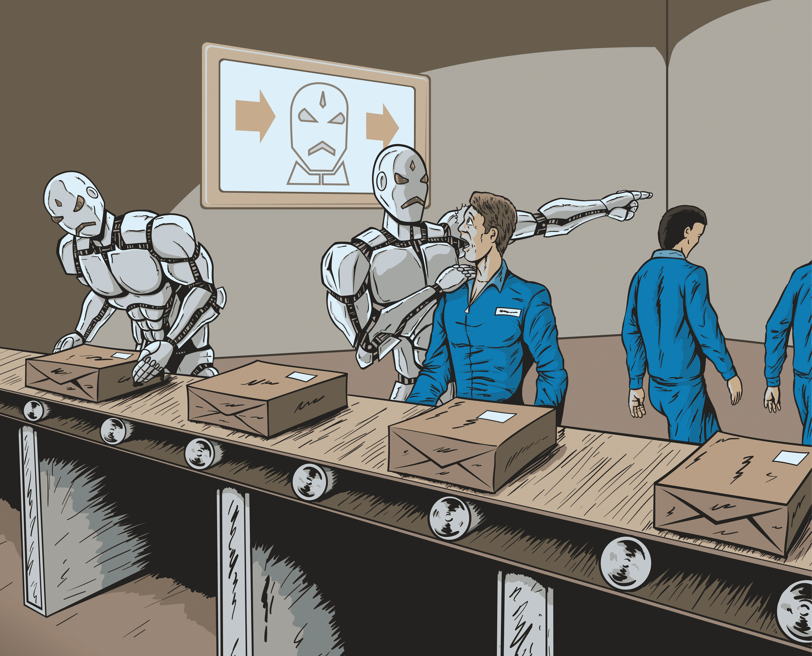
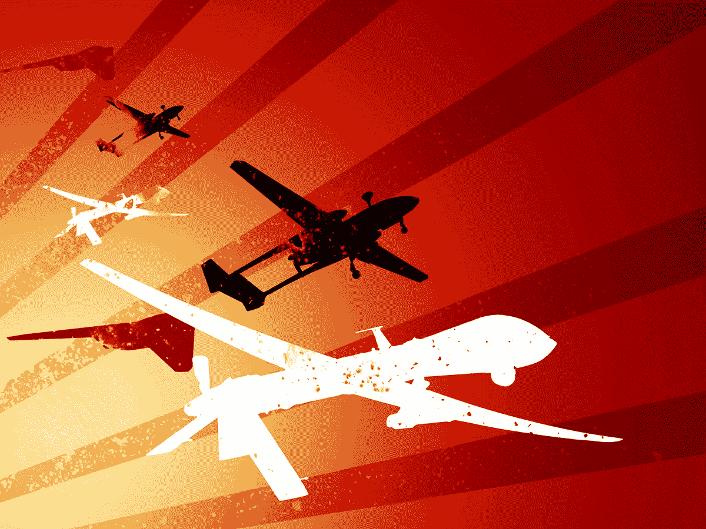

# 人工智能的前景和风险 

> 原文：<https://web.archive.org/web/https://techcrunch.com/2017/10/24/ais-promise-and-risks/>

马尔乔内·布卢门撒尔撰稿人

安德鲁·帕拉西里蒂撰稿人

今年早些时候，116 名科技名人签署了一封公开信，恳求联合国禁止“致命的自主武器系统”，并警告说它们将“允许武装冲突以前所未有的规模进行。”[据*独立*](https://web.archive.org/web/20221209002540/http://www.independent.co.uk/news/science/killer-robots-arms-race-tesla-elon-musk-and-google-mustafa-suleyman-un-autonomous-weapons-a7903906.html) 报道，这“标志着人工智能(AI)专家和机器人公司首次在这个问题上采取联合立场。”

并不是所有的观察者都如此关注；不久前还是百度首席科学家的吴恩达总结道:“担心机器人杀手就像担心火星人口过剩一样——我们有足够的时间来解决这个问题。”

在 21 世纪的最初几年，很少有话题比人工智能引起更强烈的兴趣，或引发更激烈的辩论，首先是对这个术语的理解:一位观察家在今年三月打趣说“人工智能的定义和开发该技术的研究人员一样多。”品牌咨询公司 Junior 的创始人 Robbie Whiting 认为“人工智能不是一个时髦词，它将改变世界。”

虽然人们应该严格使用这个术语，并注意夸张，但人工智能已经在重塑交通运输(包括[自动驾驶汽车](https://web.archive.org/web/20221209002540/https://www.rand.org/pubs/testimonies/CT475.html) ) 、金融和医疗保健等各种领域。脸书的首席技术官[相信](https://web.archive.org/web/20221209002540/https://www.technologyreview.com/s/545416/could-ai-solve-the-worlds-biggest-problems/)它“可以解决全球范围的问题”与此同时，[埃隆·马斯克声称](https://web.archive.org/web/20221209002540/https://www.cnbc.com/2017/07/16/musk-says-a-i-is-a-fundamental-risk-to-the-existence-of-human-civilization.html)它对“人类文明的存在构成了根本性的威胁。”大多数技术本质上既不有益也不有害；相反，我们需要考虑谁在使用它们，目的是什么。

毫无疑问，人工智能的发展速度远远超过了理解其复杂本质、众多维度和深远的国家安全后果的努力。哈佛大学的研究生 Gregory Allen 和 Taniel Chan 最近的一份报告呼吁美国政府建立“类似于人工智能的兰德公司”

作为兰德公司的研究人员，我们赞同哈佛大学团队对人工智能挑战与核武器挑战的比较；冷战期间，兰德思想家彻底改变了我们对安全、威慑和生存的看法。

考虑四个领域，人工智能的净影响可能是重要的，但不确定。

**工作岗位 :**

Sinovation Ventures 的董事长李开复[评估说](https://web.archive.org/web/20221209002540/https://www.nytimes.com/2017/06/24/opinion/sunday/artificial-intelligence-economic-inequality.html)人工智能“将带来大规模的就业机会减少”,同时将越来越多的财富集中到开发和/或采用人工智能的公司手中。其他人回应说，这种恐惧伴随着每一种颠覆性技术，可以追溯到 15 世纪的印刷机。

*经济学家*因此[向](https://web.archive.org/web/20221209002540/https://www.economist.com/news/business/21727093-humans-will-supply-digital-services-complement-ai-artificial-intelligence-will-create-new)读者保证，人工智能“正在创造工作需求”，全球越来越多的个人“在线提供数字服务”哪些公司和国家会在 AI 时代蓬勃发展？哪些部门将被淘汰、修改和/或创建？工作性质会有怎样的变化？

**战力 :**

武装无人机的支持者认为，这种武器可以比人类更精确地打击目标；这种想法认为，服役人员在战场上扮演的角色越大，他们被派往危险地区的频率就越低。

但是，如果这些武器变得足够独立，可以在没有人类指导的情况下独立运行，那会怎么样呢？将战争从人类的视野中移除会引发另一场更不受约束的武器竞赛吗？

2015 年国际人工智能联合会议期间发表的一封公开信警告说，自主武器“不需要昂贵或难以获得的原材料，因此它们将变得无处不在，对所有重要的军事大国来说都是廉价的大规模生产。”总的来说，一个冲突日益自动化的时代会更和平还是更暴力？

兰德公司的研究人员呼吁建立一个分析框架和一个[国际方法](https://web.archive.org/web/20221209002540/https://www.rand.org/pubs/research_reports/RR1610.html)来解决远程武装无人机在反恐和定点清除中的使用。

布莱斯·德宾

**决策 :**

政策制定者很容易被他们必须做出的选择数量和他们遇到的刺激范围所淹没——在当今的社交媒体时代，这比过去几十年要大得多。这种信息超载在一场危机中难以管理，更不用说在多场危机中了。

*政治杂志*最近的一篇文章提出了让计算机“处理总统必须做出的所有决定——不是自己做出最终选择，而是帮助指导人类总司令”的想法

尽管人工智能有着一贯正确的光环，但最近的一项 RAND 研究强调了过滤我们消费的新闻时算法偏差的风险，影响了刑事司法的实施，甚至影响了社会保障福利的提供。哪些决策应该委托给 AI？哪个应该留在人类手中？哪个应该给人类-AI 团队？

布莱斯·德宾

**创意 :**

世界已经习惯了人工智能能够完成壮观的计算壮举，并在流行的棋盘游戏中击败人类(IBM 超级计算机深蓝击败国际象棋大师加里·卡斯帕罗夫仅用了 20 多年)。它的持续发展将如何影响人类的创造空间？

人工智能研究人员杰西·恩格尔[认为](https://web.archive.org/web/20221209002540/https://www.axios.com/community/Jesse_Engel)它将“改变人类的创造过程……通过增加更智能的工具，实现新的表达方式。”其他人则没有这么乐观。*大西洋*记者阿德里安娜·拉弗朗斯[注意到](https://web.archive.org/web/20221209002540/https://www.theatlantic.com/technology/archive/2017/04/how-ai-will-redefine-human-intelligence/522678/)人工智能已经可以“调情”、“写小说”和“以惊人的准确度伪造名画”有创意是什么意思？更基本的是，作为人类意味着什么？

图片来自谷歌的 DeepDream 研究

关于人工智能的讨论经常转向极端，无论是没有人类痛苦的乌托邦的承诺，还是机器人奴役其人类创造者的反乌托邦的危险。我们需要更平衡、更严谨的分析来帮助制定政策，以降低风险、实现利益最大化。应该采取措施来克服对人工智能将超过政府和社会适应能力的担忧。

人工智能会如何影响至关重要的美国国家利益？哪些类型的人工智能，如果有的话，应该被视为战略技术，受到政府的限制？市场力量应该在哪里发挥最大的作用，现有的政策框架在哪里适用于新技术，新的方法(国内或国际)在哪里有意义？

虽然人工智能仍然是伟大的科幻电影，但这些问题是真实和最紧迫的。

非营利、无党派兰德公司的政策分析师 Ali Wyne 对本文也有贡献。