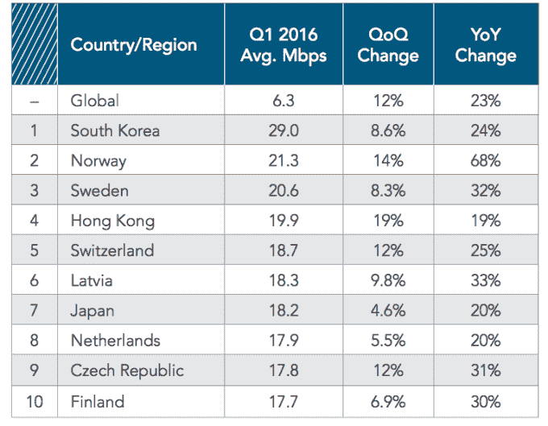
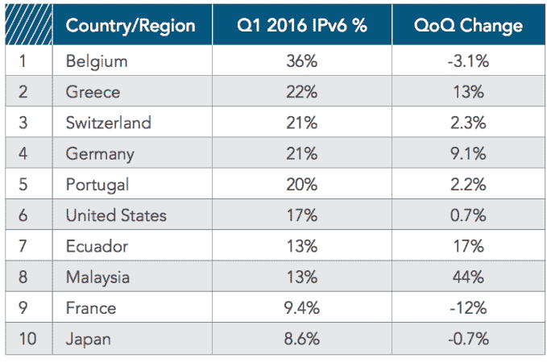

# Akamai:全球平均连接速度提高 12 %,再见 IP v4 

> 原文：<https://web.archive.org/web/https://techcrunch.com/2016/06/28/akamai-global-average-connection-speed-up-12-percent-bye-bye-ipv4/>

# Akamai:全球平均连接速度提高 12 %,再见 IPv4

CDN 网络 [Akamai](https://web.archive.org/web/20230130234152/http://akamai.com/) 今天发布了其 2016 年第一季度“[互联网状况](https://web.archive.org/web/20230130234152/http://www.akamai.com/stateoftheinternet/)”报告。这份报告调查了全球网速，在里约奥运会的夏季，网速将比以往任何时候都与现场直播的体育爱好者*更加相关。*

全球平均连接速度比 2015 年第四季度增长了 12%，达到 6.3 Mbps，同比增长 23%。

韩国仍然是全球平均连接速度最高的国家(29.0 Mbps)，比 2015 年第四季度增长了 8.6%。亚军和第三名是两个斯堪的纳维亚国家，分别是挪威和瑞典。新加坡仍然是平均峰值连接速度最高的国家(146.9 Mbps)，季度增长 8.3%。

按国家/地区划分的平均连接速度(IPv4 )(来源:Akamai)

这份 64 页的报告还包括有关网络连接的数据，以及固定和移动网络的宽带采用指标，以及互联网协议第 6 版(IPv6)相对于第 4 版(IPv4)的采用进度等。

美国不在平均连接速度的前十名之列，但在 IPv6 流量百分比方面排名第六，领先于法国和日本。研究中涉及的唯一 IPv4 地址数量下降到略高于 8.08 亿个，或季度下降 0.2%，比 2015 年第四季度减少了约 180 万个。

IPv6 流量百分比，主要国家/地区(来源:Akamai)

IPv6 采用方面的明显领导者仍然是比利时，其 36%的 Akamai 连接是通过 IPv6 进行的，比上一季度下降了 3.1%。

在全球范围内，4 Mbps 宽带的采用率为 73%，比 2015 年第四季度增长了 5.4%，韩国再次成为普及率最高的国家，为 97%。不出所料，韩国在 10 Mbps、15 Mbps 和 25 Mbps 宽带等级方面也领先世界。

至于移动连接，Akamai 及其合作伙伴爱立信发现，平均移动连接速度从英国的 27.9 Mbps 到阿尔及利亚的 2.2 Mbps 不等，而平均峰值移动连接速度从德国的 171.6 Mbps 到加纳的 11.7 Mbps 不等。

Akamai 还发现，两个主要的 Android 浏览器基础——Android WebKit 和 Chrome Mobile——占蜂窝网络上移动设备流量请求的 58 %,而苹果移动 Safari 占大约 33%。