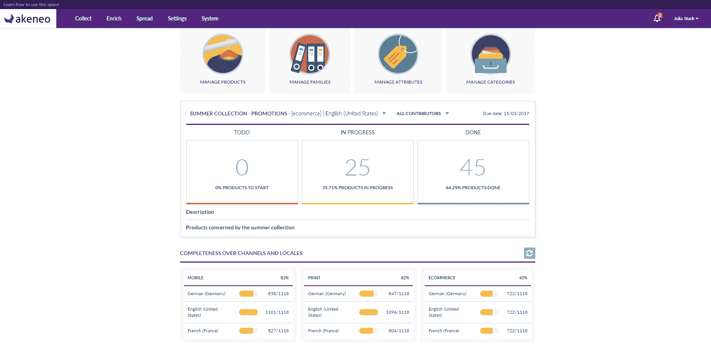

# Akeneo 凭借其产品 CRM TechCrunch 斩获 1300 万美元

> 原文：<https://web.archive.org/web/https://techcrunch.com/2017/03/20/akeneo-grabs-13-million-for-its-crm-of-products/>

法国初创公司 [Akeneo](https://web.archive.org/web/20221209084132/https://www.akeneo.com/) 刚刚筹集了 1300 万美元的 B 轮融资，由 [Partech Ventures](https://web.archive.org/web/20221209084132/https://www.crunchbase.com/organization/partech-international) 领投，现有投资者 [Alven Capital](https://web.archive.org/web/20221209084132/https://www.crunchbase.com/organization/alven-capital) 也参与其中。Akeneo 是一项产品信息管理(PIM)服务，用于管理您的商店、在线和传统纸质目录中的所有产品信息。

本质上，Akeneo 是一个开源的 PIM 应用程序——到目前为止，已经有 40，000 人下载了 Akeneo。每个人都可以免费获得它，并为自己的公司实现它。您可以从 Excel 电子表格或 ERP 中获取数据，然后在 Akeneo 中管理和丰富这些数据。最后，所有这些数据在你的所有沟通渠道中都保持准确——你的网站、你的商店、你的目录或其他任何东西。

这样，您可以在相同的产品目录上进行协作，并在任何地方重用这些信息。除了开源的主干网，Akeneo 还为高级客户建立了一个企业版。它有额外的功能和支持。

“自 2014 年以来，我们已经与全球 120 多家客户合作，”联合创始人兼首席执行官 Frédéric de Gombert 告诉我。客户包括欧尚、科拉、莱克勒克和家乐福等分销集团，Pimkie 或阿迪达斯等服装公司，三星等大公司等等。

在 Akeneo 之前，这些公司中的许多都在与 SAP 这样的大型 IT 巨头合作实施繁琐的目录管理软件。转移到 Akeneo 相当于转移到现代 CRM，但对你的产品来说。

这 120 名客户平均每年支付约 37，600 美元(€为 35，000 美元)。大多数客户仍然在他们自己的服务器上运行 Akeneo，但该公司刚刚推出了云托管版本，所以你不必管理任何东西，甚至是基础设施。

到目前为止，没有人回头看——从一个 PIM 解决方案切换到另一个是非常困难的，所以 Akeneo 没有任何流失问题。该公司现在有 70 名员工，大多数在南特，但该公司在德国和波士顿也有两个小办公室。

“PIM 市场类似于 CRM 市场，但落后了 15 年。每家公司——可能是品牌，也可能是经销商——都有两项重要资产:客户和产品。“渐渐地，人们意识到，如果你想打造出色的客户体验，你需要打造出色的产品体验。对每个人来说都是如此。”

根据 Frédéric de Gombert 的说法，PIM 服务可以成为最大的 CRM 解决方案。因此，让我们看看 Akeneo 是否正在建立产品的销售力量。

