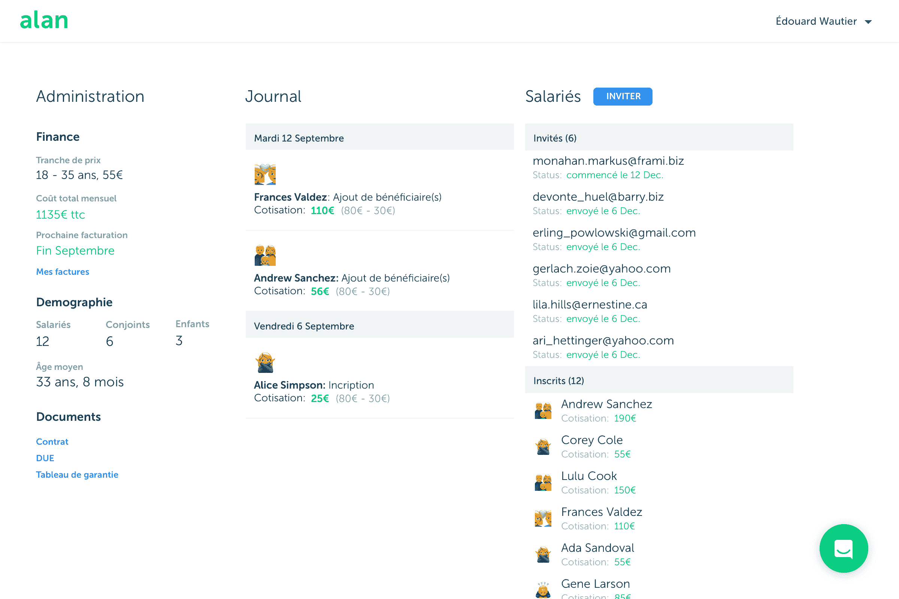

# Alan 希望将医疗保险转变为软件即服务 

> 原文：<https://web.archive.org/web/https://techcrunch.com/2016/10/24/alan-wants-to-turn-health-insurance-into-software-as-a-service/>

好吧，我的标题有点挑衅，但也算是事实。法国初创公司艾伦今天在法国推出了一家全新的全栈健康保险公司。与现有产品相比，Alan 希望让体验更加流畅。它是这样工作的。

该公司刚刚从 CNP Assurances、Power Financial、Partech Ventures 和商业天使投资公司筹集了 1300 万美元(€1200 万英镑)。艾伦不仅仅是安盛或安联的高级前端或经纪人。创业公司管理一切。它与监管机构合作，成为一家官方健康保险公司。

这是一个不小的壮举，因为它是 30 年来第一家新的健康保险公司。艾伦有一个简单的产品和直接瞄准公司。

几分钟后，你就可以和艾伦签约，为你所有的员工支付每个员工每月 55 英镑的€保险。美国读者会发现这个数字非常低，但它与法国的竞争对手不相上下。艾伦没有试图削弱竞争。相反，你以平均价格获得了良好的覆盖面。

您也可以选择在艾伦上为您的伴侣和孩子投保，每位成人额外支付€55 英镑，每位儿童额外支付€40 英镑。这家初创公司最初的目标是小公司和初创公司。未来，艾伦也在考虑让自由职业者报名。

艾伦比现有的健康保险公司更有吸引力。艾伦让你在网上注册。然后，人力资源部门可以访问一个仪表板，在那里他们可以管理其员工的保险。

员工还可以访问 Alan 的仪表板来提交报销，将他们的伴侣添加到他们的健康计划中，并在去看牙医之前获得更多关于他们保险范围的详细信息。当许多健康保险公司还停留在 20 世纪的时候，艾伦经营着一个现代化的网络服务。

Alan 会添加一张地图，标明您周围的医生和价格，这样您就可以确定您已经完全投保。我认为这也是一个整合其他服务的好机会，比如 [Doctolib](https://web.archive.org/web/20230129104138/https://www.doctolib.fr/) ，这样你就可以从艾伦的仪表盘上预约了。为什么不与 [Payfit](https://web.archive.org/web/20230129104138/https://techcrunch.com/2016/10/11/payfit-grabs-56-million-to-manage-french-payrolls/) 合作，让注册这两项服务变得更容易。

尽管健康保险并不诱人，但它也可能是一个非常有利可图的市场。法国公司现在被要求为所有员工提供医疗保险计划，并支付至少 50%的保费——这意味着数千万的潜在客户。

Alan 已经为其计划工作了几个月，并模拟了几年的补偿，知道这是一个可行的商业模式。法国的健康保险公司没有很大的利润。大公司继续提供保险计划，因为他们有其他更有利可图的保险产品。

如果艾伦能够自动化许多不同的步骤，并保持较低的员工人数，像这样一个年轻的创业公司仍然可以与外面的大竞争对手竞争。

