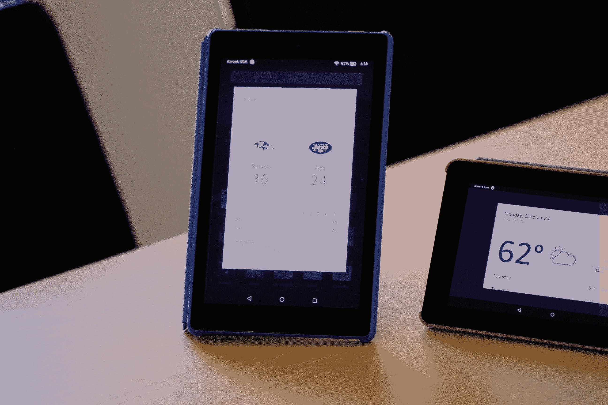
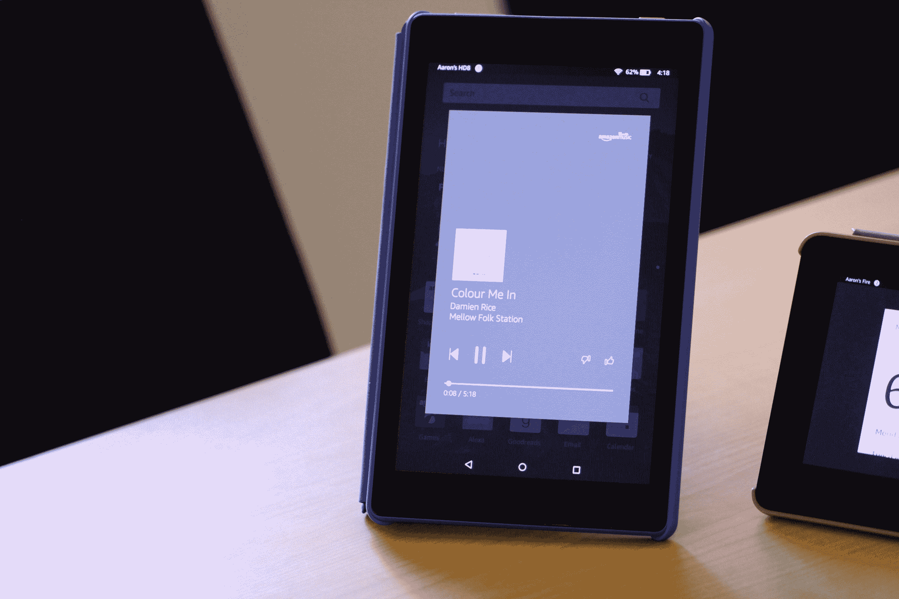

# 以下是 Alexa 在亚马逊 Fire 平板电脑上的工作方式 

> 原文：<https://web.archive.org/web/https://techcrunch.com/2016/10/26/alexa-fire-tablet/>

# 以下是 Alexa 在亚马逊 Fire 平板电脑上的工作方式

在亚马逊的未来版本中，Alexa 无处不在——它友好的人工智能小助手已经渗透到我们越来越普遍的家用电子产品的每一寸地方。这家零售巨头已经向第三方硬件开发商开放了该功能及其数千种技能，并开始将其引入自己现有的产品线，一次一个产品。

对于 Fire TV 这样的设备，Alexa 的角色非常明确——将语音功能带到一个相对独立的设备上。另一方面，该公司究竟会如何将这一功能引入其廉价的 Fire 平板电脑，仍然是一个谜。

其执行方式与移动设备上的大多数语音助手非常相似，将触摸和语音结合起来，以节省一些用户在重复任务上的输入。按住屏幕上的 home 键触发助手，而不是用类似回声的语音命令“Alexa”来触发。问 Alexa 一个问题，答案显示为一张卡片，提供了她简单的听觉回答之外的上下文信息，类似于你在 Alexa 应用程序上看到的内容。

当你回答完一个给定的答案后，在卡片外面轻点，它就会消失。

发布时，该助手将与最新的 Fire 平板电脑配合使用，包括 Fire (7 英寸)、Fire 8 和 Fire 8，以及 Alexa 的大多数标准功能，包括天气、体育比分、闹钟和通过亚马逊 Prime 和 Pandora 的音乐(其他第三方支持，如 Spotify 也将提供支持)。

其中一个更引人注目的功能是 Voice Cast，它使用 Fire 平板电脑作为 Echo 设备的视觉替代品，所以你可以有一个专门的屏幕来提供这些卡片。而且，正如亚马逊巧妙地指出的那样，Fire 50 美元的价格意味着它完全有可能购买独立的 Echo 显示器。

虽然有人想知道我们是否没有看到亚马逊测试内置显示器的可能回声。