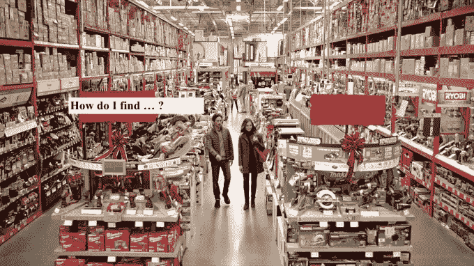
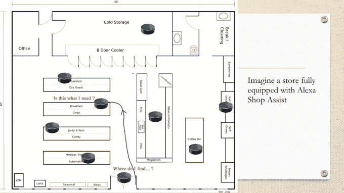
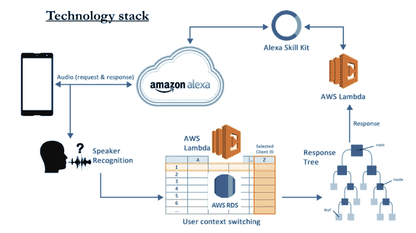
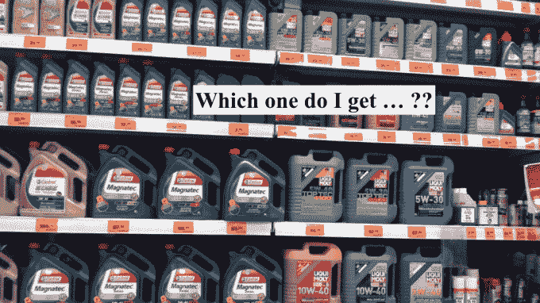

# Alexa 店员会指引你到正确的过道，回答产品问题 

> 原文：<https://web.archive.org/web/https://techcrunch.com/2017/09/17/alexa-store-assistant-directs-you-to-the-right-aisle-answers-product-questions/>

Alexa 能帮助大型零售商店的购物者吗？这些商店的店员分散在各处，通常很难找到。这是黑客背后的前提，今天在旧金山举行的 TechCrunch Disrupt 2017 黑客马拉松上展示的名为 [Alexa Shop Assist](https://web.archive.org/web/20221025222249/https://devpost.com/software/alexa-shop-assist) 。

据联合创始人劳伦斯·张(Lawrence Chang)说，这个想法是受他和其他团队成员——詹姆斯·徐(James Xu)、迪内什·森加韦(Dinesh Thangavel)和贾斯汀·泰(Justin Tai)——过去外出购物时遇到的现实生活经历的启发。

“有时很难找到合适的人，”常说，他试图在家得宝这样的大型零售店寻求帮助。当你这样做时，他们并不总是帮助你解决问题的合适人选。他们可能会让你去找另一个部门的员工，这需要更多的时间。

“但想想 Alexa——有整个数据库，”他在谈到该系统所使用的技术时表示。

尽管黑客本身——就其本质而言——不是一个成品，但这个想法相当有创意。

该系统利用两个 AWS Lambda 函数、说话人识别和上下文切换响应树。这一切都是通过一个 iOS 应用程序捆绑在一起的，该应用程序使用了 Alexa 技能集和 Alexa 语音服务。

如果在零售环境中实施，商店将在各处放置 Alexa 驱动的设备。这些不一定必须是 Echo 硬件设备，因为 [Alexa 的语音服务能够在任何硬件](https://web.archive.org/web/20221025222249/https://beta.techcrunch.com/2017/08/17/amazon-opens-up-access-to-developer-tools-for-adding-alexa-to-commercial-products/)上运行。

实际上，这对于商店里的购物者来说意味着他们可以走向这些“虚拟商店助理”中的一个寻求帮助。

例如，在演示中，团队展示了 Alexa 对一个问题的回应:“询问商店助理我在哪里可以在线找到我的普锐斯的引擎。”

Alexa 回答道:“普锐斯的机油在 5 号通道。”

该系统的这一部分将只是增强主要零售商应用程序中的现有技术，如今，实时商店库存已经映射到特定位置。但是，购物者可以不用应用程序的搜索功能，而只使用他们的声音。

然而，真正聪明的是，该系统如何能够在购物者逛商店的过程中跟踪他们，而不必收集关于虚拟助理正在帮助谁的个人可识别信息。

为此，它识别说话者声音中的特征，然后映射到一个唯一的 ID。这意味着消费者可以在同一个购物会话中再次与 Alexa 通话，助理可以记住他是谁，并能够更容易地回答后续问题。

继续同一个例子，为他们的普锐斯寻找发动机油的购物者可能稍后会问，“Alexa，问商店助手我应该买哪一个？”，同时在机油通道，然后收到一个具体的建议。

这些答案可能来自已经存档的产品信息——数据库中的产品属性，或者在线产品描述等等。

从这个意义上说，Alexa 不仅仅是取代零售店购物应用程序的“过道查找器”功能——她实际上可以回答你可能会问商店员工的基本问题。这并不是说这里的总体想法是用技术取代商店员工(尽管这是亚马逊今天在它的[概念，无收银员“Go”商店](https://web.archive.org/web/20221025222249/https://beta.techcrunch.com/2016/12/05/amazon-go/)中正在试验的东西)。)

但它可以帮助人手不足的商店，或者员工承担许多其他角色的商店——例如，重新补充库存，或者同时管理多个部门。毕竟，如今很少会发现商店员工只是站在过道里，准备回答顾客的问题。

我们询问了这个白天在英伟达工作的团队，他们是否计划在黑客马拉松结束后继续这个项目。不幸是，目前的答案是“不”

但如果亚马逊已经在考虑类似的事情，也不会令人惊讶——特别是考虑到它通过收购全食超市(Whole Foods)进军实体零售。