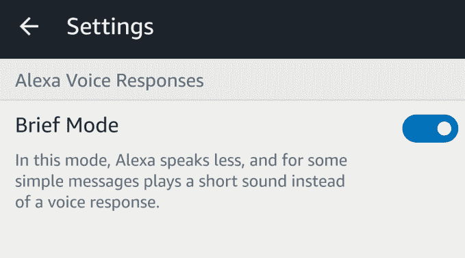

# Alexa 的新“简要模式”用铃声代替了口头确认

> 原文：<https://web.archive.org/web/https://techcrunch.com/2018/03/16/alexas-new-brief-mode-replaces-verbal-confirmations-with-chimes/>

亚马逊证实，它正在推出一种可选的“简短模式”，让 Alexa 用户配置他们的 Echo 设备，使用钟声和声音进行确认，而不是让 Alexa 用她的声音进行回应。例如，如果你要求 Alexa 今天打开你的灯，她会在这么做的同时回应“好的”。但在启用简要模式的情况下，Alexa 会在执行任务时发出一声小钟声。

这种模式将有利于那些喜欢通过语音控制智能家居的人，但不一定需要 Alexa 口头确认她对每个命令采取了行动。这对于那些已经为一系列智能家居配件启用了语音功能，并且已经有点厌倦听到 Alexa 回答的人来说尤其有帮助。

除了门铃、摄像头、灯泡、恒温器和我们已经习惯的其他设备之外，语音助手正在寻找进入更多智能家庭设备的方式，这是增加简短模式的时候。例如，在今年 1 月的 CES 2018 上，Alexa 出现在[许多新设备](https://web.archive.org/web/20221208200038/https://www.androidpolice.com/2018/01/13/ces-2018-wrap-alexa-continues-smart-home-dominance/)中，如智能水龙头、电灯开关、汽车仪表盘摄像头、投影仪，以及洗碗机、洗衣机、烘干机和冰箱等更多家用电器。

用户首先在 [Reddit](https://web.archive.org/web/20221208200038/https://www.reddit.com/r/amazonecho/comments/840rb7/no_more_ok_just_got_an_option_to_turn_on_brief/?st=jepqot7z&sh=4c576b6a) (通过 [AFTVNews](https://web.archive.org/web/20221208200038/http://www.aftvnews.com/amazon-appears-to-be-testing-a-new-brief-mode-which-reduces-alexas-superfluous-verbal-responses/) )上发现了简短模式的推出，许多人说他们几天前才收到这个选项。帖子中的其他人也提到他们也有，但后来就消失了——这似乎表明亚马逊在进行测试，或者可能是分阶段推出的错误。在某些情况下，用户还注意到 Alexa 应用程序中有一个新的切换开关，允许你打开或关闭简要模式。

这里提供的解释似乎不像简要模式将仅限于智能家居命令，而是当 Alexa 可以播放声音而不是口头确认的任何时候。它似乎也可能在其他方面减少 Alexa 的整体聊天，尽管我们还没有注意到其他方面的任何变化。

我昨天收到了启用简要模式的选项。当给 Alexa 一个关闭卧室灯的命令时，她解释了简要模式的作用，并给了我启用它的选项。(我说可以。)

现在，当 Alexa 被命令用智能家居设备做事情时，她只是发出钟声。

[https://web.archive.org/web/20221208200038if_/https://www.youtube.com/embed/pEAWYzXtx14?feature=oembed](https://web.archive.org/web/20221208200038if_/https://www.youtube.com/embed/pEAWYzXtx14?feature=oembed)

视频

[https://web.archive.org/web/20221208200038if_/https://www.youtube.com/embed/IlTn6Noxgds?feature=oembed](https://web.archive.org/web/20221208200038if_/https://www.youtube.com/embed/IlTn6Noxgds?feature=oembed)

视频

我们昨天要求亚马逊确认是否向所有用户推出简要模式，它今天证实了这一点。

“我们一直在寻找让 Alexa 对客户更有用的方法，新的简短模式设置是另一个例子，”一位发言人说。