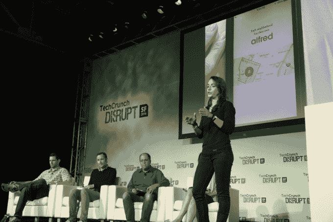

# 阿尔弗雷德俱乐部，因为自动比按需更好 

> 原文：<https://web.archive.org/web/https://techcrunch.com/2014/09/09/alfred-club-because-automatic-is-better-than-on-demand/>

按需服务空间将继续增长并不奇怪，但这并不意味着按需服务将我们从单调乏味的家务劳动中完全解救出来。这就是[阿尔弗雷德俱乐部](https://web.archive.org/web/20221007031835/https://www.alfredclub.com/)的由来。

今天在 Disrupt SF 发布的 Alfred 超越了简单的按需服务，在许多服务的基础上提供了一个自动化层。例如，用户可以从 [Instacart](https://web.archive.org/web/20221007031835/https://www.instacart.com/) 或 [Blue 围裙](https://web.archive.org/web/20221007031835/http://www.blueapron.com/)购买食品杂货，让 [Washio](https://web.archive.org/web/20221007031835/http://www.getwashio.com/) 洗衣服，并让 [TaskRabbit](https://web.archive.org/web/20221007031835/https://www.taskrabbit.com/) 跑腿，由一个人(Alfred)在自动化体验中递送这些必需品。

它是这样工作的:

当你第一次注册这项服务时，你会被指派一个阿尔弗雷德。您将看到此人的照片和一些一般信息，以及对大量背景调查的验证，以确保这是一个安全、可靠的员工。一旦你完成了，你将选择一个特定的日子，让这个人每周给你送货，并编制一份购物清单。

之后，该应用程序在后台自行工作。事实上，注册后你甚至不需要再次打开应用程序，除非你需要调整你的每周购物清单。

从那里开始，阿尔弗雷德每周都会过来送你洗好的衣服(并放在壁橱里)，送你的家庭用品(并将纸巾卷放在纸巾架上)，并帮你整理每周的杂货(放在餐具室或壁橱里)，并确保房子一尘不染。这个想法不仅是为了减少人们平均每周花在家务上的 30 个小时，也是为了减轻处理多个应用程序和服务并协调它们的精神压力。

显然，这背后的物流是困难的，但阿尔弗雷德已经与他们的服务合作伙伴建立了伙伴关系，将阿尔弗雷德的用户捆绑在一个单一的地区。这消除了取消 [Homejoy](https://web.archive.org/web/20221007031835/https://www.homejoy.com/) 预约或困难协调经历的可能性。这样，Alfred 可以服务于特定的社区，并提取所有用户的衣物、杂货等。在一次旅行中。

该公司目前在波士顿运营，计划很快扩展到其他城市地区(可能是纽约市)。在波士顿的测试期间，该公司已经发展到可以访问超过 5000 个住宅单元，原始测试组的保留率为 90%。

在可扩展性方面，该团队正在与房东和业主建立合作关系，他们可以将阿尔弗雷德的成本纳入租金成本，作为他们住宅的一个附加功能。在 B2C 方面，Alfred 在激活该社区之前，会等待给定区域有足够多的注册用户。

与此同时，Washio 和 Instacart 等服务合作伙伴受到了新的经常性客户的激励。

对于每个客户，Alfred 的费用为 25 美元/周或 99 美元/月。

我们已经看到，在传统奢侈品和服务应该面向主流的意识形态下，许多企业如雨后春笋般涌现，尤其是在优步。

要了解更多信息，请点击查看[网站。](https://web.archive.org/web/20221007031835/https://www.alfredclub.com/)