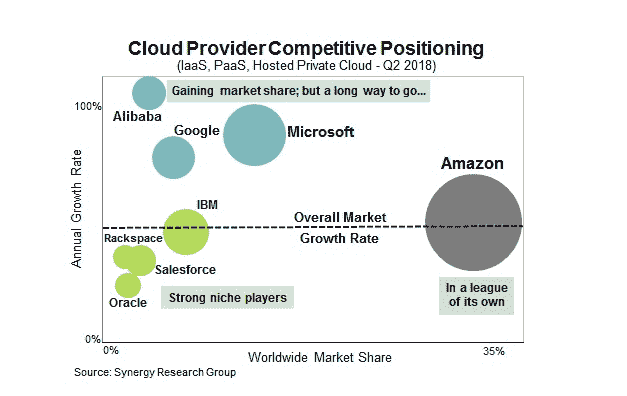

# 阿里巴巴继续获得云动力 

> 原文：<https://web.archive.org/web/https://techcrunch.com/2018/08/24/alibaba-continues-to-gain-cloud-momentum/>

当[阿里巴巴昨天报告其收益](https://web.archive.org/web/20221128153851/https://techcrunch.com/2018/08/23/alibaba-shrugs-off-china-concerns-as-revenue-jumps-61/)时，云数据被其他报道掩盖了[，但值得指出的是，其云业务在最近一个季度增长了 93%，达到 7.1 亿美元。这比](https://web.archive.org/web/20221128153851/https://techcrunch.com/2018/08/23/alibaba-softbank-ele-me-koubei-local-services/)[上一份报告中花哨的三位数增长](https://web.archive.org/web/20221128153851/https://techcrunch.com/2018/02/06/alibaba-cloud-growing-like-gangbusters-but-still-far-behind-aws-and-other-market-leaders/)略有下降，但他们的市场份额在短短两年内翻了一番，而且增长很快。

正如密切关注云市场的公司 Synergy Research 的首席分析师 John Dinsdale 指出的，增长率的下降完全是大数法则的结果。阿里巴巴无法长期保持三位数的增长。

“微软 Azure 和谷歌云平台最近出现了类似的增长率下降，如果你追溯到足够远的时间，AWS 也是如此。关键是云基础设施服务的市场现在非常大，但仍以每年 50%的速度增长，领先的参与者要么保持要么增加他们的市场份额，”他说。

早在 2015 年，当这家中国电子商务巨头推出[大规模云推进](https://web.archive.org/web/20221128153851/https://techcrunch.com/2017/02/27/alibaba-aliyun-cloud-computing/)作为其电子商务根基之外扩张努力的一部分时，阿里云总裁 [Simon Hu 向路透社](https://web.archive.org/web/20221128153851/http://www.reuters.com/article/us-alibaba-cloud-idUSKCN0Q30TP20150729)吹嘘道:“我们的目标是在四年内超越亚马逊，无论是在客户、技术还是全球规模方面。”

这显然没有发生，但该公司已经成功地移动了市场份额，从 2016 年全球云基础设施市场份额的 2%翻了一番，达到今天的 4%。根据丁斯代尔的说法，这是不可轻视的，但也值得指出的是，大多数业务是在亚洲，其中大部分是在中国本土。

像所有云竞争对手一样，该公司正专注于一些关键技术来推动增长，包括大数据分析、人工智能、安全和物联网，所有这些都是资源密集型的，有助于快速增长收入。

然而，为了保持增长，阿里巴巴需要开始开发中国和亚洲以外的市场。丁斯代尔认为，随着中国消费者向国际扩张，这种情况可能会发生。他也认识到该公司在试图进军西方市场时面临的政治现实。“阿里巴巴拥有挑战四大云提供商的实力——尽管它将面临一些不可避免的政治阻力，”他说。

虽然阿里巴巴可能不会很快达到赶上 AWS 的崇高高度，或者可能永远不会，但它在 IBM 和谷歌云平台上有很好的机会，对于一家 2015 年才开始认真对待云市场的公司来说，这是惊人的进步。