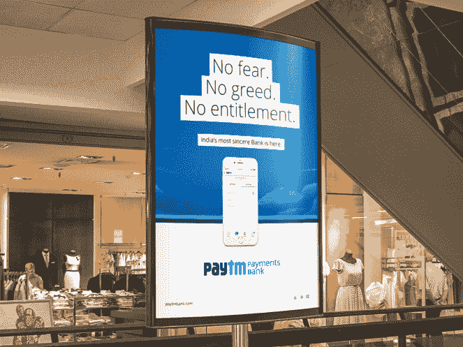

# 这是阿里巴巴与亚马逊在印度电子商务市场上的对决 

> 原文：<https://web.archive.org/web/https://techcrunch.com/2017/03/06/alibaba-paytm-amazon-india/>

印度电子商务领域的霸权之争似乎将成为两大全球巨头亚马逊和阿里巴巴之间的一场战斗。

这关系到全球增长最快的互联网市场之一。根据印度互联网和移动协会共同撰写的一份新报告，到 2017 年 6 月，印度的在线人口预计将达到 4.5 亿至 4.65 亿人，扩大了潜在电子商务客户的受众。虽然中国和美国目前在电子商务支出方面占据主导地位，但预计到 2020 年，印度的在线销售额将达到 480 亿美元，[分析公司 Forrester 声称](https://web.archive.org/web/20221126214009/http://economictimes.indiatimes.com/small-biz/policy-trends/forrester-slashes-projections-for-indian-e-retailing-from-75-bn-to-48-bn-by-2020/articleshow/57073767.cms)。

起初，本土公司 Flipkart 和 Snapdeal 似乎将引领这场进军。Flipkart 从 Tiger Global 和 Naspers 等公司筹集了超过 30 亿美元的资金，Snapdeal 从易贝、贝莱德甚至阿里巴巴等公司筹集了超过 15 亿美元的资金，但两家公司最近都被剪掉了翅膀。今年已经有两位投资者减持了他们在 Flipkart 的股份，而据报道，Snapdeal 正在[谈判，准备在 1 月份进行减持](https://web.archive.org/web/20221126214009/http://techcircle.vccircle.com/2017/01/25/snapdeal-in-talks-with-softbank-to-raise-funds-at-lower-valuation/)这就是消耗战，打折交易吸引消费者的注意力。

自[阿里巴巴于 2015 年](https://web.archive.org/web/20221126214009/https://beta.techcrunch.com/2015/02/05/antfinancial-one97/)首次投资 Paytm 以来，亚马逊-阿里巴巴的东西方对决就一直在进行中，而[亚马逊自 2014 年以来已向](https://web.archive.org/web/20221126214009/https://beta.techcrunch.com/2014/07/30/amazon-to-invest-2b-in-its-india-marketplace-as-competition-with-flipkart-intensifies/)[投入数十亿元](https://web.archive.org/web/20221126214009/https://beta.techcrunch.com/2016/06/07/amazon-will-pump-3b-more-into-its-indian-marketplace-as-it-competes-with-snapdeal-and-flipkart/)用于发展其印度业务。据路透社报道，上周，阿里巴巴第三次支持 Paytm，以 1.77 亿美元收购其电子商务子公司 36.31%的股份，这场战斗达到了一个新的清晰水平。

总而言之，阿里巴巴及其蚂蚁金服子公司拥有 Paytm 母公司 One 97 Communications 的多数股权，40%的 Paytm 业务，现在略超过 Paytm 电子商务的三分之一。

除了投资之外，上周 Paytm 发布了另一个有意义的信号，即其移动应用的更新，引入了一个明显类似阿里巴巴的功能:Paytm Mall。基于阿里巴巴的 T-Mall 服务——一种储存高街品牌和大牌的电子商务业务——pay TM Mall 的特点是“通过严格的质量准则和资格标准的可信卖家”换句话说，它是基于选择的，而不是像印度大多数其他电子商务服务那样的开放领域。

Paytm 的一名代表拒绝透露新的商城服务是否会以海外卖家为特色——即阿里巴巴的中国服务或阿里巴巴在东南亚拥有的 Lazada 尽管据报道有消息人士告诉印度商业标准报 pay TM 商城最终将与阿里巴巴的其他电子商务资产相连。

阿里巴巴与 Paytm 的联系并不新鲜，但其股份翻倍和 Paytm 商城的推出表明这是一种选择。但这并不总是那么明显。过去，执行主席马云考虑通过自己的实体向印度扩张，而阿里巴巴去年[与投资 Flipkart](https://web.archive.org/web/20221126214009/http://www.livemint.com/Home-Page/qcQWDTZFoir7LpaGZZbnGP/Alibaba-looks-to-buy-stake-in-Flipkart.html) 联系在一起，[也确实在 2015 年投资了 Snapdeal](https://web.archive.org/web/20221126214009/https://beta.techcrunch.com/2015/08/18/snapdeal-alibaba-softbank-foxconn/)——但[亚马逊](https://web.archive.org/web/20221126214009/https://www.forbes.com/sites/greatspeculations/2016/06/27/amazon-tops-indian-e-commerce-market-in-web-traffic/#765d6407768c)在印度日益增长的主导地位，加上 Flipkart[新领导层](https://web.archive.org/web/20221126214009/http://economictimes.indiatimes.com/small-biz/startups/former-tiger-global-executive-kalyan-krishnamurthy-to-be-flipkarts-new-ceo/articleshow/56424429.cms)和 Snapdeal[最近裁员](https://web.archive.org/web/20221126214009/https://beta.techcrunch.com/2017/02/22/indias-snapdeal-to-lay-off-500-600-as-it-battles-flipkart-and-amazon/)的财务问题，让 Paytm 成为显而易见的选择。

然而，这种联系不仅仅是方便，阿里巴巴和 Paytm 之间有很多相似之处。

这家印度公司涉足电子商务，但它通过其移动支付服务扎根于金融科技，该服务上个月在印度注册用户达到 2 亿，成为该国同类服务中最大的服务。

阿里巴巴高度关注支付，将其视为在电子商务中取胜的关键战略战役。除了运营中国占主导地位的移动支付服务支付宝(Alipay)之外，阿里巴巴正在通过其金融科技子公司在亚洲及其他地区争夺类似的支付服务。

蚂蚁金服最近的交易包括[以 8.8 亿美元收购总部位于美国的速汇金](https://web.archive.org/web/20221126214009/https://beta.techcrunch.com/2017/01/27/alibaba-ant-financial-moneygram/)，[对韩国 KakaoPay](https://web.archive.org/web/20221126214009/https://beta.techcrunch.com/2017/01/27/alibaba-ant-financial-moneygram/) 的 2 亿美元投资，以及在泰国【Ascend Money】和[菲律宾](https://web.archive.org/web/20221126214009/https://beta.techcrunch.com/2017/02/20/ant-financial-mynt/)Mynt 的未披露交易。最重要的是，[蚂蚁金服正在筹集 30 亿美元的债务资金，为进一步的并购活动提供资金](https://web.archive.org/web/20221126214009/https://beta.techcrunch.com/2017/02/08/alibabas-ant-financial-is-raising-3b-in-debt-to-finance-a-global-ma-spree/)，这一活动可能会进一步扩大其——以及阿里巴巴——的影响力。