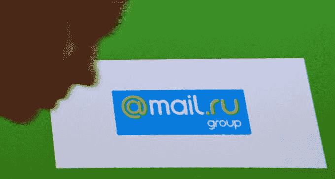

# 阿里巴巴大举进军俄罗斯，成立专注于游戏、购物等领域的合资企业 

> 原文：<https://web.archive.org/web/https://techcrunch.com/2018/09/11/alibaba-russia-mail-ru/>

中国电子商务巨头阿里巴巴与俄罗斯领先的互联网公司之一成立了一家价值约 20 亿美元的合资企业，该公司正在加倍押注俄罗斯。

据说俄罗斯有超过 7000 万互联网用户，约占其人口的一半，还有无数来自讲俄语的邻国的用户。和世界上许多地方一样，随着智能手机的发展，越来越多的人上网，这一数字预计还会上升。现在，阿里巴巴正在进入，以确保自己处于有利地位。

俄罗斯公司 Mail.ru 为 1 亿注册用户提供一系列互联网服务，包括社交媒体、电子邮件和食品配送，该公司与阿里巴巴合作推出了全球速卖通俄罗斯公司，他们希望该合资公司能够成为通信、社交媒体、购物和游戏的“一站式目的地”。Mail.ru 的支持者 MegaFon 电信公司和该国的主权财富基金 RDIF(俄罗斯直接投资基金)也向这个新成立的组织投资了未披露的金额。

概括一下:阿里巴巴——几年前在俄罗斯推出了全球速卖通服务——将持有 48%的业务，MegaFon 占 24%，Mail.ru 占 15%，RDIF 占剩余的 13%。此外，MegaFon 已同意将其在 Mail.ru 的 10%股份交易给阿里巴巴，这笔交易(仅)价值约 5 亿美元。这将使合资企业的估值达到 20 亿美元左右。

然而，这一数字不包括该合资企业的其他投资。

“双方将向合资公司注入资本、战略资产、领导力、资源和专业知识，以利用全球速卖通在俄罗斯的现有业务，”阿里巴巴在其 Alizila 博客上解释道。

阿里巴巴似乎已经在俄罗斯的互联网竞赛中选对了马

阿里巴巴的战略似乎是将 Mail.ru 的消费者服务与阿里巴巴的国际电子商务市场全球速卖通(Alibaba)结合起来。这将使俄罗斯消费者可以从中国的全球速卖通商家那里购买商品，也可以从东南亚、印度、土耳其(

[where Alibaba recently backed an e-commerce firm](https://web.archive.org/web/20221204105833/https://www.alizila.com/alibaba-buys-stake-in-turkeys-trendyol/)

)和欧洲其他地区。同样，俄罗斯在线卖家将获得这些市场的消费者。阿里巴巴的“品牌商城”——天猫——也是全球速卖通俄罗斯产品的一部分。

这笔交易表明，阿里巴巴已经在俄罗斯的互联网竞赛中选到了自己的“马”，就像它多次在印度为 Paytm 提供资金和整合支持一样。pay TM 是一家提供支付、电子商务和数字银行服务的公司。

阿里巴巴已经表示，俄罗斯是其支付宝移动支付服务的“重要增长市场”。它没有提供任何原始数据来支持这一点，但你可以打赌，当它运营全球速卖通俄罗斯时，它将对支付宝施加很大压力。Mail.ru 自己的产品叫做 Money。但是[其他报道称](https://web.archive.org/web/20221204105833/https://www.channelnewsasia.com/news/technology/alibaba-s-jv-in-russia-to-use-russia-s-payment-system---rdif-10705190)合资企业将使用俄罗斯的国家系统 Mir。

“大多数俄罗斯消费者已经是我们的用户，这种合作关系将使我们能够显著增加对各种电子商务产品的访问，包括跨境和本地商家。我们的生态系统的结合使我们能够通过我们的商家基础和商品以及产品集成来利用我们的分销，”Mail 说。Ru 集团首席执行官鲍里斯·多布罗迪耶夫在一份声明中说。

据彭博 T2 报道，阿里巴巴总裁 Michael Evans 在评论中解释说，如果阿里巴巴要在俄国发展，它需要当地公司的帮助。

“迄今为止，我们在俄罗斯能够发展的很大一部分是跨境业务。但未来需要我们的合作伙伴参与进来，包括建立一个更大的本地企业，”他说。

“重要市场参与者之间的合资企业是电子商务市场的新趋势。考虑到这是与一家中国公司的合作，我对这一企业的巨大潜力充满信心，它将加强俄罗斯和中国之间的商业联系。俄罗斯的电子商务市场潜力巨大，此外，俄罗斯制造商将有机会进入新的市场，”拥有 Mail.ru 和 MegaFon 的 USM 创始人阿利舍尔·乌斯马诺夫补充道。

这是 MegaFon 今年达成的第二次战略联盟。[5 月](https://web.archive.org/web/20221204105833/https://www.reuters.com/article/us-russia-megafon-venture/russias-megafon-cuts-stake-in-mail-ru-to-form-digital-venture-idUSKBN1I90T2)它与俄罗斯天然气工业银行(Gazprombank)成立了一家合资公司，通过一项交易，它出售了 mail . ru 5%的股份【2017 年 2 月，MegaFon 以 7.4 亿美元收购了 mail . ru 15.2%的股份。

在俄罗斯交易的前一天，阿里巴巴联合创始人兼执行主席马云——该公司的公众形象——[宣布计划在未来一年辞职](https://web.archive.org/web/20221204105833/https://techcrunch.com/2018/09/09/alibaba-announces-ceo-daniel-zhang-will-succeed-jack-ma-as-chairman-next-year/)。现任首席执行官张勇将接替他担任董事长，~~这意味着该公司还需要任命一位新的首席执行官。~~ **更正:张将出任董事长兼 CEO。**