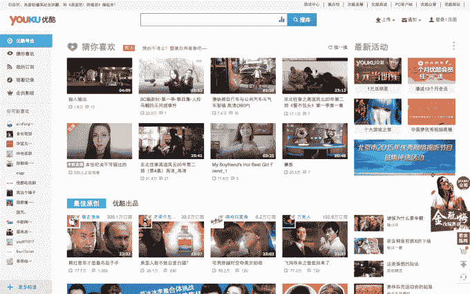

# 阿里巴巴将以 35 亿美元收购中国视频网站优酷土豆

> 原文：<https://web.archive.org/web/https://techcrunch.com/2015/10/16/alibaba-to-buy-youku-tudou-in-deal-valuing-chinas-youtube-at-4-2b/>

在纽约证券交易所上市的中国电子商务巨头阿里巴巴正在大举进军视频领域，此前其宣布了以全现金交易的方式收购优酷土豆的计划。阿里巴巴[之前花了 12.2 亿美元购买了视频公司](https://web.archive.org/web/20230326055803/https://techcrunch.com/2014/04/28/alibaba-buys-1-22bn-stake-in-youku-tudou-chinas-youtube/)18.3%的股份，该公司声称每月为 5.8 亿用户提供服务。

优酷的市值为 38 亿美元，阿里巴巴打算支付每股 26.60 美元——相对于最近 20.43 美元的收盘价，这是一个相当不错的溢价。因此，这笔交易对优酷的估值约为 51 亿美元。阿里巴巴在一次分析师电话会议上证实，考虑到优酷账面上的现金，其总发行价值约为 35 亿美元。

根据一份文件，如果收购成功，阿里巴巴打算将优酷私有化[。优酷董事长兼首席执行官古永锵将继续执掌公司。](https://web.archive.org/web/20230326055803/http://ir.youku.com/phoenix.zhtml?c=241246&p=irol-newsArticle&ID=2097814)

需要说明的是，阿里巴巴提出收购该公司，尽管辜朝明和其他创始股东已对拟议中的交易表示支持，但交易仍有待股东批准。

阿里巴巴打算获得该公司的全部所有权，以加强其对数字娱乐的关注。该公司于 2012 年由竞争对手优酷和土豆合并而成。

阿里巴巴最为人所知的是其电子商务服务——包括淘宝商城(Taobao marketplace)和天猫商城(T-Mall)品牌网站——但它也在内容方面大做文章，以求更多地出现在中国互联网用户的日常生活中。除了对优酷的投资，阿里巴巴还拥有微博网站新浪微博的股份(通过 5.86 亿美元的投资),其内容创作业务也在蓬勃发展，包括华数传媒(阿里巴巴创始人马云支持的公司)和电影内容公司阿里巴巴影业。

阿里巴巴媒体雄心的更具体证据可以在天猫票房中找到，[它最近在中国](https://web.archive.org/web/20230326055803/https://techcrunch.com/2015/09/02/alibaba-streaming/)推出了类似网飞的服务，以及它通过[智能电视和机顶盒](https://web.archive.org/web/20230326055803/https://techcrunch.com/2013/07/23/alibaba-pursues-new-smart-tv-os-to-grow-its-e-commerce-play/)进入客厅。这些设备由第三方制造商制造，运行在阿里巴巴自己的操作系统上，包括一套其产品——允许设备所有者直接从他们的大屏幕上购物、支付账单等。

显然，优酷和阿里巴巴还存在进一步的协同效应。阿里巴巴表示，计划利用其电子商务、媒体和广告平台，“显著加速”优酷的增长。

这很重要，因为迄今为止，尽管该公司拥有庞大而活跃的用户群，但它仍在财务上苦苦挣扎。优酷和土豆合并了他们的业务，以节省共同的成本和支出，但财务上的好时光并没有真正到来。Q2 2015 年收入同比增长 57%，达到 2.596 亿美元，但该公司三个月净亏损 5520 万美元。

在争夺中国互联网用户的关注方面，优酷并不是唯一一家。百度的爱奇艺、搜狐和腾讯都在视频领域展开竞争，百度和腾讯能够分别依靠其搜索引擎和移动通讯帝国吸引观众。最近的研究表明，作为中国最大的视频平台，优酷和爱奇艺(土豆网仍然是优酷的一个独立网站)几乎没有什么不同。

抛开挑战不谈，优酷即将看到一半的广告收入来自移动业务，但看起来它可能会找到一个更适合阿里巴巴的私人子公司，而不是一个公开上市的独立企业。不管怎样，这就是将要发生的。