# 今天在 Y Combinator 的 S18 演示日 2 TechCrunch 上发布的所有 59 家创业公司

> 原文：<https://web.archive.org/web/https://techcrunch.com/2018/08/21/all-59-startups-that-launched-today-at-y-combinators-s18-demo-day-2/>

从酵母种植的大麻素到项目管理软件，再到希望衡量大学校园意见的消费者应用程序，Y Combinator 2018 年夏季课程的第二天展示了各种各样的空间。

正如我们[昨天在](https://web.archive.org/web/20230221100935/https://techcrunch.com/2018/08/20/here-are-the-63-startups-that-launched-today-at-y-combinators-s18-demo-day-1/)提到的，B2B 软件和服务是最大的垂直市场，132 家初创公司中有 30%属于这一类别。医疗保健相关的初创公司紧随其后，占 28%。如果你想知道的话，这是完整的细目分类。

*   > 航空航天:3%

*   > 农业:1%

*   > 汽车:2%

*   > B2B 软件和服务:30%

*   > 区块链:5%

*   > 消费品及服务:9%

*   > 消费媒体:7%

*   > 教育:3%

*   > fin tech:6%

*   > 政府:1%

*   > 医疗保健:28%

*   > 工业:1%

*   > 房地产和建筑业:4%

下面是今天展示的 59 家创业公司的详细介绍。我们发誓你会觉得你真的在计算机历史博物馆和我们一起看演示。此外，如果你渴望获得更多来自硅谷顶级加速器之一的最新精选[，请查看我们从第一天开始的列表](https://web.archive.org/web/20230221100935/https://techcrunch.com/2018/08/20/here-are-the-63-startups-that-launched-today-at-y-combinators-s18-demo-day-1/)。

## **精神愉快**

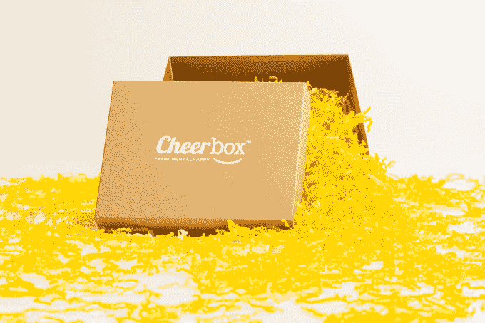

[Mental Happy](https://web.archive.org/web/20230221100935/https://cheerbox.com/) 是一家员工送礼服务公司，它组装了一个它称之为 Cheerbox 的东西。“精神快乐”将关心办公室里辛勤工作的人的虚假表达提升到了一个新的水平，扔掉了鲜花和愚蠢的办公室小摆设，转而支持积极的信息和他们认为员工实际上可以使用的东西，包括食物、健康礼物和个性化的笔记。这些快乐的平均价格是多少？平均 59 美元。一些人也在购买。这家年轻的公司表示，在过去的两个月里，它已经创造了 5 万美元的销售额。

## **泰坦**

[【泰坦】](https://web.archive.org/web/20230221100935/https://www.titanvest.com/) 的服务已经拥有来自数千家客户的 1000 万美元的资产，它正在努力超越其他面向消费者的金融科技产品。该公司是一家资产管理公司，为普通投资者构建、管理和解释其投资主题。该公司使用应用内视频和其他演示工具带领客户浏览他们的投资组合，使他们更容易理解策略，并使公司投资更加透明。

## 金赛德

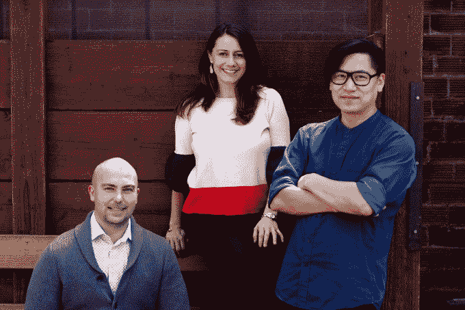

儿童保育费用是美国家庭面临的最大经济负担之一，尽管美国每年有高达 300 亿美元的政府资金可用于儿童保育，但这些资金被锁定在灵活的支出账户中，这些账户非常复杂，以至于 90%的资金都没有使用。

[金赛德](https://web.archive.org/web/20230221100935/https://www.trykinside.com/)希望通过自动化索赔流程来提供帮助。它还可以作为一种儿童保育管理工具，让父母通过类似 Venmo 的功能向护理提供商支付费用，同时使公司更容易提供儿童保育福利，从而有助于吸引有才华的员工。这家六周前刚刚成立的公司表示，它计划瞄准拥有 20 名以上员工的雇主，这是一个很大的市场。美国有超过 620，000 家这样的企业，至于 Kinside 认为自己追逐的潜在市场总额，是 28 亿美元。

[点击](https://web.archive.org/web/20230221100935/https://techcrunch.com/2018/08/02/kinside-wants-families-to-make-the-most-of-their-dependent-care-flexible-spending-accounts/)阅读更多关于金赛德的信息。

## **固定器**

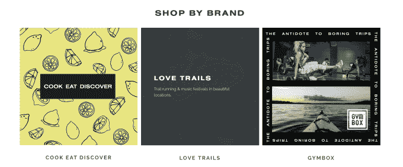

旅游和体验市场 [中介](https://web.archive.org/web/20230221100935/https://fixersworld.com/) 推销体验，从瑜伽静修到周末越野跑和由当地人策划的音乐节。它旨在帮助旅行者发现和预订他们在其他地方找不到的旅行。该公司在 8 个月内实现了 170 万美元的销售额，预订了 7000 场活动，而该公司没有在营销上花一分钱。创始人声称，千禧一代旅行者的主要动机是体验，而不是目的地。像瑜伽教师这样的企业家正在经营企业和静修场所，并靠修理者赚钱。

## **64-x**

创始团队包括生物工程领域的一些杰出人物(包括乔治·丘奇、帕米拉·西尔弗和哈佛大学威斯研究所的杰弗里·韦) [64-x](https://web.archive.org/web/20230221100935/https://www.64-x.com/) 是在其他无法进入的环境中运行的工程生物。首席执行官亚历克西斯·罗夫纳本人是 Wyss 研究所的博士后研究员，首席运营官瑞安·加拉格尔曾是波士顿咨询公司的顾问，他们希望将该研究所围绕 的研究商业化，以加速和扩大生产功能化蛋白质和具有不同化学性质的序列定义聚合物的能力。

## **爸爸**

[爸爸](https://web.archive.org/web/20230221100935/https://www.joinpapa.com/)的口号是“需要孙子孙女”为了解决孤独的问题，Papa 将大学生与老年人之家联系起来。大学生与学长匹配，帮助他们完成与交通和技术相关的任务，但主要目标是为有孤独风险的人提供陪伴。创始人断言，孤独使该国超过 5000 万老年人面临患老年痴呆症等健康问题的风险；事实上，医疗保险通过 UPMC 健康计划覆盖了爸爸，因为 T4 更广泛地接受了这样一种信念，即在一个人的黄金岁月里，良好的社交是过上更健康生活的重要组成部分。

## 高大的罂粟

不开心的员工要花钱，但是高大的罂粟(T2)认为它可以通过向那些被骚扰的人提供一个教育工具包来留住更多的员工，这个工具包教他们如何锁定他们的在线存在并正确管理事件响应。

这家初创公司是安全专家利·霍尼韦尔(Leigh Honeywell)的心血结晶，其前身是霍尼韦尔自 2008 年以来一直在从事的追捕网络社区中的巨魔的工作，包括在 Slack，她通过首先加强他们原本脆弱的个人账户，然后针对不良行为者聚集的网站，保护那些被外人盯上的同事。

Tall Poppy 不仅与客户合作，教育他们如何保护自己，还让他们了解每个州的法律，他们可以用这些法律来保护自己并惩罚攻击者。同时，以每年 150 美元一个座位的价格，它的软件可以与其他风险管理工具相媲美。

[点击](https://web.archive.org/web/20230221100935/https://techcrunch.com/2018/07/22/tall-poppy-aims-to-make-online-harassment-protection-an-employee-benefit/)阅读更多关于高大罂粟的信息。

## **AnchorUSD**

[AnchorUSD](https://web.archive.org/web/20230221100935/https://www.anchorusd.com/) 是一种稳定的加密货币，由美元一对一支持。创始团队希望成为加密金融系统值得信赖的储备货币。他们的目标是开发一种服务，在区块链上提供最可靠、最稳定的价值存储。

系绳是不可信的，但是因为没有其他选择，它成为了交换的媒介。锚想要替换系绳。它基于 Stellar 构建，并已成为 Stellar 的官方合作伙伴，这意味着它们更便宜、更快、更安全。交易成本加上浮存利息。这位创始人声称已经解决了 Stripe 的规模问题，另一位则致力于脸书的增长。

## **龙船花**

Ixora 的技术只想为任何类型的视觉娱乐创造逼真的环境，它说它可以比大型工作室便宜得多。

根据 Ixora 的说法，主要电影工作室每年制作 100 部大片，其中包含 1000 多个 CGI 镜头，每部成本约为 1 万美元。Ixora 说，它的软件几乎不用花钱就能做同样的事情，而且可以在“几个小时”内完成。如果这种宣传不够吸引人，那么除了电影之外，电视、游戏和虚拟现实体验都开始需要电影级别的图形。随着丰富的真实感环境成为整个娱乐业的标准(见证“权力的游戏”和“丛林之书”只是两个例子)，Ixora 可能会在未来很长一段时间内迎合一个相当大的市场。

## **伯比克斯**

图片:布莱斯·德宾/

通过 [伯比克斯](https://web.archive.org/web/20230221100935/https://berbix.com/) ，一家旨在制作身份验证条纹的公司，收集和识别照片身份变得轻而易举。该公司已经开发了一种与软件的集成，这样公司就可以削减成本并阻止欺诈。由 Airbnb 的两位前信任和安全产品和工程负责人创建，他们试图为各种 P2P 市场和在线平台建立身份验证，他们认为这是一个 100 亿美元的机会(至少)。

## **数据表单**

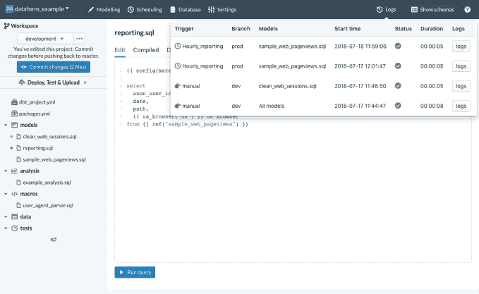

[Dataform](https://web.archive.org/web/20230221100935/https://dataform.co/) 正在构建软件来帮助数据团队，这些团队花费 80%的时间来准备和格式化他们进行分析、创建仪表板或执行机器学习功能所需的数据。该公司已经建立了工具包，帮助收集和管理这些数据，以便可以使用(*这篇文章被更新，以澄清 Dataform 的业务和网址)。*

## **CB 治疗学**

陡山实验室的前实验室目录员谢尔·巴特发现，大麻素是药物中最接近治愈疼痛、癫痫和其他慢性疾病的奇迹。但是基于植物的大麻素价格昂贵，而且产生的结果不一致。Butt 和 Jacob Vogan 一起意识到生物合成大麻素可以将生产成本降低十分之一，并将产量提高到目前的 24 倍。作为大麻测试公司 SB Labs 的创始人，Butt 和他的技术联合创始人拥有为诺华公司商业化药物的丰富经验，在将这种新疗法推向市场方面具有独特的优势。

## RevenueCat

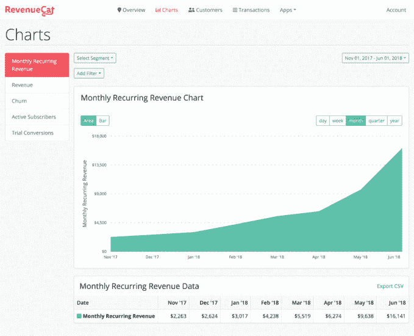

RevenueCat 帮助开发者管理他们的应用内订阅。它提供了一个 API，开发者可以使用它来支持 iOS 和 Android 上的应用内订阅，这意味着他们不必担心每个平台上的所有细微差别、漏洞和更新。

该 API 还允许开发人员将关于他们订阅业务的所有数据集中到一个地方。它可能发现了什么东西，尽管还不清楚这个东西有多大。这家成立 9 个月的公司表示，目前每月的交易额为 35 万美元；它从那笔钱里赚了不为人知的百分比。

点击阅读更多关于 RevenueCat 的信息。

## **HeyDoctor**

摄影师:安德鲁·哈勒/彭博

HeyDoctor 是一项在线处方服务，面向越来越多在网上推销药物和处方的初创公司和服务。与这些公司合作，HeyDoctor 可以开出和重新开出药物处方，范围从节育、头发生长或替换、尿路感染治疗、实验室工作等等。

该公司设想创建一个替代医疗记录平台，该平台对患者开放且可访问，可在按需提供商之间移植。在过去的 6 个月里，已经在该平台上进行了超过 125，000 次初级保健访问。上个月，它获得了 105，000 美元的收入，并表示这个数字反映了 22%的月环比增长。

## **阿尼玛 App**

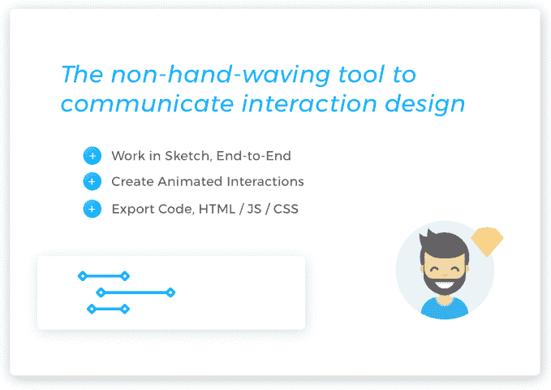

或阿贝尔， [YO](https://web.archive.org/web/20230221100935/https://techcrunch.com/2014/06/18/yo-yo/) 的前首席执行官和联合创始人，带着一个目标更复杂、执行更复杂的新公司回来了。Arbel 是 Y Combinator 支持的初创公司[Anima](https://web.archive.org/web/20230221100935/https://www.animaapp.com/)的联合创始人之一，该公司允许设计师自动将设计转换为代码。

使用该工具，Arbel 和他的团队——从谷歌、苹果和亚马逊的工程和设计队伍中挑选出来的个人——估计开发团队可以节省数周的工作，消除设计师和开发人员之间的干扰。它也有一些早期的信徒。根据 Arbel 的说法，网飞、谷歌和亚马逊已经在使用它的工具，它计划对每个座位每年收取 500 美元。

## **商店与**

全球有影响力的人正团结在移动应用程序 [ShopWith](https://web.archive.org/web/20230221100935/https://itunes.apple.com/us/developer/shopwith-inc/id1413047076?mt=8) 上，它允许购物者浏览虚拟店面和过道，旁边是他们最喜欢的时尚和美容创作者和 YouTubers。用户可以准确地看到这些有影响力的人展示了什么产品，并且可以在不离开应用程序的情况下购买它们。这是一个免费下载和数小时的商业消费乐趣。

这就像 QVC 模式，但对于购买习惯受 YouTube、Instagram 和 Snapchat 上的社交视频内容影响的 GenZ 购物者来说。该公司透露，一名美容影响者在五个小时内利用购物平台赚了 10，000 美元。创始人是前产品经理，拥有在脸书和亚马逊开发社交商务产品的经验。

## **zifyhomes**

[zifyhomes](https://web.archive.org/web/20230221100935/https://www.ziffyhomes.com/)将在美国流行的同居模式带给了印度的千禧一代。ZiffyHomes 的投资组合中已经包含了一批管理式、合住式、带家具的公寓，它已经为 2000 多名年轻的印度专业人士提供服务，并从其运营的三个印度城市获得了 220 万美元的年收入。但它有雄心满足全国 6000 多万符合其目标人口的人的需求，鉴于它需要支付 20%的租金，你可以看到它的收入如何快速增长。

公司当然有竞争。它把自己比作 WeWork，然而 WeWork 本身正在印度取得重大进展。另一个较小的竞争对手，总部位于孟买的初创公司 Awfis 上个月宣布了 2000 万美元的新资本。但鉴于这种模式对印度来说相对较新，以及潜在市场的规模，这个机会对我们来说看起来是一个坚实的机会。

## **改革家疗法**

[Reformer Therapeutics](https://web.archive.org/web/20230221100935/https://reformertherapeutics.com/) 正在开发多种疾病的药物，重点是致命的三阴性乳腺癌，目前用过时的有毒化学疗法治疗。他们的乳腺癌药物被称为改革者 1，针对导致癌症扩散的细胞。该药物在人类临床试验中被证明是安全的，该小组正在开始一项为期 3 年的 FDA 试验。创始人是在科学交流中心一起工作时认识的。

## **Ajaib**

印度尼西亚是一个转型国家，有越来越多的个人拥有可投资资产，但在财务上却达不到许多财富管理公司设定的标准。Ajaib 是一家新成立的初创公司，雄心勃勃地要成为“印度尼西亚财富管理的蚂蚁金服”为什么要比较？因为中国不久前也是如此——这个国家的中产阶级很少获得财富管理建议。随着近四年前蚂蚁金服的成立，这种情况发生了变化。事实上，Ant 现在拥有超过 4 亿用户。

中国有近 14 亿人口，相比之下，印尼只有 2.61 亿人口。尽管如此，如果它的计划计划对管理的每一美元收取 1.4%的费用，估计该国将有 3700 亿美元的储蓄可供追逐，如果它获得一些动力，它可能会在后院面临一个有意义的机会。

## **艾莫杰**

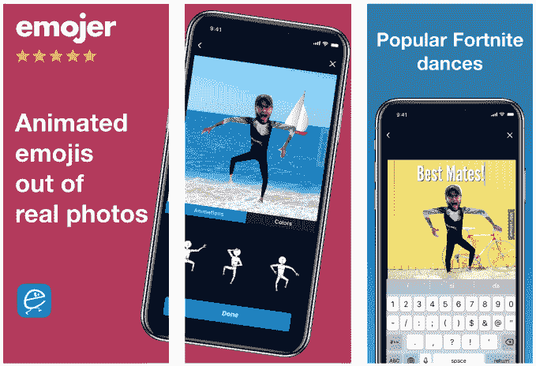

用真实照片制作动画表情符号， [表情符号](https://web.archive.org/web/20230221100935/https://emojer.app/) 可能是你用相机能获得的最大乐趣。该公司的软件使用深度学习算法来检测身体部位，并指导用户通过手机拍摄简单的照片来创建自己的头像。它用一个超级简单的界面取代了深厚的 Photoshop 专业知识和动画技巧。这些头像看起来和 Elf Yourself 非常相似，Elf Yourself 是一个很受欢迎的网站，可以让你把朋友的脸贴在跳舞的圣诞精灵上，每年圣诞节都会在网上疯传。创始人拥有机器学习和计算机视觉博士学位。

## Snark AI

[Snark AI](https://web.archive.org/web/20230221100935/https://snark.ai/) 帮助公司租用不使用的 GPU。随着时间的推移，这是一种潜在降低 GPU 成本的方法，这可能是一项巨大的投资，但随着时间的推移，当它不在使用时，可能会产生有意义的回报。工作原理:初创公司将适当数量的 GPU 能力与团队需要的任何东西相匹配，然后将其部署到公司在各个数据中心拥有的分布式闲置卡网络中。

Snark 的方法表面上也能让“深度学习”跑得更快。事实上，其创始人表示，该公司已经与五家公司(好吧，好吧，很可能是其他创业公司)合作，使他们的研究周期加快十倍。

[点击](https://web.archive.org/web/20230221100935/https://techcrunch.com/2018/07/25/snark-ai-looks-to-help-companies-get-on-demand-access-to-idle-gpus/)阅读更多关于 Snark AI 的信息。

## Scanwell Health

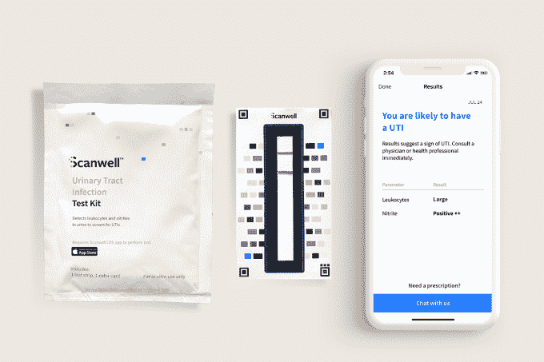

尿路感染是非常不舒服和令人分心的，更糟糕的是，往往会变得更严重，更快。长期以来，治疗都需要医生出诊。但截至上个月，一家名为 [Scanwell Health](https://web.archive.org/web/20230221100935/https://www.scanwellhealth.com/) 的年轻初创公司首次开始直接向消费者销售，目前仍是唯一一款获得 FDA 批准的尿液测试应用程序，允许人们在家中使用试纸条和拍照手机测试尿液。(它的应用程序使用复杂的颜色度量来分析条纹，并确定什么是什么。)

难怪这种产品有一些需求。公司创始人陈宁华表示，该公司的 2000 套套装一上市就销售一空。请注意，这些工具包的价格为 5 美元。向 Scanwell 咨询以确认结果——它依赖于外部医生——需要客户另外支付 25 美元

[点击](https://web.archive.org/web/20230221100935/https://techcrunch.com/2018/07/27/check-out-this-first-of-its-kind-direct-to-consumer-urine-testing-app-with-fda-clearance/)阅读更多关于 Scanwell Health 的信息。

## **咧嘴一笑**

滑板车热潮正在冲击拉丁美洲， [咧嘴一笑](https://web.archive.org/web/20230221100935/https://ongrin.com/) 正在润滑车轮。这家总部位于墨西哥城的公司是由联合创始人塞尔吉奥·罗莫创办的，此前他和他的合伙人意识到他们无法在美国的踏板车市场上分得一杯羹。罗莫和他的联合创始人已经为可能是拉丁美洲最热门的新交易找到了一批投资者。支持者包括 Sinai Ventures、Liquid2 Ventures、500 Startups、Monashees 和 Base10 Partners。

## 叛乱

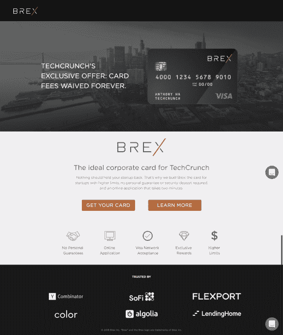

[哗变](https://web.archive.org/web/20230221100935/https://www.mutinyhq.com/)帮助 B2B、软件即服务公司在他们的网站上向每个访问者展示定制的信息。

例如，当你访问哗变客户振幅的主页时，像客户推荐和行动号召这样的东西会根据你公司的规模而变化。至于兵变通过帮助客户个性化他们的网站所追逐的机会有多大？它声称是 50 亿美元。

在这里阅读更多关于兵变的信息。

## 柠檬盒

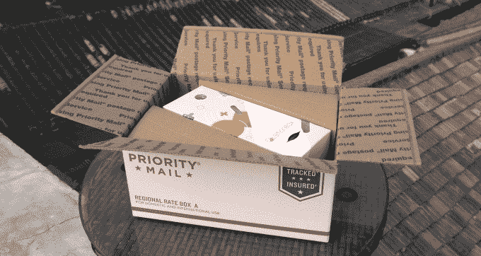

[LemonBox](https://web.archive.org/web/20230221100935/http://www.lemonbox.me/) 是一家让中国消费者以实惠的价格购买美国健康产品的初创公司。如今，它允许中国消费者购买 LemonBox 品牌的每日维生素包。

接下来，我们的目标是扩展到更具体的垂直领域，包括母婴和美容。它甚至可以超越电子商务，提供饮食专家咨询等服务。

[点击](https://web.archive.org/web/20230221100935/https://techcrunch.com/2018/08/05/lemonbox/)了解更多关于 LemonBox 的信息。

## **奥什平价药品**

[Osh ' s Affordable pharma ceuticals](https://web.archive.org/web/20230221100935/https://oshpharma.com/)是一家公益公司，将医生和患者与低成本复合药物的来源联系起来。该公司正在寻求降低罕见疾病药物的准入门槛。三周前，该公司推出了一种治疗威尔逊氏病的药物。以前在巴西、印度或加拿大没有治疗这种疾病的药物。它将药费从每月 3 万美元削减到每月 120 美元。该公司估计其潜在市场总额为 170 亿美元。“仿制药定价是一场危机，人们因为无法获得所需药物而死亡，”首席执行官亚历克斯·奥什米扬斯基说。奥什可能有解决办法。

## **育碧**

[Ubits](https://web.archive.org/web/20230221100935/http://ubits.mx/ubits/) 是 Lynda.com 对拉丁美洲的称呼。Ubits 为领导力、销售和微软 Excel 等主题提供西班牙语的企业培训课程。目前，在世界第二大通用语言西班牙语中没有好的选择。Ubits 有 80 个在线课程的 1000 个视频。他们有 75 个客户，包括花旗、陶氏、雀巢、巴黎银行，平均每年支付 9000 美元。他们有 70 万美元的存款，每月增长 40%。拉丁美洲有 4000 万上班族。他们对每个员工每年收费 50 美元。

## 激励

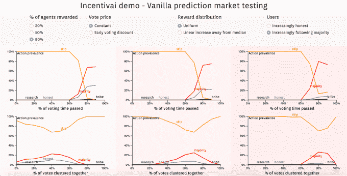

如果开发人员不预测人类将如何滥用他们的区块链，加密货币项目可能会崩溃。[incentive ai](https://web.archive.org/web/20230221100935/http://incentivai.co/)已经建立了人工智能模拟，不仅测试安全漏洞，还测试贪婪或不合逻辑的人类如何破坏区块链社区。

加密开发者可以在系统上线前使用该服务修复系统。他们可以支付奖励来审计他们的项目并生成报告，或者他们可以托管人工智能模拟工具，如软件即服务。这家成立仅两个月的公司表示，它已经从三个付费客户那里获得了 25 万美元的收入，其中包括市场预测初创公司 Augur，它可能因在以太坊网络上策划了第一个 ICO 而闻名。

[在这里阅读更多关于 Incentiveai 的内容](https://web.archive.org/web/20230221100935/https://techcrunch.com/2018/08/17/incentivai-smart-contract-security/)。

## **玩具盒**

[Toybox](https://web.archive.org/web/20230221100935/https://toyboxsystems.com/) 正在推销一种软件服务，这种服务可以让设计师在任何网站上与开发者交流变化，而无需编写一行代码。这些变化被记录为开发人员的 CSS 编辑，因此快速修复可以很容易地实现。该公司表示，它减少了设计师和开发人员之间就图像或视觉效果的微小变化进行沟通的需要，并可以显著加快生产速度。该公司选择了每个座位 180 美元的价格点。自四周前发布以来，他们已经拥有 400 名活跃用户。

## **昆都士**

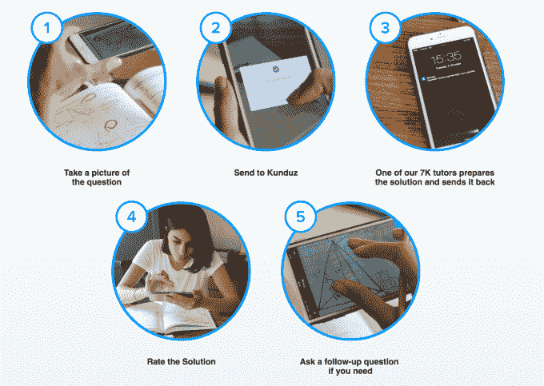

土耳其备考应用程序 [【昆都士】](https://web.archive.org/web/20230221100935/https://kunduzapp.com/) 利用 7000 名辅导教师的网络，正在开发一种服务，该公司称这种服务比传统辅导方式便宜十倍，速度也更快。与美国的同类产品 [【嘟嘟】](https://web.archive.org/web/20230221100935/https://techcrunch.com/2017/03/08/tutoring-startup-toot-launches-into-twin-policy-storms-around-education-and-immigration/) 一样，昆都士的用户使用该应用程序拍摄一张问题照片，然后它将学生与导师联系起来。据该公司称，寻求帮助的学生通常在 10 分钟内得到答案，该公司表示，三分之一的问题是“重复”问题，因此可以在几秒钟内得到回答，无需人类的帮助。首先在土耳其推出，昆都士已经回答了其国内市场的 300 万个问题，其潜在市场在 24 亿美元范围内。它说，下一个是印度。

## **美食协会**

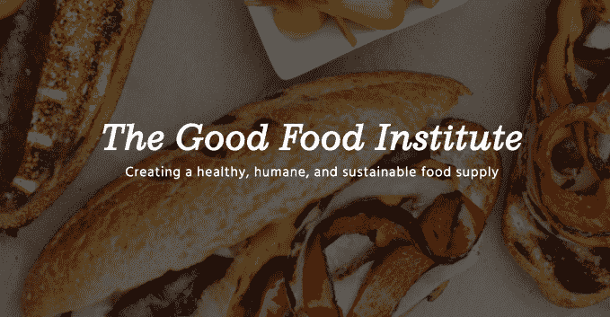

现行的制肉体系被打破。[【The Good Food Institute】](https://web.archive.org/web/20230221100935/https://www.gfi.org/)，一个非盈利性的促进肉类替代品和清洁肉类的机构，是植物性和清洁肉类行业的智囊团和加速器。它为全国的大学设计课程。它的生态系统中目前有 350 名企业家。它正在发起一个关于清洁肉类和植物性肉类的会议。该组织正试图推动植物替代品和清洁肉类领域的投资组合增长，并与寻求投资该行业的风险公司进行磋商。

## **和舒适性**

即使在像诺德斯特龙和梅西百货这样的大型零售商那里，大码女性的服装选择也很有限。虽然大多数美国女性属于大码服装类别，但有 1 亿女性只能选择很小一部分。[和](https://web.archive.org/web/20230221100935/https://www.andcomfort.com/)想要解决供给问题。为了做到这一点，两位前哈佛大学同学的创始人正在建立一个直接面向消费者的时尚品牌，为大码女性提供时尚、简约的产品，包括束腰衬衫和围裙式连衣裙。这个品牌还处于早期阶段，但自从最近几周推出以来，他们已经实现了 25，000 美元的销售额。

## **机器人医学博士**

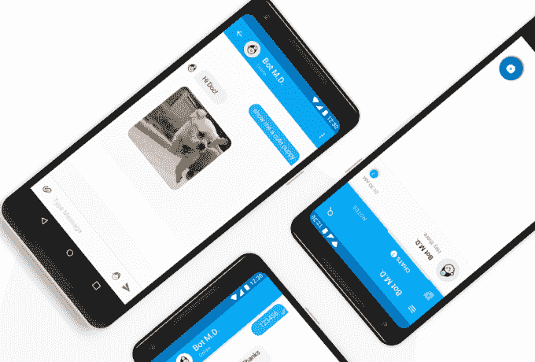

如果 [【机器人医学博士】](https://web.archive.org/web/20230221100935/https://www.botmd.io/) 的创始人如愿以偿，新兴市场的医生将有机会获得人工智能临床助理。该公司开发了一种机器人，可以提供关于药物、药物相互作用和疾病的问题的答案，同时还可以转录口述的病例笔记。对于任何拥有智能手机的医生来说，Bot M.D .都可以成为他们在急需帮助的地方改善患者护理的可下载、可负担和可扩展的方式。它从这些互动中收集的数据也会被证明是有利可图的。正如该公司指出的，制药公司每年花费 30 亿美元来了解他们的医生客户。如果它能成为他们的仓库，它就有可能获得一定比例的支出。

## **OKCredit**

[OKCredit](https://web.archive.org/web/20230221100935/https://www.okcredit.in/) 帮助印度的中小企业——印度是世界上最大的中小企业基地，每年向消费者提供 5000 亿美元的信贷……理论上。OKCredit 将他们的交易和支付记录数字化，减轻了这些目前维护和核算纸质账簿的企业的负担。

这似乎引起了共鸣。该公司已经与 15，000 家企业合作，它说它没有在营销上花任何钱。至于它所解决的需求，它说这是一个 3000 亿美元的市场。

## **Emptor**

无需多言 [概不负责。](https://web.archive.org/web/20230221100935/https://www.emptor.ai/)Emptor 帮助当地公司寻找设施和维护提供商，如看门人、园林设计师和暖通空调维修技术人员，它自称是企业的图钉，包括一个机器学习系统，可以对支出进行分类，并提供降低成本的建议。

这种服务对医院来说简直是天籁之音。该公司表示，许多医院亏损，那些没有利润的医院平均只有 2.6%。根据去年发表在《卫生事务》(Health Affairs)上的一项研究，由于 2015 年通过的一项法规可能会在 2030 年前将医院服务支出减少多达 2500 亿美元，情况对他们来说也将变得更糟。如果 Emptor 能给他们一个控制运营费用和提高利润的方法，那么每个人都是赢家。

## **迪耐赛**

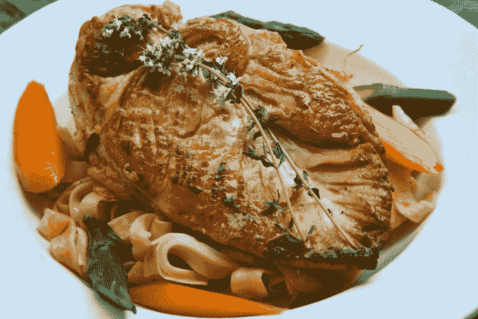

简单地说，要确保食物中毒的暴发将成为过去。每年仅在美国，食源性疾病就使 4800 万人患病，并导致大约 3000 人死亡。通过其网站[【iwaspoisoned.com](https://web.archive.org/web/20230221100935/https://iwaspoisoned.com/)，该公司允许用户生成食物中毒报告，以实时检测疫情。事实上，该公司表示，在今年早些时候 Chipotle 爆发之前，它就预测到它会有食品安全问题。

该公司拥有 25，000 名消费者用户，为企业客户和 280 家公共卫生机构提供数据服务、监控、基准测试和行业分析。这项服务对餐馆也有帮助。如果他们想走在这些趋势的前面，他们需要这些数据。难怪已经有 16 家连锁餐厅注册了这项服务。

## **现代财库**

为仍在使用支票、电汇或自动清算机构等传统支付机制的企业提供支付履行服务， [现代财政部](https://web.archive.org/web/20230221100935/https://www.moderntreasury.com/) 希望为企业节省时间和资金。作为非信用卡交易的一个条纹，该公司为企业提供了一种方式，以取代他们用来管理支付的本土基础设施和 excel 电子表格。

## 琳娜·艾

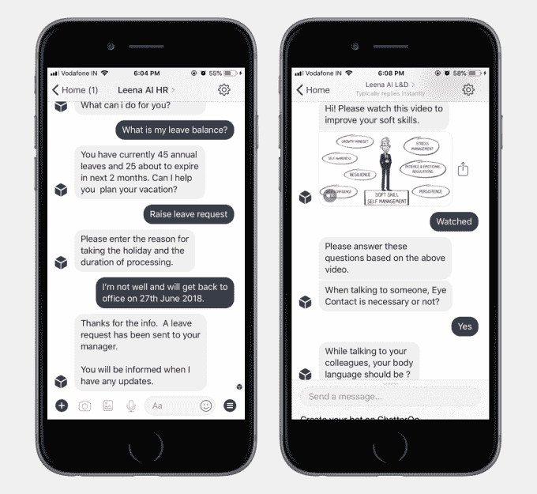

Leena AI 正在开发人力资源机器人，为员工即时答疑解惑。脸书可以将这些机器人集成到 Slack 或 Workplace 中，它们使用政策文件和后端系统中的信息进行构建和训练。

有些问题和答案相当标准，涵盖了假期和费用报告等内容。但 Leena AI 也使用自然语言处理来理解一家公司的独特术语，或者只是某人可能会问这些问题的不寻常方式。

[在这里阅读更多关于 Leena AI 的内容](https://web.archive.org/web/20230221100935/https://techcrunch.com/2018/06/29/leena-ai-builds-hr-chat-bots-to-answer-policy-questions-automatically/)。

## **算盘协议**

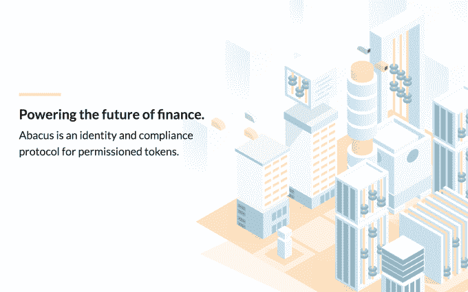

[Abacus Protocol](https://web.archive.org/web/20230221100935/https://abacusprotocol.com/)允许任何公司将可替代和不可替代的资产(如商品、股票或债务)进行令牌化，并自动化其合规要求，如了解客户、SEC 注册豁免和证券限制。这些功能不仅在发行时发生，而且在安全令牌的每次二次交易或转移时发生。使用该平台，公司可以利用令牌化的优势，使资产更具流动性，并简化簿记，而无需雇用开发团队。

## 快乐实验室

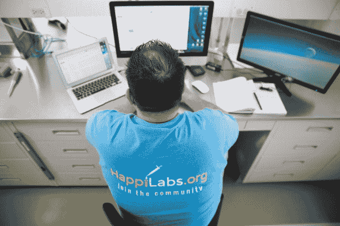

[HappiLabs](https://web.archive.org/web/20230221100935/https://www.happilabs.org/) 是一名虚拟实验室经理，涉及从生物技术和大脑研究到机器人技术的多个主题。它已经与全国 26 个实验室合作，帮助他们以经济有效的方式购买从烧杯到手套到专门机器的一切东西。

创始人兼首席执行官汤姆·鲁金斯(Tom Rugins)是一名前博士生，也是实验室经理，他说他对科学采购与零售世界的差距感到惊讶。

[点击此处了解更多关于 HappiLabs 的信息。](https://web.archive.org/web/20230221100935/https://techcrunch.com/2018/08/14/y-combinator-invests-in-happilabs-to-help-scientists-shop-smarter/)

## 联盟

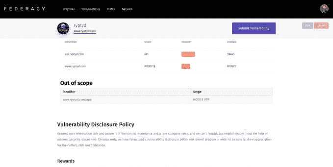

Federacy 的使命是让即便是最小的初创公司也能获得 bug bounty 项目。这个想法是让初创公司设立 bug 奖金变得免费和简单。

目前，联合创始人正在审查他们带到平台上的每个研究人员。虽然他们意识到这种方法可能不会永远持续下去，但他们希望在构建平台的同时控制访问。

[点击](https://web.archive.org/web/20230221100935/https://techcrunch.com/2018/08/10/federacy-wants-to-put-bug-bounty-programs-in-reach-of-every-startup/)阅读更多关于联邦民主的信息。

## **学院脉搏**

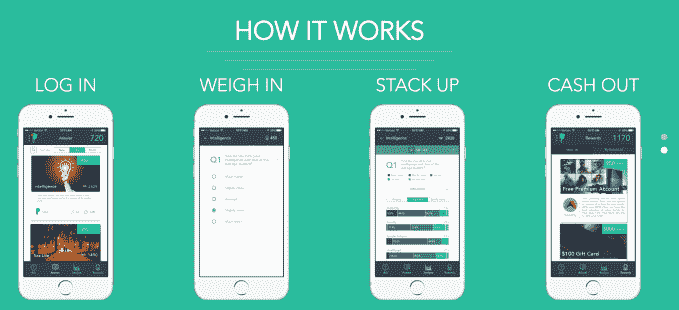

Z 世代的年轻人喜欢参加测验，公司喜欢向 Z 世代的年轻人推销产品。这两个事实让 [大学脉动](https://web.archive.org/web/20230221100935/https://collegepulse.com/) 背后的团队垂涎三尺，为他们看到的业务机会而垂涎三尺。使用该公司的服务，学生可以在他们的社区进行民意调查，以了解他们校园周围发生的事情。查询范围从寻找性活动和 GPA 之间的相关性，到镇上最受欢迎的喝麦芽酒的地方。该公司已经活跃在全国 33 所大学校园中，通过向令人羡慕的钱包开放的观众出售其访问权而获利。该公司成立于达特茅斯的校园内，它看到了一个由广告支持的内容交付平台的未来，该平台面向那些想了解 的人们 [。](https://web.archive.org/web/20230221100935/https://www.youtube.com/watch?v=jsWDM8LqJUU)

## **Medinas Health**

解决价值 7650 亿美元的医疗浪费问题[Medinas Health](https://web.archive.org/web/20230221100935/http://www.medinashealth.com/)为医院提供了一种简单的方法来转售他们用过的和多余的医疗设备和用品。该公司已经为其市场筹集了 100 万美元，以帮助医疗机构购买和销售设备。在阿什顿·库彻和盖伊·奥塞里(Guy Oseary)的 Sound Ventures 以及通用催化剂(General Catalyst)的 Draft Ventures 基金的带领下，该公司还在努力降低资金短缺的农村医疗保健中心的成本。

## OpenPhone

[OpenPhone](https://web.archive.org/web/20230221100935/https://www.openphone.co/) 一直在开发一款应用程序，让获取和使用商务电话号码变得更容易。你不需要第二部手机，你不需要为大型团队设计昂贵的解决方案。

下载 iOS 或 Android 应用程序后，你可以每月花费 9.99 美元获得第二个电话号码。它可以是美国或加拿大的本地或免费电话号码。你也可以移植一个现有的电话号码，扔掉你的第二部电话。

[点击](https://web.archive.org/web/20230221100935/https://techcrunch.com/2018/07/01/openphone-lets-you-get-a-business-phone-number-with-an-app/)阅读更多关于 OpenPhone 的信息。

## **iLabService**

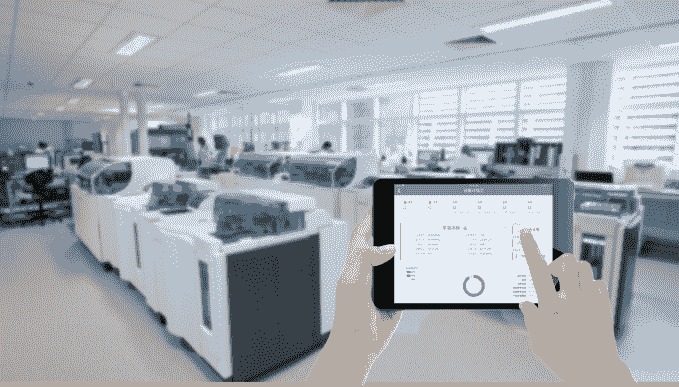

[iLabService](https://web.archive.org/web/20230221100935/http://www.ilabservice.com/)是中国实验室监控、管理和自动化服务。他们使用传感器来监控实验室设备，并在出现问题时向您发出警报。他们目前正在跟踪 1500 件设备。中国有 30 万个实验室，使用 2500 万件设备。他们每年收取 2 亿美元的设备费用，在中国创造了 50 亿美元的市场机会。创始人在 ThermoFisher 工作时发现了这一巨大的未满足的客户需求。

## Splish

Splish 应用程序将内容弹出到 1-5 秒的视频循环中。照片也可以上传，但动作必须以你选择的动画效果的形式加入。所以基本上，Splish 上没有什么是静止的。

虽然不稳定，但 Splish 上的内容旨在持续存在，而不是转瞬即逝。这个想法是，在 Splish 上分享东西是一种亲密的体验；这是伴侣之间正在进行的智能手机对话的一部分，而不是选择性修剪的照片。事实上，这家初创公司很快就瞄准了青少年，主要是因为不像成年人那样拍摄假期照片和晚餐外出照片并发布到社交媒体上，青少年“没事可做”，所以它会告诉他们发布什么。(例如，这些“线索”可以包括用户拍摄自己喝辣酱的画面。)青少年显然喜欢这个主意。该公司表示，六周前推出的这款应用平均用户每天会打开四次。它没有透露目前为止吸引了多少用户。

点击这里阅读更多关于 Splish 的信息。

## **牛逼的**

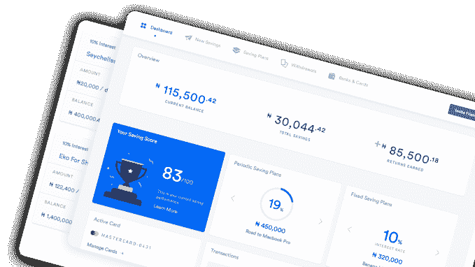

希望将算法化管理的投资平台的好处带给整个非洲大陆的非洲人。借鉴在美国流行的 Betterment 和 Wealthfront 剧本，CowryWise 让年轻、高净值的非洲人能够更明智地投资他们的资金——使用以前只有大型金融服务机构才能使用的机器学习工具。

## **Radix Labs**

[Radix Labs](https://web.archive.org/web/20230221100935/http://radix.bio/) 想成为实验室的操作系统。以网络化的方式组织实验室设备可能会对研究和开发产生巨大的影响。今天，实验室设备就像 80 年代的 maniframes，每个设备都需要单独编程。连续运行实验可以减少得出结果所需的时间，让生物学家自动化他们的实验室和实验，以模拟制造业的大规模生产。

## **Kyte**

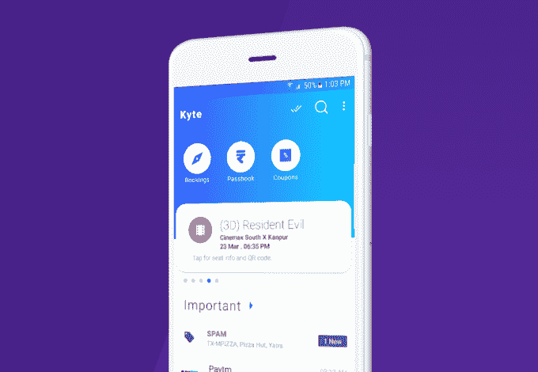
根据 [Kyte](https://web.archive.org/web/20230221100935/http://kyte.ai/) 的团队统计，去年，印度企业向客户发送了 1800 亿条短信，其中 60%是垃圾短信。该公司的人工智能短信收件箱旨在抛弃垃圾邮件，并将印度用户的交易记录和优惠券组织到一个设计简洁的中心。收件箱清理初创公司每周增长 13%，因为它希望抓住印度的 3 亿智能手机用户。

## **Hypcloud**

图片来源:Li-Anne Dias，Crunchbase 新闻。

[hyp cloud](https://web.archive.org/web/20230221100935/https://www.hypcloud.de/en/)在德国打造房地产开发融资平台。该团队希望通过更简化的工作流程实现更具协作性和效率的谈判时间，从而区分他们所建立的东西，这将有望让客户更快地接触到融资合作伙伴。使用基于网络的软件，客户可以同时与多达 5 家银行谈判，以获得更优惠的条件。

## **Miru**

[Miru](https://web.archive.org/web/20230221100935/https://www.miruhome.com/) 打造了一款 AR 应用，向用户展示家中任何一件家具的样子。Miru 应用程序使用计算机视觉管道将物品放置在你的生活空间中，让你从任何零售商网站中提取物品。宜家也有类似的服务，但只是针对他们自己的产品目录。家具可视化是一个 65 亿的市场，但这只是开始。在使用 Miru 的可视化服务时，该应用程序可以绘制你的房屋地图，并为未来的房屋项目收集数据，如油漆和地板。

## 克拉利蒂

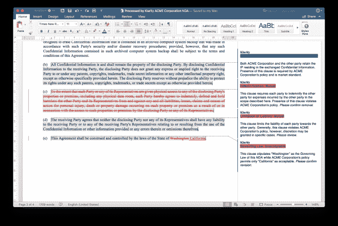

[Klarity](https://web.archive.org/web/20230221100935/https://www.klaritylaw.com/) 希望通过应用人工智能，特别是自然语言处理，实现合同审查过程的自动化。它提供了一种订阅云服务，可以检查 Microsoft Word 文档中的合同，当发现与剧本清单不匹配的内容时，会提出建议。

然后，该产品生成一份文件，由一名人类律师审查并签署建议的修改，将审查时间从一个多小时减少到 10 或 15 分钟。

[点击](https://web.archive.org/web/20230221100935/https://techcrunch.com/2018/08/17/klarity-uses-ai-to-strip-drudgery-from-contract-review/)阅读更多关于 Klarity 的信息。

## **SF17 疗法**

来自精准医疗初创公司 Simpatica Medicine 的创始团队带着 [SF17 Therapeutics](https://web.archive.org/web/20230221100935/https://www.sf17therapeutics.com/) 回来了，这是一个精准医疗分析平台，为儿科风湿病学家提供对威胁生命的情况的监测。该技术使儿科医生能够为患者匹配正确的治疗方案，或者在一个疗程不起作用时改变治疗方案。该平台还被用于展示药物发现能力，可以识别新药化合物开发的目标。

## 比…得票数多

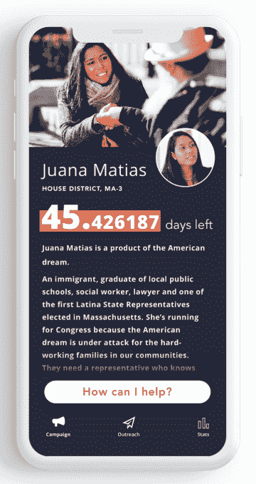

[Outvote](https://web.archive.org/web/20230221100935/https://www.outvote.io/) 希望让草根风格的竞选活动变得更简单、更个性化，推出了一款允许人们给朋友发短信提醒投票的应用。

虽然今天有很多选民外联工具，但许多由 MoveOn 等知名组织运营的工具都涉及到人们选择接收来自相关群体的短信。Outvote 是不同的，因为它是一个工具，帮助个人选民接触他们自己的熟人、家人和朋友。其创始人说，这个想法是为了了解谁的朋友和同事不投票，然后迫使他们去投票。

[点击这里阅读更多关于 Outvote 的信息](https://web.archive.org/web/20230221100935/https://techcrunch.com/2018/07/25/outvote-hopes-to-flip-elections-by-getting-democrats-to-text-their-friends/)。

## 固化基底

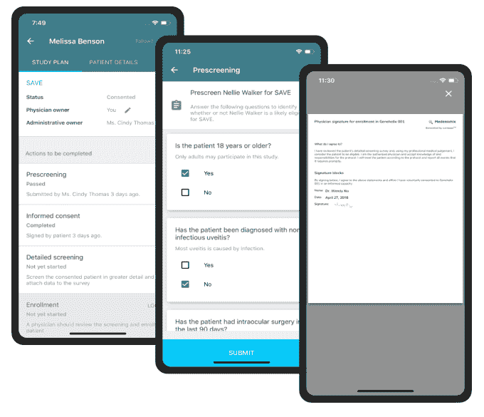

[Curebase](https://web.archive.org/web/20230221100935/https://www.curebase.com/#tagline) 的目标是通过减少招募时间、自动化人工步骤并让制药公司将试验结果分发给诊所的软件，比任何人都更快、更便宜地进行临床试验。考虑到临床试验是物流方面的噩梦，经常在几十个地方进行协调，任何解决方案听起来都像是一种改进，Curebase 的“临床试验市场” 表示，三笔交易预计将产生 175，000 美元的收入，这应该有助于说服更多客户相信其软件和全方位服务支持的优点。

## **OneGraph**

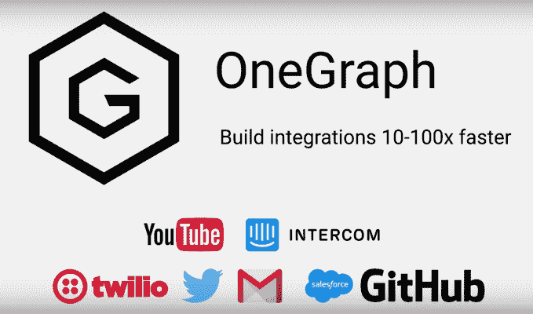

[OneGraph](https://web.archive.org/web/20230221100935/https://www.onegraph.com/) 是一项 GraphQL 服务，旨在连接万维网的 SaaS API，并帮助客户以比目前更快的方式构建集成。OneGraph 支持二十多个 API，包括 Stripe、Salesforce、GitHub 等等。

## **梦工厂**

[DreamCraft](https://web.archive.org/web/20230221100935/https://www.dreamcraft.com/) 是一个让视频游戏制作者无需编写代码就能创作游戏并从中获利的平台。该公司表示，游戏改装是一个价值 40 亿美元的行业，但改装者通常赚不到任何钱，因为他们根本不拥有原创游戏。在 DreamCraft 上，修改者将能够创建新的游戏，同时保留 70%的收入，并获得托管这些游戏的自由。联合创始人来自谷歌和艺电，希望建立一个平台，作为游戏制作者的应用商店。

## **火花交换**

使用闪电网络执行无信任的点对点互换，[spark swap](https://web.archive.org/web/20230221100935/https://sparkswap.com/)正在寻求建立一种新的方式来交易比特币和莱特币等加密货币对，而无需在交易所存放资产。

## 特殊地

[例外](https://web.archive.org/web/20230221100935/https://growexceptionally.com/)旨在帮助父母了解、组织和交流所有关于为有特殊需求的儿童提供护理和教育的信息，从自闭症到唐氏综合症。

第一步是教育:根据家长提供的信息，创业公司的平台帮助家长了解状况本身、他们对学校的期望以及他们的权利(比如他们的孩子是否值得坐在前排，或者教师多久分享一次孩子的进步报告)。它还可以帮助家长与学校和教师合作，制定个人教育计划。

除了教育规划之外，exceptive 还计划更换昂贵的财务和医疗规划专家，这些专家通常每年要花费这些家长 10，000 美元以上。创业公司能创造多大的生意是一个公开的问题，但我们喜欢父母不再需要律师或其他昂贵的专业人士代表他们的孩子谈判的想法。

[在这里阅读更多关于例外的](https://web.archive.org/web/20230221100935/https://techcrunch.com/2018/06/27/exceptionally-helps-parents-navigate-the-special-needs-education-labyrinth/) 。

祝贺你，如果你已经做到这一步，你对最新的一批相当了解。请稍后继续关注我们今天最喜欢的创业公司。