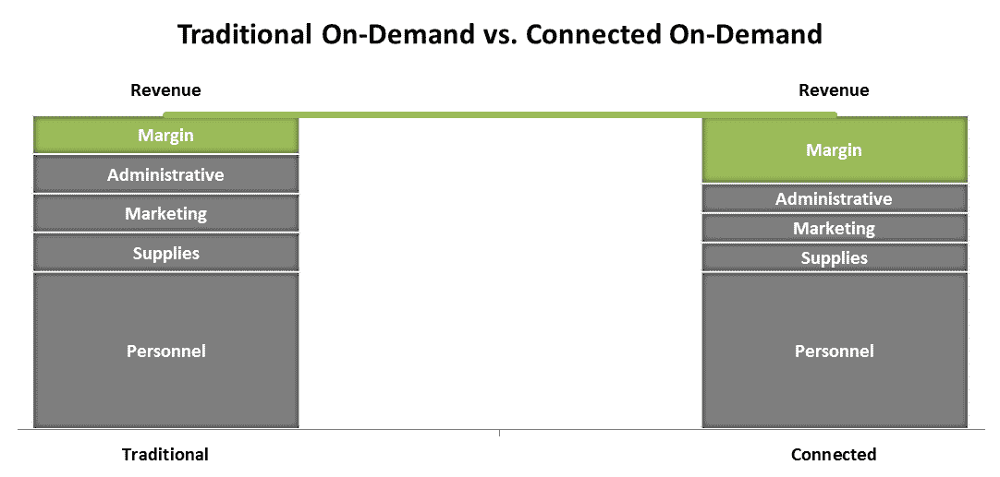

# 并非所有按需模型都是同等创建的 

> 原文：<https://web.archive.org/web/https://techcrunch.com/2016/04/24/all-on-demand-models-are-not-created-equally/>

乔·梅德韦德是勒勒·希波风险投资公司软银资本的合伙人。

More posts by this contributor

按需服务的时代即将结束。媒体每周都会报道首轮融资和初创企业的倒闭，而且，随着资金的停止，似乎每个“X 的优步”都注定要失败。

许多人(相当)质疑软件能否吃掉主要由人力资本推动的服务。虽然便利吸引了消费者，但成功的按需创业必须产生技术杠杆，以释放成本结构中的附加值。这个新发现的价值应该被用来授权和奖励那些正在做繁重工作的服务提供者，在某些情况下，确实如此。

虽然在经济低迷时期不可避免会有负面影响，但仍有许多按需创业公司走上了成功之路。查看传统服务的成本构成可以提供信息，因为特定类别比其他类别具有更大的利润灵活性，包括人员、房地产、供应、营销和管理。

大多数按需创业公司利用技术来提高供应、营销和管理费用的效率。人员和房地产的杠杆程度取决于初创公司在按需服务领域的地位。

**人员** 在按需分配的情况下，技能水平对人员开销有着重要的影响。如下图所示，人力资本通常是任何服务企业最大的支出，尤其是高端垂直行业。

在高技能类别中，初创公司通过模范服务实现品牌差异化的潜力更大。比起伟大的管家或出租车司机，消费者更有可能特意去找一位一流的医生。

然而，招聘和保留单个服务提供商的成本越高，员工的支出就越大。这削弱了利用其他成本要素获得利润优势的潜力。

**房地产** 下图是按房地产策略分解的按需服务。它包括初创公司，在这些公司中，个人服务提供商实际上向消费者或企业客户提供服务。这些是总部位于美国的私营公司，已经筹集了至少 500 万美元的资本。

**按需连接** 这一类别解决的是历史上已经交付给消费者的服务，因此没有重要的房地产组成部分。

这些初创公司利用以数字为中心的方法来增强消费者对流动的、社区评级的服务提供商的访问。他们经常开发先进的物流解决方案来获得额外的效率。

交通运输是该类别的垂直海报，吸引了最多的投资者关注。GPS 手机的普及解决了司机和乘客相互定位时的摩擦。再加上市场的规模、使用的频率和需求的紧迫性，产生了一场完美的点播风暴。

这一类别中最成功的创业公司建立了具有流动性护城河的网络效应，这通常是昂贵的建设，但很难解构。优步显然是这一浪潮的先锋，并投入巨资建立了一个占主导地位的供应基地。

**只需添加交付** 这一类别在现有业务的基础上增加了新的或增强的交付解决方案。这些创业公司可能会自己雇佣送货专业人员，或者帮助传统的商业伙伴管理他们。

虽然几乎每个人都喜欢让产品或服务送到他们家门口，但他们并不都愿意为此支付更多的钱。成功的交付层模型必须瞄准巨大的市场，如餐饮、杂货和航运。他们必须在潜在客户群中找到足够大的比例，愿意为了方便而接受增量定价。在这种模式下，也可以通过推广当地产品以及通过与必要合作伙伴的批量折扣来创造利润价值。

在经济低迷时期，这一类别最容易受到价格弹性增长的影响，尤其是在可支配收入垂直行业。

**优化房地产**
这一类别优化基础设施，包括拆除面向客户的物业、整合工业空间以及搬到更便宜的商业区。

在餐饮领域，一些初创公司正在移除公共餐饮场所，并将运营与工业厨房整合在一起。在杂货和大盒子零售领域，初创公司直接从仓库送货上门。在自助存储中，初创公司正在消除存储中的“自我”，增加一个交付和物流层，将存储基础设施从城市中心的边缘推到更大、更便宜的仓库。

其中一些初创公司正在增加以前没有的送货服务。较低的房地产成本需要超过增加的交付和物流费用，才能取得长期成功。

**消灭房地产**

历史上，许多传统的服务模式需要一个店面物业或公共办公室。主干道上的汽车修理店受益于意识。一家位于城市好地段的沙龙获得了高租金区域的信誉。

在我们日益数字化的世界中，新一波按需创业正在将传统的服务点转移到客户所在地。需求可以在线生成，并在客户方便的任何地方提供服务。这一策略有利于服务提供商，包括美容师、医生、按摩师和机械师。

虽然这些垂直行业中的一些复杂服务必须在配备重型设备的受控环境中执行，但很大一部分访问可以在异地进行。上门服务降低了在一个地点工作的效率，因此大规模优化工作和供应渠道以最大限度地减少运输时间至关重要。

店面拆除消除了个人为自己工作的巨大障碍。这不仅对消费者来说更方便，而且由于成本结构中的一个关键因素被消除，因此释放出巨大的价值。这可以使服务提供商建立自己的业务，并从他们创造的收入中获取更大的比例。

**页边空白图片**

由市场规模、平均价格点、使用频率、产品和服务的组合、需求的紧迫性、劳动力的短暂性等因素驱动，每个类别都有不同的经济特征。，展示了按需销售中可能出现的利润中断。然而，下面的专栏试图代表成功执行的成熟创业公司的标准化成本结构。

假设所有按需创业公司的供应、营销和管理费用都因技术而减少，一些特征就会出现。许多传统的服务企业被像 Angie's List 和 Yelp 这样的评论聚合器，或者像 Booker 和 MINDBODY 这样的预订平台引入了数字世界；然而，外包方法通常缺乏内部工程团队可以提供给垂直聚焦的按需创业公司的优势。

该分析假设人员费用保持不变。你可以主张削减一些基础人员成本，尤其是 1099 人的劳动力。然而，如果你认同完美市场理论，那么从长期来看，人力资本成本应该有一个总体均衡。

**传统按需服务与联网按需服务** 
传统按需服务与联网按需服务的比较必须是孤立的，因为这两种模式都缺乏不动产。对于管理员来说，有一些财产成本，但绝大多数工作都是在异地完成的，因此不包括在核心成本中。

利润率的提高可能并不显著。然而，对于像优步这样大规模应用其利润优势的公司来说，联网的按需模式可以创造巨大的颠覆性价值。

**传统服务与按需服务**

在这种比较中，送货人员和房地产有着实质性的影响。

在添加或增强交付的情况下，为“仅添加交付”类别以及“优化不动产”类别添加交付人员。假设 just add 交付类别的收入增加，因为这必须得到客户群的保证，这些模型才能成功。只需添加交付初创公司没有下面展示的全部成本结构，但有效地与他们的传统合作伙伴分享。其他类别可以保持与传统定价相同的价格，或者如果他们愿意削减利润，就进行价格竞争。

房地产成本杠杆可以产生显著的杠杆效应。通过有效地将服务点转移到客户的位置，初创公司获得了历史上与基础设施相关的经济价值。这种价值可以在市场参与者之间共享，并创造出一种可以大幅提高利润率的模式。

**奖励个人服务提供商**

理论上，所有点播类别都有可能颠覆传统服务。然而，所有的随需应变模式并不都是一样的，它们对利润的潜在破坏也不应该从同一个角度来看。

所有这些假设模型都需要高超的执行力来满足市场双方的需求。当利润可以被重新获得并与从事艰苦工作的人分享时，可持续破坏的可能性最大。吸引和留住训练有素的劳动力的成本往往被低估。

无论是 1099 还是完全就业，大多数工人为按需创业公司工作的愿望很大程度上取决于他们在哪里能赚到最多的钱。他们能获得更多他们创造的价值吗？从长期来看，收入通常比灵活性更重要。

初创企业可以吸引优质服务提供商，并通过良好的技术遏制客户流失。他们可以提供对客户和供应品的访问、优化的日程安排、付款处理、客户评论和稳定的工作供应。一家精心打造的按需创业公司不仅可以避免客户流失，还可以发现许多服务提供商为了平台带来的附加值和便利，将自己的客户带到了平台上。

在越来越多的负面声音中，四家按需创业公司在过去 45 天里筹集了近 1 亿美元，这些公司不仅为客户服务，还为员工服务。

3 月初，[your mechanical](https://web.archive.org/web/20221127102308/https://www.crunchbase.com/organization/yourmechanic)(为机械师提供比商店和经销商多 2-3 倍收入的可能性)宣布拨款 2400 万美元。[安抚](https://web.archive.org/web/20221127102308/https://www.crunchbase.com/organization/soothe)募集了 3500 万美元，该项目为按摩治疗师提供了赚取 2-3 倍于水疗收入的能力。此后不久，他们的竞争对手 [Zeel](https://web.archive.org/web/20221127102308/https://www.crunchbase.com/organization/zeel) 宣布了一轮 1000 万美元的竞标。这三家公司属于消除房地产类别。

在互联点播类别中，尽管可利用的利润空间较小，Q 管理的[最近因与其员工分享价值创造而获得奖励。这家初创公司是最早提供 W-2 就业机会的公司之一，该公司为服务行业的工人划出了 5%的股权。由 Q 管理的战略已经奏效，并产生了 4 月初宣布的 2500 万美元一轮。](https://web.archive.org/web/20221127102308/https://www.crunchbase.com/organization/managed-by-q)

最终，不仅向客户，而且向个人服务提供商重新分配其价值创造的初创公司，在按需经济中最有长期发展潜力。