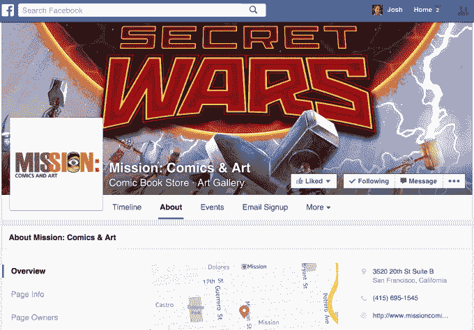
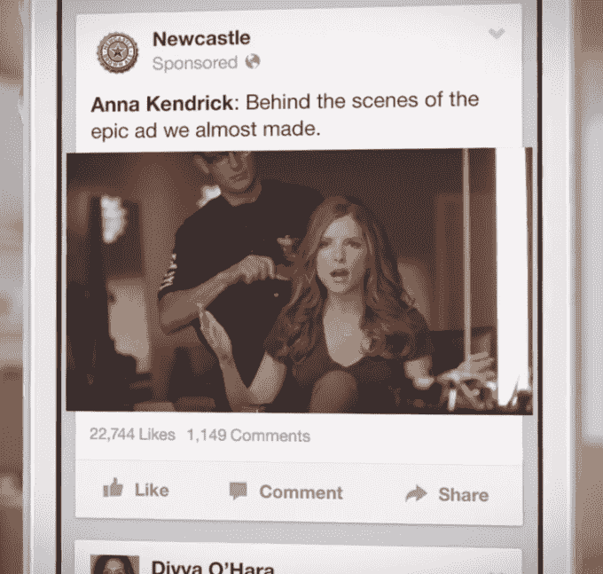
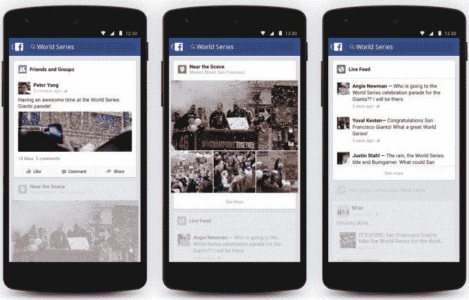
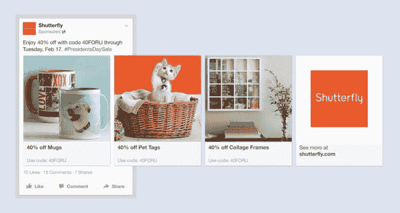
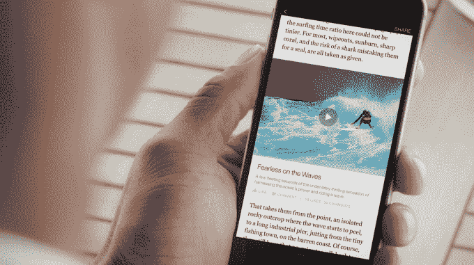
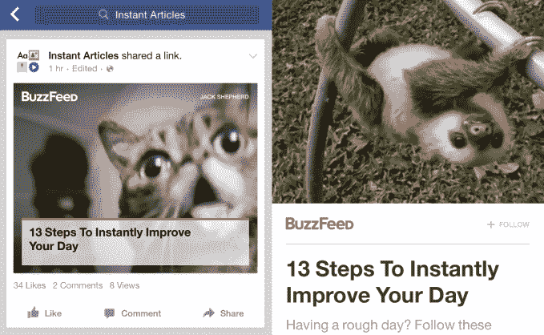

# 脸书寻求吸收互联网

> 原文：<https://web.archive.org/web/https://techcrunch.com/2015/05/13/all-you-need-is-like/>

脸书永远不想让你离开，所以它会吞噬你想去的地方。几年前，它的新闻 Feed 充斥着指向其他网站内容的链接。新闻文章、YouTube 剪辑、商业网站、电子商务商店广告。

但脸书认为，围墙花园之外的世界充满了摩擦。而且摩擦不是[黑客的方式](https://web.archive.org/web/20230404131752/https://techcrunch.com/2012/02/01/facebook-ipo-letter/)。

在野外，你不得不忍受加载时间，额外的点击，以及天理不容的打字。每个链接都是一个断开的机会，阻碍了脸书的使命及其商业模式。

所以它开始寻求消除任何你不得不离开它友好的蓝色盒子的理由。所有值得关注或至少值得花钱的内容或经历都被放在里面，让它们触手可及。

这听起来可能有点不祥，但至少现在，这个计划对出版商、商人，甚至你都有好处。然而，从长远来看，它建立了脸书对我们所有人的影响力。我们让它保存我们的传记，但现在它也想要我们的行为。

## 清理杂乱的互联网

2007 年，当脸书推出 Pages 时，这些齿轮开始转动。开发该产品的团队将企业网站视为混乱、不一致的孤岛。每个网站显示的关键信息都不一样，从一家公司做了什么到它的联系方式。另外，派对是在脸书和你的朋友们一起开的。难道企业不想进入派对，而不是被困在大街上吗？

佩奇给了企业在脸书围墙花园的代表权。他们很整洁，除了一张个人照片和一些帖子外，看起来几乎一模一样。用户知道在哪里可以找到他们想要的东西。不需要谷歌。随着时间的推移，脸书增加了封面照片、[时间轴](https://web.archive.org/web/20230404131752/https://techcrunch.com/2012/02/29/how-to-use-timeline-for-pages/)、地图、评论、开放时间、消息渠道等，以帮助网页取代网站。

这对脸书有双重好处。离开的理由越少，留下的理由越多。Pages 成为脸书巨大的内容来源。世界各地的大量社区管理者花时间制作状态更新、照片和链接，以最大化它们在信息流中的效用和娱乐价值。

这使得脸书成为一个目的地。没有必要绕过 Nike.com 去看它最新的鞋子，没有必要去乐队的网站看巡演日期，也没有必要去新闻发布点看文章。当新闻提要在一个无限滚动的提要中聚集了最好的内容时，为什么还要在互联网上闲逛呢？

## 漏流

问题是，分享到新闻源的大部分内容只是外部互联网的预览和链接。当用户点击离开时，他们可能不会再回来。所以脸书向下移动堆栈，从包含作者到包含他们的内容。

如今，你在 YouTube 上看不到太多关于脸书的视频了。曾经，内嵌的可播放嵌入程序是提要的主要部分。视频就是这样传播开来的。但是这些也充满了摩擦。在他们开始演奏之前，你必须发出“喘息”的咔嗒声。当他们结束时，他们会怂恿你看更多非脸书的内容。YouTube 视频会在脸书的地盘上显示谷歌的广告，这无疑让社交网络感到恼火。

所以脸书设计了自动播放视频的 T2。你直接把你的视频上传到脸书，而不是贴一个链接。当观众滚动时，他们会自动播放，没有前置广告或弹出式广告。它们是干净的。他们很有效率。人们看得目瞪口呆。

类似于哈利波特报纸上的动态图片，自动播放视频于 2013 年 12 月推出。一旦他们获得动力，2014 年 5 月至 7 月间，浏览量增长了 50%。9 月，脸书的视频浏览量达到了每天 10 亿次。到了一月份，就是[30 亿](https://web.archive.org/web/20230404131752/https://techcrunch.com/2015/01/28/facebook-now-has-3b-video-views-per-day/)。现在超过 40 亿。这使得在所有的有机片段中插入一些视频广告变得很容易。

脸书有它需要的证据。人们希望 it 部门吸收互联网。

为什么要在网上点击，试图把一个大主题的新闻串联起来呢？看看[脸书的](https://web.archive.org/web/20230404131752/http://newsroom.fb.com/news/2014/12/updates-to-trending/)趋势页面，里面全是读者的反应和相关人员的帖子。

当你可以发脸书信息时，为什么还要处理电子邮件呢？新的 [Messenger For Business](https://web.archive.org/web/20230404131752/https://techcrunch.com/2015/03/25/facebook-launches-messenger-platform-with-content-tools-and-chat-with-businesses/) 程序将让你获得电子商务购物收据，并通过脸书聊天联系客户支持。

其他应用？脸书也有类似的应用程序。Snapchat？试试[戳](https://web.archive.org/web/20230404131752/https://techcrunch.com/2012/12/21/facebook-poke-app/)。或者[弹弓](https://web.archive.org/web/20230404131752/https://techcrunch.com/2014/06/17/facebook-slingshot/)。或者[重复片段](https://web.archive.org/web/20230404131752/https://techcrunch.com/2015/04/01/friends-contribute-then-their-friends-contribute-then/)。或[螺栓](https://web.archive.org/web/20230404131752/https://techcrunch.com/2014/07/29/instagram-bolt/)。Yelp？脸书[附近的地方](https://web.archive.org/web/20230404131752/https://techcrunch.com/2012/12/17/facebook-nearby/)。四方？[附近的朋友](https://web.archive.org/web/20230404131752/https://techcrunch.com/2014/04/17/facebook-nearby-friends/)。论坛？[房间](https://web.archive.org/web/20230404131752/https://techcrunch.com/2014/10/23/facebook-rooms/)。

无聊？当你能向后看的时候，为什么要向外看。脸书的 TimeHop 克隆版[在这一天](https://web.archive.org/web/20230404131752/https://techcrunch.com/2015/03/24/facehop/)展示你多年前的状态更新和怀旧照片。

脸书可能会自我松绑，但它是通过吸收任何在其王国之外显示潜力的东西来做到这一点的。

## 广告就是商店

包括购物。即使企业为点击向脸书付费，它也不希望他们引诱人们到外面去。

传统上，电子商务广告会把人们带到一个网络店面，在那里他们必须手工输入他们的付款和送货细节。这太烦人了，尤其是在手机上，以至于许多人在掏钱之前就放弃了购物车。

于是脸书好心地提供了[购买按钮](https://web.archive.org/web/20230404131752/https://techcrunch.com/2014/07/17/facebook-buy-button/)。在新闻提要中看到你想要的产品的广告，点击购买，你的付款信息会自动从脸书的档案中自动填充，然后嘣，你毫不犹豫地就买了。没有时间重新考虑冲动购买。

现在脸书的[新产品广告](https://web.archive.org/web/20230404131752/https://techcrunch.com/2015/02/17/facebook-product-ads/#.c09dfs:l3ng)可以向你展示一系列你可能想要的东西。去一个大的电子商务网站，你可能会没完没了地浏览，却找不到你想要的东西。但是，有了这么多你的个人信息、兴趣、网络历史和[线下购买数据](https://web.archive.org/web/20230404131752/https://techcrunch.com/2012/10/01/facebook-ads-frequency/)，脸书的广告会比你自己更好地告诉你该买什么。

也许脸书对你的离开唯一不介意的地方就是应用商店。[应用安装广告是它的摇钱树](https://web.archive.org/web/20230404131752/https://techcrunch.com/2014/11/30/like-advertising-a-needle-in-a-haystack/)，上个季度它在移动广告上赚了[24 亿美元的大部分。但即使在这里，脸书也尝试了](https://web.archive.org/web/20230404131752/https://techcrunch.com/2015/04/22/facebook-q1-2015-earnings/#.c09dfs:Unmh)[弹出式应用商店窗口](https://web.archive.org/web/20230404131752/https://techcrunch.com/2012/12/18/apple-hooks-up-facebook/)，希望让你不用离开就能下载。

## 新闻，最不需要“优化”

脸书产品经理 Michael Reckhow 昨天告诉我:“我们已经彻底检查、优化并加速了使用脸书的所有核心体验:加载新闻、加载照片、加载视频。”。"最后一件需要花很长时间载入你的新闻提要的事情是文章."

从这个意义上说，即时文章是脸书寻求吸收互联网的高潮。

该产品可以让脸书托管新闻出版商的文章，这样只要点击一下，这些文章就会立即出现在手机上，而不是强迫你等待 8 秒钟才能加载外部网页。在文章中，富媒体工具允许媒体添加音频说明和可缩放的视频，脸书强大的本地应用程序可以支持这些内容，但这永远无法在笨重的移动浏览器上工作。如果出版商出售出现在即时文章中的广告，他们将获得收入，而如果脸书出售广告，它将获得 30%的收入。

这是一场由脸书主导推荐流量的权力游戏。一些网站从脸书获得的比谷歌还多，相比之下，Twitter 的贡献微乎其微。在多年吮吸新闻的奶水后，出版商开始依赖脸书。但是对新闻空间的竞争比读者关注它的速度要快。这导致新闻源上脸书页面覆盖范围的自然下降，威胁到他们的推荐流量。

所以当脸书说“跳”的时候，像《纽约时报》和 BuzzFeed 这样的出版商会说“里面有多远？”。

## 无限连接

脸书不需要任何个人出版商，但他们都需要社交网络。由于内容远远超过了它的算法可以填充到人们的订阅源中的数量，所以供应很高，而脸书控制着需求。如果它愿意给出版商一种在 feed 中脱颖而出并获得更多流量的方法，他们愿意尝试，而不是冒险被留在花园墙外。

有牺牲。出版商其他文章的循环推广不太适合极简即时文章格式。更糟糕的是，他们无法与那些希望成为常客甚至付费订户的临时读者建立牢固的关系。

通过托管内容，脸书为这些循环打分。读完一篇即时文章，你还在脸书，准备读另一篇。脸书与用户建立了更紧密的联系，越来越成为他们教育和娱乐方式的一部分。大量的使用转化为大量的广告浏览量。

这也是整个“吸收互联网”战略回归脸书使命和业务的地方。它建立了一个最好的在网上印钱的方式，以其原生的新闻提要广告的形式。它们看起来就像你最喜欢的朋友的帖子和页面，但出售应用程序和衣服以及你能想象到的一切。

新闻供稿广告效果如此之好，脸书根本不用担心如何赚钱。它可以专注于消除摩擦，以造福 14.4 亿人。脸书甚至支持大规模的国际半慈善活动。Internet.org 正在开发卫星和无人驾驶飞机，将数据传送到农村地区。它与当地运营商合作，这些运营商补贴免费获得基本的互联网服务，如健康提示、公民信息……哦，还有脸书。通过象征性地成为第一世界的互联网，脸书可以投资真正成为互联网。

它的大部分吸收策略可能会让企业和出版商进一步欠脸书的债。正如[搜索引擎公司 Land 的丹尼·沙利文](https://web.archive.org/web/20230404131752/http://marketingland.com/facebook-instant-articles-slippery-slope-for-google-128596)指出的那样，它也可能削弱开放的互联网。脸书托管内容降低了改进过时的移动浏览器标准的紧迫性，并可能让购买大量广告的脸书大合作伙伴提前获得信息管道。

尽管如此，脸书做的很多事情让用户的生活变得更容易，这也是脸书合理化有争议的决定的方式。通过 Messenger 和群变得更加开放和联系——每个产品都有超过 5 亿用户——仍然是完全免费的。

它只是让你更多地使用脸书的任何地方。做到这一点的最好方法是让你减少对外部互联网的需求。

你所需要的就是。