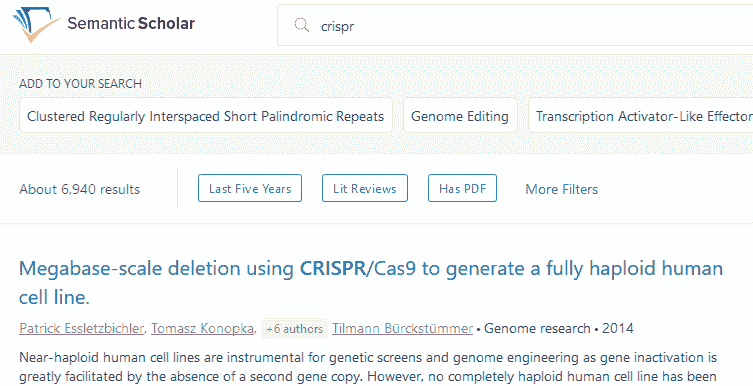

# 艾伦人工智能研究所的语义学者将生物医学论文添加到其人工智能分类语料库 

> 原文：<https://web.archive.org/web/https://techcrunch.com/2017/10/17/allen-institute-for-ais-semantic-scholar-adds-biomedical-papers-to-its-ai-sorted-corpus/>

# 艾伦人工智能研究所的语义学者将生物医学论文添加到其人工智能分类语料库中

语义学者(Semantic Scholar)致力于用自然语言处理(natural language processing)和其他人工智能方法为科学文献编制索引，已经向其宝库添加了数千万篇论文，从计算机科学扩展到生物医学研究。对于更多领域的人来说，这是一个尝试这个有用工具的好机会。

语义学者(Semantic Scholar)由艾伦人工智能研究所(Allen Institute for AI)创建，扫描这些论文的全文，将它们与其他论文相关联，以确定特定的主题、数字的内容、药物和器官等关键词。

现在有如此多的文献被发表，而且可以追溯到如此遥远的地方，以至于一个研究者甚至一个团队几乎不可能对其进行充分的评论。如果六年前的一篇论文碰巧注意到一种药物副产品对去甲肾上腺素产生的轻微影响，但这不是主要发现，或者发表在不同学科的期刊上，会怎么样？

摄取这数百万篇论文并跟踪这些东西，以便研究人员可以轻松地找到它们，这是语义学者背后的想法，但直到最近，该系统还仅限于计算机科学论文。现在已经增加了几个生物医学领域——所以现在看看你的论文是不是语料库的一部分吧！

 该网络工具的更新还包括一些用户界面的改进，浮现出它认为可能与你的搜索相关或最近在该领域出现趋势的主题和标签——例如，给定用户可能不知道的新药或技术。

任何人都可以使用这个工具，尽管显然不是每个人都会觉得它有用——如果你正在寻找普通的感冒治疗方法，或者你是一名古生物学家，这里没有你想要的。但是，随着语义学者跟踪的论文数量越来越多，这种情况可能会改变。