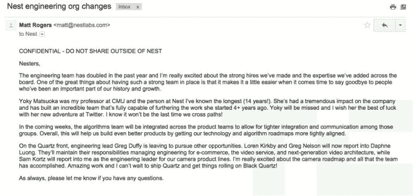
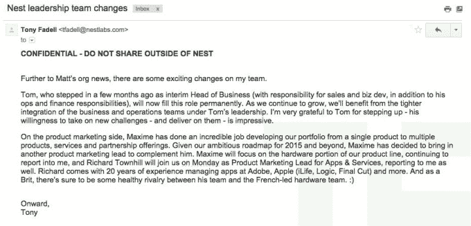

# 随着 Dropcam 创始人和技术副总裁的退出，Nest 重组管理层

> 原文：<https://web.archive.org/web/https://techcrunch.com/2015/01/31/along-with-departures-of-dropcam-founder-and-engineering-head-nest-sees-bigger-reorg-memos/>

[Nest](https://web.archive.org/web/20230326125755/http://www.nest.com/) ，去年被谷歌收购的联网家庭公司，[昨天](https://web.archive.org/web/20230326125755/http://www.theverge.com/2015/1/30/7954831/dropcam-ceo-and-nest-vp-of-technology-both-leave)因其两名关键人物的离职而成为新闻:技术创始副总裁 Yoky Matsuoka 和 Greg Duffy，他是作为[收购](https://web.archive.org/web/20230326125755/https://techcrunch.com/2014/06/20/google-and-nest-acquire-dropcam-for-555-million/)公司 Dropcam 的首席执行官来到 Nest 的。在此之后，我们收到了(匿名)来自 Nest 联合创始人托尼·法德尔和马特·罗杰斯的两份不同的备忘录，这份备忘录让我们对正在发生的事情有了更多的了解。

简而言之，该公司正在进行重组，准备在 2015 年推出一系列新产品，首先是分两个阶段(或两个层次)更新相机，Nest 将其称为“石英”和“黑石英”。根据这一点，以及离职，该公司正在增加更多的业务和产品管理，重新分配一些更接近产品组的技术团队，并更直接地将相机硬件与罗杰斯的权力联系起来。

虽然备忘录并没有真正提供达菲或松冈离开公司的背景，但我们在其他地方看到了声称 Dropcam 和 Nest 之间存在文化冲突的报道。

我们有另一个指向类似问题的线索——也是匿名的——声称达菲在离开前与法德尔发生了冲突。它还指出，在员工被告知他们必须在周六工作“直到 4 月或 5 月(通过几周前的电子邮件法令)，因为我们应该努力争取一个我们甚至不相信的发布”后，士气低落

有一点似乎很清楚:达菲和松冈很受欢迎，他们的离开让公司的其他人感到惊讶。“这个地方处于震惊和怀疑之中，”另一个线人给我们写道。

Nest 拒绝对此事发表评论。我们在下面嵌入了两个备忘录，但以下是基本细节:

罗杰斯的说明——可能在消息公开后向公司发布——证实了松冈和达菲的离职，松冈以未指明的角色转到 Twitter，达菲“离开以寻求其他机会。”达菲后来也在推特上说了同样多的话。

看起来两者都不会被取代:松冈领导的算法团队现在将进行重组，以更紧密地与产品团队合作，“通过让我们的技术和算法路线图更加紧密地保持一致，帮助(Nest)打造更好的产品。”

Duffy 以前的直接下属 Loren Kirkby 和 Greg Nelson 现在将向 Daphne Luong 报告，“管理电子商务、视频服务和下一代视频架构的工程。”与此同时，罗杰斯将更直接地掌握相机硬件，萨姆·科尔兹现在向罗杰斯汇报。

为了跟进此事，法德尔还在另一份备忘录中提到了一些变化。汤姆·冯瑞奇鲍尔(Tom vonReichbauer)从特斯拉跳槽到 Nest 时是该公司的首席财务官，现在他作为公司的业务负责人承担了更多责任，除了运营和财务职责外，还负责监督销售和业务发展。

马克西姆·贝隆(Maxime Veron)在 2011 年加入 Nest 之前为苹果工作了多年，他将为第二个产品营销领导腾出空间，“鉴于我们 2015 年及以后的雄心勃勃的路线图。”理查德·汤希尔(Richard Townhill)将成为该公司应用和服务的新产品营销负责人。

*用 Nest 的响应更新。*