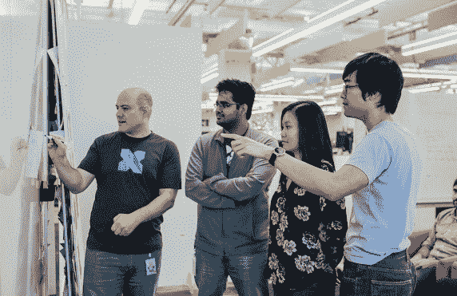

# Alphabet 从其 X moonshot 工厂 TechCrunch 推出新的网络安全公司 Chronicle

> 原文：<https://web.archive.org/web/https://techcrunch.com/2018/01/24/alphabet-launches-new-cybersecurity-company-chronicle-out-of-its-x-moonshot-factory/>

# Alphabet 在其 X moonshot 工厂推出新的网络安全公司 Chronicle

Alphabet，你可能仍然错误地称之为“谷歌”，今天[宣布](https://web.archive.org/web/20230123125243/https://medium.com/chronicle-blog/give-good-the-advantage-75ab2c242e45)推出[编年史](https://web.archive.org/web/20230123125243/https://chronicle.security/)，这是一家新的网络安全公司，旨在给公司提供更好的机会来检测和击退黑客。Chronicle 正从 Alphabet 的 X moonshot 集团毕业，现在是 Alphabet 旗下的一家独立公司，就像谷歌一样。

从 Google Ventures 加入 X 的斯蒂芬·吉列(Stephen Gillett)之前是赛门铁克的首席运营官，他将成为新公司的首席执行官。

首先，Chronicle 将提供两项服务:面向企业的安全情报和分析平台，以及谷歌[于 2012 年](https://web.archive.org/web/20230123125243/https://techcrunch.com/2012/09/07/google-acquires-online-virus-malware-and-url-scanner-virustotal/)收购的在线恶意软件和病毒扫描器 VirusTotal。

 吉列[写道【Chronicle 背后的总体想法是消除公司的安全盲点，让企业更好地了解他们的安全状况。吉列写道:“我们希望让安全团队更轻松、更快速、更经济地捕捉和分析安全信号，从而将他们的工作速度和影响提高 10 倍我们正在构建我们的智能和分析平台来解决这个问题。"](https://web.archive.org/web/20230123125243/https://medium.com/chronicle-blog/give-good-the-advantage-75ab2c242e45)

x 的 Moonshots Astro Teller 队长还指出，“安全团队识别和调查攻击所需的信息就在组织的现有安全工具和 IT 系统中，但它隐藏在海量数据中，因此不容易被看到、理解或使用。”

然而，这个新平台到底会是什么样子还有待观察。吉列指出，它将在 Alphabet 的基础设施上运行，并使用机器学习和高级搜索功能来帮助企业分析他们的安全数据。Chronicle 还表示，它将在云中提供其服务，以便它们可以“随着组织的需求而增长，而不需要再添加一个安全软件来实施和管理。”

Chronicle 并不是第一家采用这种方法的公司，所以看看它与竞争对手有什么不同会很有趣，竞争对手包括各种日志分析公司和像 IBM 这样的公司。

虽然 Alphabet 承认目前没有太多细节可以分享，但该公司确实表示，这项服务目前正在由多家财富 500 强公司进行 alpha 测试。

*编年史将在今天晚些时候举行新闻发布会，随着我们对这项服务了解的深入，我们将更新这篇文章。*