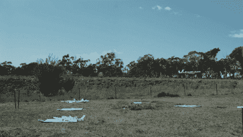

# Alphabet 的 Project Wing 现在在澳大利亚东南部用无人机送玉米煎饼

> 原文：<https://web.archive.org/web/https://techcrunch.com/2017/10/16/alphabets-project-wing-now-delivers-burritos-by-drone-in-southeastern-australia/>

# Alphabet 的 Project Wing 现在在澳大利亚东南部用无人机送墨西哥卷饼

自从我们上次听到 Project Wing， [X](https://web.archive.org/web/20230321051814/https://x.company/) 的 moonshot 无人机送货项目已经有一段时间了。但是经过几个月的休耕，团队[今天](https://web.archive.org/web/20230321051814/https://blog.x.company/testing-in-the-australian-skies-5a71db1ed6fe)发布了一个更新，看起来这个项目已经取得了相当大的进展。Alphabet 的 X 部门现在正在澳大利亚东南部测试 Project Wing 无人机，它的飞行器正在向测试人员的院子里送货。

这是澳大利亚东南部，我们谈论的是相当大的院子，但这仍然是这个项目的一个进步。事实上，谷歌现在正与 [Guzman y Gomez](https://web.archive.org/web/20230321051814/https://blog.guzmanygomez.com/project-wing-drone-mothership/?utm_source=referral&amp;utm_medium=WingBlog&amp;utm_campaign=project_wing) 合作递送墨西哥食物(这里有 [TacoCopter](https://web.archive.org/web/20230321051814/http://tacocopter.com/) 的回声)和[药店连锁](https://web.archive.org/web/20230321051814/https://www.chemistwarehouse.com.au/)。

目前的 Project Wing 无人机可以以每小时 120 公里的速度飞行，据我们所知，这里的基本设置是一架无人机，它可以在十几个或更多旋翼的帮助下垂直起飞和降落，然后切换到垂直飞行以进行更长的距离。送货挂在无人机下面，然后下降到最终送货点，这样无人机本身就不必着陆。虽然谷歌没有说这些无人机有多大，但我们这里不是在谈论一架小型 DJI 无人机，而是一架相当大的飞行器。

澳大利亚的位置显然意味着无人机可以在相当开阔的土地上飞行，几乎没有障碍。谷歌指出，虽然其飞行规划软件负责预先规划路线，但无人机的机载传感器负责在飞行期间和交付地点避开障碍物。当然，目前只有少数测试人员可以通过无人机交付食物，但所有这些项目背后的想法是研究更大交付网络的可行性。

谷歌的声明是在亚马逊在英国开始自己的无人机送货测试大约 10 个月后发布的。两家公司在最近几个月都非常低调，尽管随着年底购物季的升温，我们似乎还会有更多的更新(亚马逊通常会在感恩节前后提供更新)。