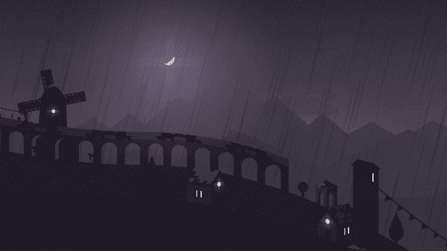

# 奥拓的冒险回顾:立即获得这款令人惊叹的 iOS 游戏

> 原文：<https://web.archive.org/web/https://techcrunch.com/2015/02/20/altos-adventure-review/>

最好的手机游戏提供了一种禅宗般的满足感，而不是银行账户余额为负和精神破产的感觉。

 [Alto’s Adventure](https://web.archive.org/web/20230320103938/https://itunes.apple.com/us/app/altos-adventure/id950812012?ls=1&mt=8)

多伦多雪人工作室(Snowman studios)的新游戏肯定会满足灵魂，这要归功于具有微妙视差效果的惊人平面图形美学，华丽的配乐和游戏玩法，易于学习，难以掌握，非常适合长期可玩性。

Alto 的冒险也是一次性购买仅 2 美元，没有应用内购买，尽管有一个游戏内货币机制用于解锁升级，这对许多其他开发者来说是一个太诱人的摇钱树，不容错过。雪人的联合创始人 Ryan Cash(不是双关语，只是他的真名)解释说，他和联合创始人 Jordan Rosenberg 讨论过使用 IAP 并使游戏免费，但最终不得不保持真实的自我。

他在一次采访中解释道:“我知道如果我自己下载了这款游戏，我会被它拒之门外——哪怕是一点点。”。“我们真的想回到老学校游戏，在那里游戏是…游戏。”

他们通过 Alto's Adventure 成功做到了这一点，尽管这是对“无尽的跑步者”类型游戏的扭曲，在这种游戏中，由于不断生成、变化的背景、障碍和交互式功能矩阵，玩家理论上可以永远继续下去。玩家扮演奥拓(Alto)的角色，他是一个滑雪骆驼牧羊人，必须雕刻才能拯救他的羊群，同时完成简单的技巧来积累分数，并避免沿途的岩石和峡谷等障碍。

玩家通过点击屏幕跳过危险来控制游戏，或者抓住一些空气，这样他们就可以通过按住屏幕或研磨杆之间的电线来完成特技。一些电源点缀着整个景观，以及可以解锁永久游戏性提升的硬币。这款游戏的最大优势之一是它不会特意加入额外的功能和机制来让你晕头转向，这有助于提高它的禅宗感应效果。

这款游戏简单明了的玩法掩盖了其曲折的创作之路。卡什和罗森博格一起长大，在他们年轻的时候，他们一起玩了无数个小时的游戏，比如托尼·霍克(Tony Hawk)的职业溜冰者和 Amped，但当他们两人进入工作世界后，游戏就被抛到了一边。虽然现金最终帮助在 Marketcircle 上为 MAC 以及后来的 iPhone 和 iPad 制作应用程序，但重点是商业和生产力软件，而不是游戏。

即使是雪人刚入门的时候，也不是一款游戏促使两人离开各自的工作岗位而联手。卡什和罗森伯格过去曾讨论过制作一款应用，但受到了苹果当时新推出的提醒应用中设置基于位置的提醒所需的许多步骤的启发，试图做出更好的东西。他们在 2012 年 4 月创建了雪人，并开发了 Checkmark 应用程序，该应用程序旨在通过三次点击来创建基于位置的提醒。

当应用程序的设计者指出它与 20 世纪 80 年代的儿童游戏《西蒙》(Simon)非常相似时，他们开始开发一款实用应用程序，以延续他们的第一款应用程序，因此他们改变了策略，转而为 iOS 开发了一款移动版的应用程序。卡什说，在受到表扬，包括被选为本周星巴克精选之后，他们将注意力转向建立“更大的东西——我们真正热爱的东西”。

两人都热爱单板滑雪，并且对现有的在手机上捕捉这项运动的尝试不满意。他们还受到了《小翅膀》的启发，罗森博格下载了这本书并对其着迷，最终将他的狂热也传递到了现金上。

“艺术、音乐、音效——它们都令人愉悦，”卡什解释道。"听着音乐，我觉得自己好像在度假。"

奥拓冒险的最后一部分来自卡什对哈利·奈斯比特作品的回忆，基于他从奈斯比特为 Realmac 团队在其网站上使用而创建的[头像中看到的东西。这种艺术风格结合了 Cash 和 Rosenberg 对真实滑雪板体验的准确诠释的渴望，以及 Tiny Wings 树立的榜样，结合在 Alto 的冒险项目中，该项目始于 2013 年 1 月，并在上周以标题的发布达到高潮。](https://web.archive.org/web/20230320103938/http://www.harrynesbitt.com/illustration/realmac-avatar-characters/)

Alto 的冒险代表了最近一系列发布的最新产品，这些产品表明人们对优质移动游戏体验的需求健康且不断增长，这种体验也不需要玩家做出永久的 IAP 承诺才能享受。Cash 说他不太确定该公司接下来会做什么，尽管他们收到了很多将 Alto's Adventure 带到其他平台的请求，但他还没有对具体的未来发布做出任何承诺。

目前，你必须拥有或借用一台 iPad 或 iPhone 才能享受，但对于那些有机会使用的人，让我告诉你:奥拓的冒险非常值得你花时间、精力和金钱。