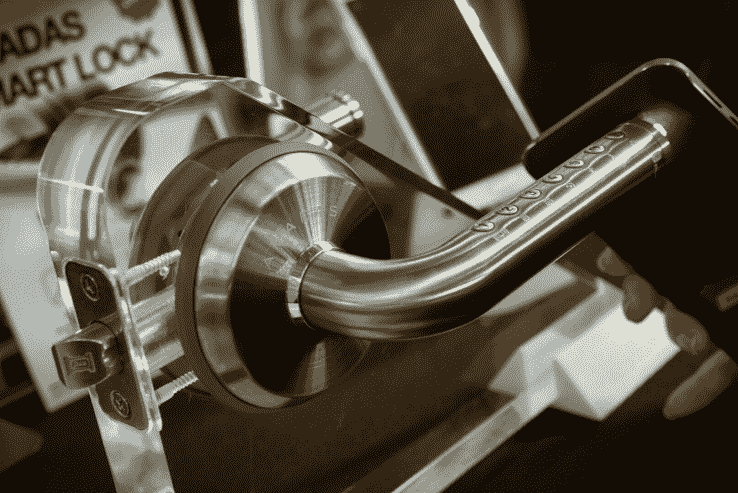

# 智能锁 Amadas 取消 Kickstarter 活动 

> 原文：<https://web.archive.org/web/https://techcrunch.com/2016/09/14/amadas-kickstarter-cancellation/>

尽管达到了融资目标，Amadas 仍将在周一取消其 Kickstarter 活动。该公司的首席执行官告诉我，这场运动并不像公司希望的那样清晰。挑战在于投资者和公司对产品的特性有一些误解。该运动可能会在明年初重返平台。

今天我在 [TechCrunch Disrupt](https://web.archive.org/web/20221225123102/https://techcrunch.com/events/disrupt-sf-2016/) 上与 Amadas 的首席执行官 Eun Min Park 交谈时，她告诉我，“我们还没有为竞选做好充分准备。"我们可以再试一次，这次一定要成功。"

该团队指出，问题在于其解决方案只有蓝牙，但市场上的许多竞争对手都提供通过 Wi-Fi 的远程解锁解决方案。面临的挑战是，许多支持者认为 Amadas 的解决方案也将支持从世界任何地方远程解锁。

“我们的竞选页面上没有任何地方说我们支持 Wi-Fi，”该公司的首席运营官 Sung Kim 说，“但我们收到了很多支持者的投诉，有些人甚至声称我们歪曲了我们的产品。”

该团队向我解释说，他们需要很长时间才能在组合中加入 Wi-Fi，这是许多支持者所要求的。

“我们对任何可能的误解负责，”Park 解释道，强调了公司选择取消活动的原因。“最终，我们将制造出与 HomeKit、Nest 等兼容的锁。但我知道 TechCrunch 写了关于[黑智能锁](https://web.archive.org/web/20221225123102/https://techcrunch.com/2016/08/08/smart-locks-yield-to-simple-hacker-tricks/)的问题，我们需要确保我们把安全作为最重要的因素。”

蓝牙驱动的智能锁有许多智能创新，包括基于 PIN 码的解锁功能，甚至还有一个备份解决方案，以防你的前门耗尽 AA 电池。锁的外部手柄内置一个小型太阳能电池板，因此你可以使用手电筒(如大多数智能手机内置的手电筒)为内部电池充电足够长的时间，以便让你进屋开锁。

钢 Amadas 锁有一个锦囊妙计:可以用手电筒给内部电池充电，这样没电的电池就不会毁了你的一天。

## 阿玛达斯的声明

这篇文章发表后，Amadas 联系我们澄清了一些事情。公司声明如下。

AMADAS 真诚地感谢 Kickstarter 支持者给予的所有支持，并向任何在 Kickstarter 官方宣布更新之前得知取消消息的 Kickstarter 支持者道歉。AMADAS 决定取消该项目，以便在不久的将来更专注于向用户提供“更好”的产品(无论是在众筹还是 B2B/B2C 渠道)，并对造成支持者之间的任何误解承担全部责任。缺少 WiFi 解决方案只是 AMADAS 计划在未来实现的功能的一个例子，而不是取消的唯一原因。AMADAS 承诺将通过解决门锁解决方案更全面的关键痛点，带着将改变现状的产品重返市场。为了表示感谢，AMADAS 还将向已经注册的 Kickstarter 支持者提供相同的折扣率，并随时通知他们未来的任何关键里程碑。