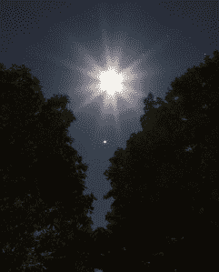
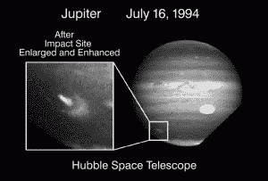

# 业余天文学家在视频上捕捉木星的最新撞击 

> 原文：<https://web.archive.org/web/https://techcrunch.com/2016/03/30/amateur-astronomers-catch-jupiters-latest-impact-on-video/>

本周，两名业余天文学家发布了木星撞击事件的录像。一次在奥地利，一次在爱尔兰，这两次独立的观测显示，在完全相同的时间出现了短暂而微弱的闪光。

[https://web.archive.org/web/20221210031934if_/https://www.youtube.com/embed/4LiL7RYG7ac?feature=oembed](https://web.archive.org/web/20221210031934if_/https://www.youtube.com/embed/4LiL7RYG7ac?feature=oembed)

视频

菲尔·普莱特，*糟糕的天文学*石板的作者，[说](https://web.archive.org/web/20221210031934/http://www.slate.com/blogs/bad_astronomy/2016/03/29/jupiter_hit_by_asteroid_or_comet_in_march_2016.html)这些片段揭示了“一个实际影响的非常有力的证据”然而，他指出，哪种行星撞击地球还不清楚；目前还没有足够的数据来确定来源是彗星还是小行星。

业余天文学家 Gerrit Kernbauer 于 3 月 17 日^(至 9 日)在奥地利的莫德林使用 20 厘米[望远镜](https://web.archive.org/web/20221210031934/http://www.amazon.co.uk/Skywatcher-Explorer-200P-1000-T%C3%A9lescope-EQ-5/dp/B002OTZZPA)观测木星。在对他的视频的描述中，Kernbauer 说那个特别的夜晚“看到的”并不是最好的，所以他在处理视频时犹豫了。直到 10 天后，当他在看录像时，他发现了一个奇怪的亮光，出现了不到一秒钟。

“看见”是天文学家用来描述天空大气条件的术语。由于不断变化的温度、风的模式和大气中的尘埃粒子，天文学家有时很难稳定地收集来自恒星和天空中其他物体的光。当大气条件不稳定时，天文学家会说有“糟糕的观测条件”

这种效应就是为什么星星经常出现“闪烁”这也是为什么许多天文台建在高海拔地区的原因，那里的大气更稀薄，因此“视觉”通常更好。

当木星在天空中可见时，它是天文学家观测的热门对象。它如此明亮，以至于你经常可以用肉眼很容易地看到它。但是对于一个捕捉撞击事件的人来说，你需要正确的技术、经验和一点点运气。

*2010 年 8 月月亮和木星的会合/图片由美国国家航空航天局/汤姆·柯奇亚罗提供*

通常情况下，对这种事件的一次观察不足以让天文学家相信这是一次撞击。这是因为望远镜图像中的闪光也可能是由技术错误或望远镜视线中的其他东西引起的。

然而，第二个观测者也恰好在同一时间拍摄了木星的延时录像。来自爱尔兰 Swords 的业余天文学家 John Mckeon 在他的 YouTube 视频上说，“成像会议的最初目的是获得这一延时，与当晚倒数第二次捕捉的撞击巧合。”

[https://web.archive.org/web/20221210031934if_/https://www.youtube.com/embed/HakDInn_pHE?feature=oembed](https://web.archive.org/web/20221210031934if_/https://www.youtube.com/embed/HakDInn_pHE?feature=oembed)

视频

在视频中的小闪光之前，你可以看到其他物体过境木星。这些是木星 67 颗已知卫星中最大的一些，包括木卫一、木卫三和木卫二。

作为太阳系中最大的行星，木星对撞击并不陌生。科学家们第一次目睹木星与地球的碰撞要追溯到 1994 年，当时木星被大型彗星苏梅克-利维 9 号 T2 撞上 T3。撞击本身是在行星的远端，因为它面对着地球，但是一旦木星旋转了一点，科学家们就用哈勃太空望远镜看到了舒梅克留下的撞击点。

*舒梅克-利维 9 撞击木星的地点/图片由美国宇航局/JPL 提供*

近年来，科学家在 2009 年、2010 年和 2012 年捕捉到了木星的撞击。除了科学家在摄像机上发现的影响，还有很多他们错过的。如果木星受到轻微撞击，或者木星离太阳太近，科学家不太可能注意到它们。

虽然这个月的撞击并不罕见，但它*特别的是*它是由业余天文学家发现的(尽管非常熟练的业余天文学家拥有高质量的设备)。

随着现成的天文学技术质量的提高和成本的降低，我们可以期待更多这样的观测在世界各地发生。随着越来越多的人在晚上将望远镜对准天空，随着时间的推移，对木星撞击的探测只会增加。