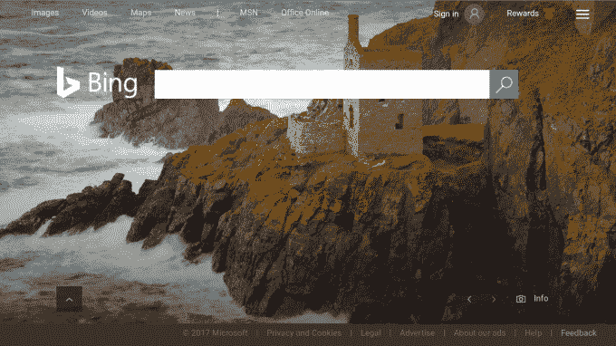
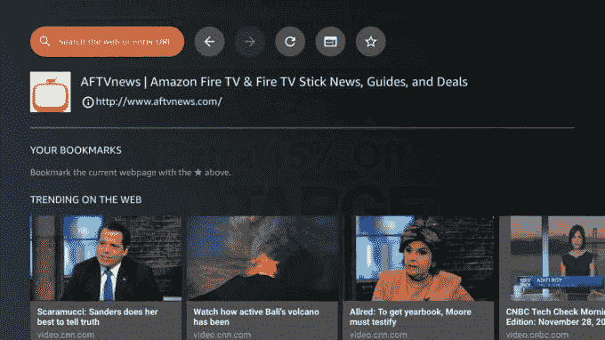

# 亚马逊为 Fire TV 增加了 Silk 网络浏览器 

> 原文：<https://web.archive.org/web/https://techcrunch.com/2017/11/29/amazon-adds-its-silk-web-browser-to-fire-tv/>

亚马逊低调地为 Fire TV 推出了 Silk web 浏览器，允许拥有 Fire TV、Fire TV Stick 和 Fire TV Edition 电视的用户在大屏幕上浏览网页。该应用程序提供了几个标准的网络浏览器功能，如搜索或输入网址，访问书签，向前或向后移动，保存密码等。它还使用 Bing.com 作为默认搜索引擎，并支持语音搜索，这要归功于它与 Fire TV 的语音遥控器的集成。

然而，总的来说，这款浏览器是一款相当简单的应用，看起来不像是为在电视屏幕上使用而精心定制的。不过话说回来，浏览器首先并不是一个真正适合在电视上使用的应用。

例如，光标通过遥控器上的方向按钮四处移动。这很实用，但显然比拿起你的手机(可能就在附近)进行搜索或加载网页要麻烦得多。

但是 Fire TV 的 Silk 浏览器并不是真正的网络搜索，而是在线视频。

该应用程序包括一个名为“网络趋势”的内容部分，其中突出了热门视频，包括来自美国消费者新闻与商业频道、CNN、Fox 等新闻来源的视频。您可以使用遥控器上的按钮而不是光标来播放、暂停、快进和快退这些视频，这样更容易观看。

该应用的发布首先被 [AFTVNews](https://web.archive.org/web/20221002060015/http://www.aftvnews.com/amazon-releases-their-silk-web-browser-for-the-amazon-fire-tv/) 发现，它指出 Silk 浏览器的测试版已经在今年六月[泄露](https://web.archive.org/web/20221002060015/http://www.aftvnews.com/amazon-briefly-leaks-silk-browser-for-the-fire-tv/)，暗示发布正在进行中。

*上图:形象积分， [AFTVNews](https://web.archive.org/web/20221002060015/http://www.aftvnews.com/amazon-releases-their-silk-web-browser-for-the-amazon-fire-tv/)*

亚马逊尚未正式宣布该应用的到来，但它今天下午通过电子邮件向我们证实了这一消息。

决定不发布公告可能是因为该公司正在拉斯维加斯举行 re:Invent 会议，或者它可能会等到浏览器完全兼容所有亚马逊 Fire TV 设备后再发布公告。

亚马逊表示，目前，该应用程序可以在第一代和第二代 Fire TV 设备、第二代 Fire TV Stick 以及所有版本的 Element 和 Westinghouse 的 Fire TV Edition 电视上运行。但它尚未在新的 Fire TV 上推出，可能是因为该设备运行新的 Fire OS 6。(然而,[浏览器的 Appstore 页面](https://web.archive.org/web/20221002060015/https://www.amazon.com/dp/B01M35MQV4)上的一个注释称，它将于 12 月份推出新的 Fire TV。)

*(根据亚马逊的确认更新，美国东部时间下午 2:00)*