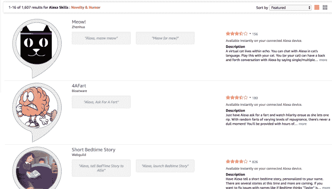

# 亚马逊将父母同意添加到针对儿童的 Alexa 技能中，推出首个合法的儿童技能 

> 原文：<https://web.archive.org/web/https://techcrunch.com/2017/08/31/amazon-adds-parental-consent-to-alexa-skills-aimed-at-children-launches-first-legal-kids-skills/>

亚马逊今天[推出了](https://web.archive.org/web/20221129043038/https://developer.amazon.com/blogs/alexa/post/a311e51b-da95-40d7-bb5e-8ce591016e03/alexa-now-supports-kid-skills)第一款专门针对儿童的 Alexa 技能，该技能将与新的验证父母同意功能一起上线，以便在儿童数据保护的范围内运行，如[儿童在线隐私保护法案](https://web.archive.org/web/20221129043038/https://www.ftc.gov/tips-advice/business-center/privacy-and-security/children%27s-privacy) (COPPA)。这一举措为大型儿童媒体品牌打开了大门，因为潜在的法律问题，这些品牌迄今为止一直避免为 Alexa 的语音平台开发应用程序。

一开始，两个主要的儿童品牌就在 Alexa 上推出了这一新功能。维亚康姆旗下的 Nickelodeon 正在推出海绵宝宝技能，而芝麻街有一个新的 Elmo 技能。

尼克的记忆游戏，海绵宝宝挑战，孩子们成为 Krusty Krab 餐厅的新员工，负责接受越来越复杂的食物订单，然后将这些订单传达给员工，包括海绵宝宝，Squidward 和 Krabs 先生，Nickelodeon 说。

与此同时，芝麻街的技巧让孩子们给 Elmo 打电话，和他玩捉迷藏，利用音频线索找出他藏在哪里，并练习他们的字母表。

亚马逊还推出了自己的 Storytime 技能，为 5 至 12 岁的孩子提供睡前故事。该收藏将包括艾迪·布莱恩特从周六夜现场和汤姆·肯尼，海绵宝宝之声，从亚马逊急流图书馆阅读的故事。以后还会增加有声小故事。

很可能，许多品牌儿童的技能将随之而来，因为通过快速进入消费者家庭的下一代计算平台来接触这些年轻受众的需求受到压抑。

语音激活设备的采用比去年[增加了 128.9%](https://web.archive.org/web/20221129043038/https://beta.techcrunch.com/2017/05/08/amazon-to-control-70-percent-of-the-voice-controlled-speaker-market-this-year/) ，据估计[6050 万美国消费者今年将至少每月使用一次语音助手](https://web.archive.org/web/20221129043038/https://beta.techcrunch.com/2017/05/08/amazon-to-control-70-percent-of-the-voice-controlled-speaker-market-this-year/)。其中，3560 万人将在连接的扬声器上使用语音助手——可能是回声设备。亚马逊的设备目前正在赢得智能扬声器市场，份额为 70.6%。

根据亚马逊的说法，Echo 用户第一次启用“孩子技能”时，Alexa 会提示你通过 Alexa companion 应用程序提供父母许可。验证过程将要求父母和监护人输入通过短信发送到他们手机的一次性密码，或者通过信用卡进行验证。

然而，这种父母同意将适用于所有的孩子技能，所以父母将只需完成一次过程。虽然这不一定是处理同意的恰当方式，但这是亚马逊的明智之举。如果父母启用了这些高度可见且肯定会受欢迎的孩子的语音技能，他们将有效地允许他们的孩子尽可能多地使用 Alexa。

**FTC、COPPA 和语音计算**

父母同意的加入解决了当今语音平台一直面临的一个巨大问题，像 Siri、Cortana、谷歌助手和 Alexa 这样的虚拟助手一直在美国法律的灰色地带运营，直到现在。

《卫报》去年春天的一项调查发现，科技公司存储录音的方式违反了美国法律。具体来说，他们没有达到 COPPA 的父母同意的标准。该法律的指导方针旨在保护儿童的在线隐私，并要求公司获得父母明确、可核实的同意，以便存储 13 岁以下儿童的个人信息。

当时，亚马逊告诉卫报，它遵守 COPPA，因为它不针对儿童。当被问及现有的技能是否会增加父母同意时，亚马逊告诉我们，迄今为止推出的那些技能是“面向所有观众”的，并不仅限于孩子。

但在父母把一个回声设备带回家后，Alexa 已经被小孩子们使用了。了解到这一点，许多 Alexa 技能开发人员已经为儿童开发了应用程序，从声控游戏到笑话应用程序，甚至只有孩子才会喜欢的东西，如“放屁”技能。

例如，在 Alexa 技能商店的“新奇&幽默”类别中有 1607 种技能，其中充满了针对儿童的应用程序，如睡前故事、有趣的噪音、笑话、插科打诨、有趣的事实等等。与此同时，现在超过 5400 种游戏技能中的许多显然也是针对孩子的，比如“你愿意吗？”或者比如《冰雪奇缘》(自然不是迪士尼的)。

尽管语音计算激增，但美国联邦贸易委员会直到 2017 年 6 月才[更新](https://web.archive.org/web/20221129043038/https://www.natlawreview.com/article/ftc-and-fbi-issue-compliance-reminder-children-s-online-privacy-protection-act)其 [COPPA 企业指南](https://web.archive.org/web/20221129043038/https://www.ftc.gov/tips-advice/business-center/guidance/childrens-online-privacy-protection-rule-six-step-compliance)，将联网设备和玩具考虑在内。它的指导方针现在规定，在线服务包括“网络语音服务”，并表示企业必须获得许可才能存储儿童的声音。

鉴于联邦贸易委员会的这一澄清，Alexa 现在提供父母同意并不奇怪。

亚马逊表示，其他儿童技能也将于今天推出，包括动物声音测验、老麦当劳、傻东西、动物园漫步等。它还正式向那些希望为儿童培养技能，但又不想因此惹上法律麻烦的开发者开放了 Alexa 技能工具包。

至于大孩子的品牌，更多的 Alexa 应用程序正在他们的路线图上，因为父母同意是可用的。

Nickelodeon 数字和新业务执行副总裁马修·埃文斯(Matthew Evans)告诉 TechCrunch 说:“我们有几个想法正在酝酿中，但还没有什么可以宣布的。”"我们的计划是从海绵宝宝挑战中学习，为我们推出的下一个技能提供信息."