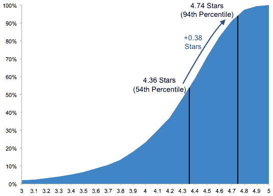

# 亚马逊禁止与免费或打折产品相关的激励性评论

> 原文：<https://web.archive.org/web/https://techcrunch.com/2016/10/03/amazon-bans-incentivized-reviews-tied-to-free-or-discounted-products/>

亚马逊正在对其[社区指南](https://web.archive.org/web/20230319205425/https://www.amazon.com/gp/help/customer/display.html?nodeId=14279631)、[今天](https://web.archive.org/web/20230319205425/https://www.amazon.com/p/feature/abpto3jt7fhb5oc)宣布做出重大改变，将消除任何激励性评论，除了那些来自其自己的亚马逊 Vine 计划的评论。该计划允许亚马逊——而不是卖家或供应商——确定可信任的审查者，并有许多控制措施，以防止审查过程中的偏见。

亚马逊历来禁止对评论进行补偿——甚至起诉那些为虚假评论付费的[商家](https://web.archive.org/web/20230319205425/https://techcrunch.com/2016/04/26/amazon-cracks-down-on-fake-reviews-with-another-lawsuit/) [以及撰写虚假评论](https://web.archive.org/web/20230319205425/https://techcrunch.com/2016/06/01/amazon-sues-sellers-for-buying-fake-reviews/)的[个人，以努力使其评论和评级系统更加公平，对在线购物者更有帮助。然而，它允许企业向客户提供产品，以换取他们的“诚实”审查。](https://web.archive.org/web/20230319205425/https://techcrunch.com/2015/10/16/amazon-files-suit-against-individuals-offering-fake-product-reviews-on-fiverr-com/)

唯一的条件是，这些审查者必须在他们的审查文本中披露他们与所涉企业的关系。评论者通常免费或以折扣价获得产品，以换取他们的评论。

尽管从理论上讲，这些评论者可以写出他们对产品的真实看法——正面的或负面的——但这些激励性的评论往往会压倒性地偏向被评级的产品。

这是由多种因素造成的——事实上，卖家可能已经找到了那些不太挑剔的评论者，事实上，评论者可能认为，如果他们选择说负面的话，他们将不再有机会接受这种报价。

总的来说，购物者已经开始不信任这些评论，因为他们认为这些评论有偏见。这不仅仅是一种“感觉”，事实证明—[最近一项对超过 700 万条评论的研究](https://web.archive.org/web/20230319205425/http://reviewmeta.com/blog/analysis-of-7-million-amazon-reviews-customers-who-receive-free-or-discounted-item-much-more-likely-to-write-positive-review/)表明，有激励性评论的产品的平均评分高于没有激励性评论的产品。(也就是说，平均评分为 4.74，平均评分为 4.36，满分为 5 星)。

即使有 0.38 的星差，影响也是巨大的——将产品从第 54 百分位提升到第 94 百分位。实际上，激励性评论可以创造出顶级产品。

该研究还发现，受到激励的评论者给出 1 星评级的可能性比没有受到激励的评论者低 12 倍，离开批评性评论的可能性几乎低 4 倍。

从技术上讲，这些评论者没有现金报酬，但写评论已经成为一种意外之财。研究表明，那些参与激励性评论的人平均写了 232 篇评论，而那些没有参与的人，平均只写了 31 篇评论。对于这些“无报酬”的评论者来说，有很多免费和打折的产品！

亚马逊表示，今后，唯一的激励性评论将是来自亚马逊网站的评论。然而，它们的工作方式不同。首先，亚马逊选择谁将被允许评论产品，它这样做主要是为了增加新产品或预发布产品的评论数量，这些产品尚未产生足够的销售额来获得大量的有机评论。

只有在撰写了许多被其他客户评为“有帮助”的评论之后，Vine 评论者才会被邀请加入该计划，并且倾向于拥有特定产品类别的专业知识。

亚马逊客户体验副总裁 Chee Chew 在一份关于 Vine 如何控制偏见的声明中解释道:“我们不会奖励积极的星级评分，不会试图影响评论的内容，甚至不会要求撰写评论。“我们还限制了每种产品的 Vine 评论总数，”他补充道。

此外，供应商与 Vine 评审员没有任何联系，他们也无法影响哪些评审员将收到他们的产品，这些产品直接提交给亚马逊进行分发。

该零售商指出，这些变化将适用于除书籍以外的所有产品类别，因为亚马逊一直允许提前分发书籍。亚马逊还表示，它有其他想法让 Vine 在未来变得更有用，但没有详细说明。

亚马逊的一位发言人告诉我们，在政策改变之前收到的评论只有在过度且不符合之前政策的情况下才会被追溯删除。不幸的是，这意味着你仍然会在亚马逊网站上看到大量这些看似有偏见的评论。该零售商还表示，如果它发现有人试图通过将评论与打折产品捆绑在一起来操纵评论，它将从今天开始对他们采取行动。

*图片演职员表、图表:[review meta](https://web.archive.org/web/20230319205425/http://reviewmeta.com/blog/analysis-of-7-million-amazon-reviews-customers-who-receive-free-or-discounted-item-much-more-likely-to-write-positive-review/)*